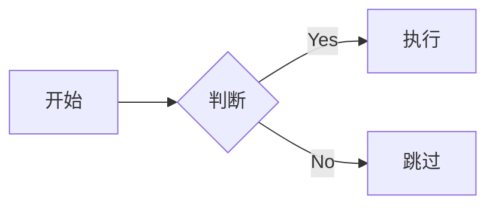
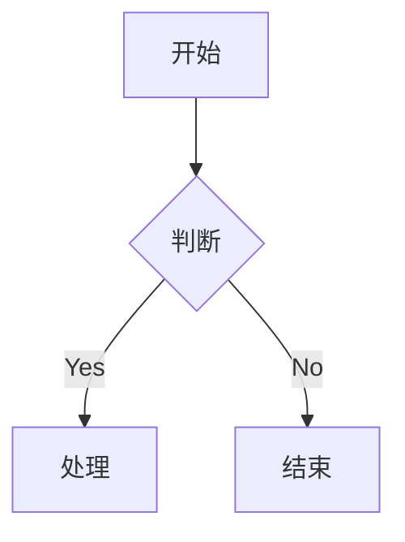
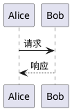
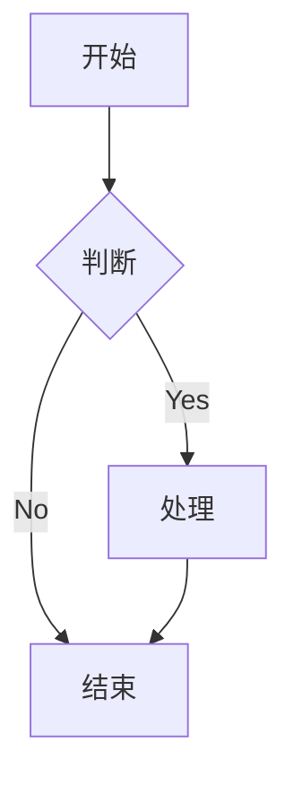
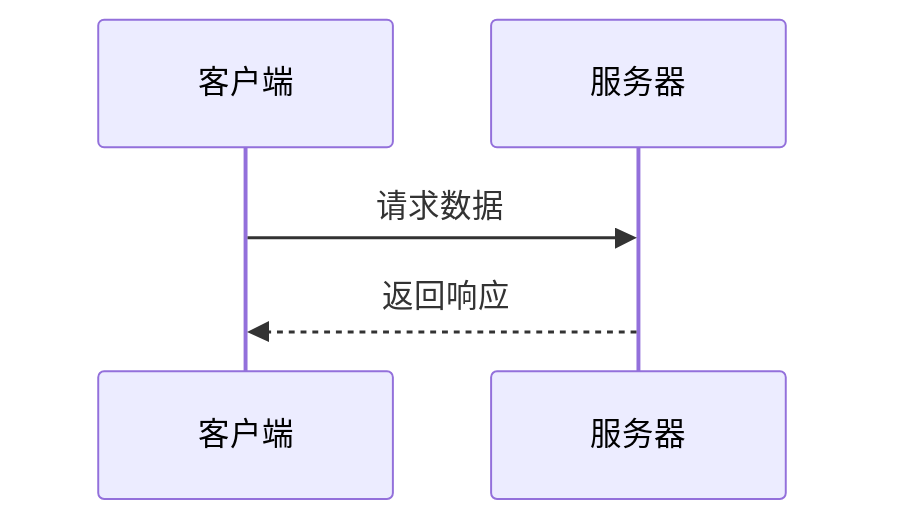

# mkdocs material 超全配置

**仍然在修改**  
如果需要任何的文件，可以直接访问本博客的 [GitHub](https://github.com/WncFht/notes) 页面

## 1 入门基础

### 1.1 什么是 MkDocs？

MkDocs 是一个快速、简单、华丽的静态站点生成器，专门用于构建项目文档。文档源文件使用 Markdown 编写，配置文件使用 YAML 格式。

#### 1.1.1 MkDocs 的优势

1. **简单易用**
   - 使用 Markdown 编写文档
   - 配置文件简单直观
   - 一键式构建和部署

2. **功能强大**
   - 内置开发服务器，支持实时预览
   - 多种主题可选
   - 支持自定义主题
   - 自动生成导航
   - 全文搜索功能

3. **部署方便**
   - 生成纯静态页面
   - 一行命令部署到 GitHub Pages
   - 支持自定义域名
   - 兼容所有静态网站托管平台

#### 1.1.2 MkDocs vs 其他文档工具

| 工具 | 优势 | 劣势 |
|------|------|------|
| MkDocs | - 简单易用<br>- 专注文档<br>- 部署方便<br>- 主题丰富 | - 功能相对简单<br>- 插件生态较小 |
| GitBook | - 界面优雅<br>- 生态完整<br>- 多人协作好 | - 构建速度慢<br>- 定制性差<br>- 免费版限制多 |
| Docusaurus | - React 技术栈<br>- 功能强大<br>- 扩展性好 | - 学习曲线陡<br>- 配置复杂<br>- 构建较慢 |
| VuePress | - Vue 技术栈<br>- 定制性强<br>- 插件丰富 | - 主题较少<br>- 配置繁琐<br>- 学习成本高 |

#### 1.1.3 MkDocs 工作原理

MkDocs 的工作流程如下：

1. **文档编写**
   - 使用 Markdown 格式编写文档
   - 文档存放在 `docs` 目录下
   - 支持多级目录结构

2. **配置解析**
   - 读取 `mkdocs.yml` 配置文件
   - 解析主题设置、插件配置等
   - 生成导航结构

3. **构建过程**

   ```plaintext
   Markdown 文件 -> 解析器 -> HTML 文件
                 -> 主题渲染
                 -> 插件处理
                 -> 静态资源处理
   ```

4. **输出部署**
   - 生成纯静态 HTML 文件
   - 保留原始目录结构
   - 自动处理内部链接
   - 复制静态资源

### 1.2 为什么选择 Material 主题

Material for MkDocs 是一个基于 Google Material Design 设计语言的主题，它不仅美观，而且功能强大。

#### 1.2.1 Material 主题特性

1. **现代化设计**
   - 遵循 Material Design 规范
   - 响应式布局
   - 支持深色模式
   - 自动适配移动设备

2. **强大功能**
   - 智能搜索
   - 代码高亮
   - 标签页支持
   - 自动目录生成
   - 多语言支持
   - 版本控制集成

3. **出色的用户体验**
   - 快速加载
   - 平滑动画
   - 实时搜索
   - 代码复制按钮
   - 返回顶部按钮

#### 1.2.2 与其他主题对比

| 特性 | Material | ReadTheDocs | mkdocs | 其他主题 |
|------|----------|-------------|---------|----------|
| 设计风格 | 现代简约 | 传统文档 | 简单基础 | 风格多样 |
| 响应式 | ✅ | ✅ | ❌ | 部分支持 |
| 深色模式 | ✅ | ❌ | ❌ | 部分支持 |
| 搜索功能 | ✅ | ✅ | ❌ | 部分支持 |
| 定制性 | 强 | 中 | 弱 | 不一致 |
| 插件支持 | 丰富 | 一般 | 基础 | 不一致 |

#### 1.2.3 Material 主题的技术架构

```plaintext
Material Theme
├── 核心组件
│   ├── 导航栏
│   ├── 侧边栏
│   ├── 搜索组件
│   └── 内容渲染器
├── 扩展功能
│   ├── 代码高亮
│   ├── 标签系统
│   ├── 目录生成
│   └── 主题切换
└── 插件系统
    ├── 内置插件
    └── 第三方插件集成
```

### 1.3 环境要求

#### 1.3.1 Python 环境

##### 1.3.1.1 Python 版本选择

MkDocs 需要 Python 3.6 或更高版本，推荐使用 Python 3.8+：

```bash
# 检查 Python 版本
python --version

# 推荐版本
Python 3.8.x
Python 3.9.x
Python 3.10.x
```

##### 1.3.1.2 pip 配置说明

pip 是 Python 的包管理工具，需要确保其正确安装：

```bash
# 检查 pip 版本
pip --version

# 升级 pip
python -m pip install --upgrade pip
```

##### 1.3.1.3 虚拟环境管理

推荐使用虚拟环境来管理项目依赖：

```bash
# 创建虚拟环境
python -m venv venv

# 激活虚拟环境
# Windows
venv\Scripts\activate
# Linux/Mac
source venv/bin/activate

# 退出虚拟环境
deactivate
```

#### 1.3.2 pip 包管理

##### 1.3.2.1 pip 源配置

为加快下载速度，建议使用国内镜像源：

```bash
# 临时使用
pip install -i https://pypi.tuna.tsinghua.edu.cn/simple mkdocs

# 永久配置
pip config set global.index-url https://pypi.tuna.tsinghua.edu.cn/simple
```

##### 1.3.2.2 依赖管理

安装必要的包：

```bash
pip install mkdocs-material
pip install mkdocs-glightbox
pip install mkdocs-git-revision-date-localized-plugin
```

##### 1.3.2.3 requirements. txt 使用

维护项目依赖：

```bash
# 生成依赖文件
pip freeze > requirements.txt

# 安装依赖
pip install -r requirements.txt
```

#### 1.3.3 Git 环境

##### 1.3.3.1 Git 基础配置

```bash
# 配置用户信息
git config --global user.name "Your Name"
git config --global user.email "your.email@example.com"

# 配置默认分支
git config --global init.defaultBranch main
```

#### 1.3.4 SSH 密钥配置

```bash
# 生成 SSH 密钥
ssh-keygen -t rsa -b 4096 -C "your.email@example.com"

# 查看公钥
cat ~/.ssh/id_rsa.pub
```

将公钥添加到 GitHub 账户的 SSH keys 中。

#### 1.3.5 .gitignore 配置

创建 `.gitignore` 文件，添加以下内容：

```gitignore
# Python
__pycache__/
*.py[cod]
*$py.class
venv/

# MkDocs
site/

# IDE
.idea/
.vscode/
*.swp
*.swo

# OS
.DS_Store
Thumbs.db
```

## 2 环境搭建

### 2.1 Windows 系统安装

#### 2.1.1 Python 安装

##### 2.1.1.1 下载安装包

1. 访问 [Python 官网](https://www.python.org/downloads/) 下载最新版本
2. 选择适合你的 Windows 版本（32 位/64 位）的安装包
3. 下载完成后双击安装包开始安装

##### 2.1.1.2 环境变量配置

1. 安装时勾选 "Add Python to PATH"
2. 如果忘记勾选，可以手动添加：

   ```plaintext
   # 添加到系统环境变量 Path
   C:\Users\YourUser\AppData\Local\Programs\Python\Python3x\
   C:\Users\YourUser\AppData\Local\Programs\Python\Python3x\Scripts\
   ```

3. 检查环境变量：

   ```bash
   echo %PATH%
   ```

##### 2.1.1.3 验证安装

在命令提示符中执行：

```bash
# 检查 Python 版本
python --version

# 检查 pip 版本
pip --version
```

#### 2.1.2 MkDocs 安装

##### 2.1.2.1 pip 安装方法

使用 pip 安装 MkDocs：

```bash
# 安装 MkDocs
pip install mkdocs

# 验证安装
mkdocs --version
```

##### 2.1.2.2 常见问题解决

1. **pip 不是内部命令**
   - 解决方法：重新添加 Python Scripts 目录到 PATH

2. **权限问题**
   - 解决方法：使用管理员权限运行命令提示符

   ```bash
   # 管理员权限安装
   pip install --user mkdocs
   ```

3. **SSL 证书错误**
   - 解决方法：添加信任选项或使用国内镜像

   ```bash
   pip install --trusted-host pypi.org --trusted-host files.pythonhosted.org mkdocs
   ```

#### 2.1.3 版本选择

MkDocs 版本选择建议：

```bash
# 查看可用版本
pip install mkdocs==

# 安装特定版本
pip install mkdocs==1.5.3  # 推荐版本
```

#### 2.1.4 Material 主题安装

##### 2.1.4.1 安装命令

```bash
# 安装 Material 主题
pip install mkdocs-material

# 验证安装
python -c "import mkdocs_material; print(mkdocs_material.__version__)"
```

##### 2.1.4.2 依赖检查

安装必要的依赖：

```bash
# 安装扩展支持
pip install pymdown-extensions
pip install mkdocs-glightbox
pip install mkdocs-git-revision-date-localized-plugin
```

##### 2.1.4.3 版本兼容性

| MkDocs 版本 | Material 版本 | Python 版本 |
|------------|--------------|------------|
| 1.5. x | 9.4. x | ≥3.8 |
| 1.4. x | 9.3. x | ≥3.7 |
| 1.3. x | 9.2. x | ≥3.7 |

### 2.2 Linux/Mac 系统安装

#### 2.2.1 包管理器安装 Python

##### 2.2.1.1 apt/yum 安装方法

Ubuntu/Debian:

```bash
# 更新包索引
sudo apt update

# 安装 Python
sudo apt install python3 python3-pip

# 安装开发工具
sudo apt install python3-dev
```

CentOS/RHEL:

```bash
# 安装 EPEL 仓库
sudo yum install epel-release

# 安装 Python
sudo yum install python3 python3-pip
```

##### 2.2.1.2 brew 安装方法

macOS:

```bash
# 安装 Homebrew（如果未安装）
/bin/bash -c "$(curl -fsSL https://raw.githubusercontent.com/Homebrew/install/HEAD/install.sh)"

# 安装 Python
brew install python

# 更新 pip
pip3 install --upgrade pip
```

##### 2.2.1.3 环境变量配置

bash/zsh:

```bash
# 添加到 ~/.bashrc 或 ~/.zshrc
export PATH="$HOME/.local/bin:$PATH"
export PYTHONPATH="$HOME/.local/lib/python3.x/site-packages:$PYTHONPATH"

# 更新环境变量
source ~/.bashrc  # 或 source ~/.zshrc
```

#### 2.2.2 pip 安装依赖

##### 2.2.2.1 系统级安装

```bash
# 全局安装（需要 root 权限）
sudo pip3 install mkdocs mkdocs-material

# 验证安装
mkdocs --version
```

##### 2.2.2.2 用户级安装

```bash
# 用户目录安装
pip3 install --user mkdocs mkdocs-material

# 检查安装路径
python3 -m site --user-site
```

##### 2.2.2.3 虚拟环境安装

```bash
# 创建虚拟环境
python3 -m venv mkdocs-env

# 激活虚拟环境
source mkdocs-env/bin/activate

# 安装依赖
pip install mkdocs mkdocs-material

# 退出虚拟环境
deactivate
```

### 2.3 项目初始化

#### 2.3.1 创建项目

##### 2.3.1.1 mkdocs new 命令详解

```bash
# 基本语法
mkdocs new [项目名]

# 创建新项目
mkdocs new my-docs

# 使用现有目录
cd existing-project
mkdocs new .
```

##### 2.3.1.2 项目命名规范

- 使用小写字母
- 单词间用连字符 (-) 分隔
- 避免使用特殊字符
- 名称具有描述性

示例：

```bash
mkdocs new technical-docs    # 好的命名
mkdocs new tech_docs        # 避免使用下划线
mkdocs new TechDocs         # 避免使用大写
```

##### 2.3.1.3 初始化配置

创建项目后的基本设置：

```bash
cd my-docs
# 启动开发服务器
mkdocs serve
# 在浏览器中访问 http://127.0.0.1:8000
```

#### 2.3.2 目录结构说明

##### 2.3.2.1 基础目录结构

```plaintext
my-docs/
├── docs/               # 文档目录
│   ├── index.md       # 首页
│   ├── about.md       # 其他页面
│   └── img/           # 图片目录
├── mkdocs.yml         # 配置文件
└── venv/              # 虚拟环境（可选）
```

##### 2.3.2.2 docs 目录组织

```plaintext
docs/
├── index.md           # 首页
├── guide/             # 指南目录
│   ├── index.md      # 指南首页
│   ├── install.md    # 安装说明
│   └── usage.md      # 使用说明
├── api/               # API文档
│   └── index.md      # API首页
└── examples/          # 示例目录
    └── basic.md      # 基础示例
```

##### 2.3.2.3 资源文件管理

```plaintext
docs/
├── assets/           # 资源目录
│   ├── images/      # 图片资源
│   ├── css/         # 样式文件
│   ├── js/          # 脚本文件
│   └── fonts/       # 字体文件
└── files/           # 下载文件
    └── sample.pdf   # 示例文件
```

#### 2.3.3 基础配置文件

##### 2.3.3.1 mkdocs. yml 结构

基本配置文件结构：

```yaml
# 站点信息
site_name: 我的文档
site_url: https://example.com/
site_author: 作者名
site_description: 站点描述

# 主题设置
theme:
  name: material
  language: zh
  features:
    - navigation.tabs
    - navigation.top

# 导航设置
nav:
  - 首页: index.md
  - 指南: 
    - guide/index.md
    - 安装: guide/install.md
    - 使用: guide/usage.md

# Markdown 扩展
markdown_extensions:
  - attr_list
  - md_in_html
  - toc:
      permalink: true
```

##### 2.3.3.2 最小配置示例

最简单的配置文件：

```yaml
site_name: 我的文档
theme:
  name: material
```

##### 2.3.3.3 配置文件语法

YAML 语法要点：

```yaml
# 字符串
title: 我的文档

# 列表
plugins:
  - search
  - tags

# 对象
theme:
  name: material
  features:
    - navigation.tabs

# 多行字符串
description: >
  这是一个
  多行描述
  示例

# 锚点引用
copyright: &copyright 2024 My Docs
footer:
  copyright: *copyright
```

## 3 MkDocs 核心配置

### 3.1 站点信息配置

#### 3.1.1 site_name 配置

##### 3.1.1.1 命名规范

网站名称是站点的第一印象，应遵循以下规范：

```yaml
# 推荐的命名方式
site_name: 技术文档中心
site_name: Developer Hub
site_name: API Documentation

# 避免的命名方式
site_name: docs            # 太过简单
site_name: My Doc Site     # 不够专业
site_name: TEST           # 缺乏描述性
```

命名建议：

- 使用简洁明了的名称
- 反映文档的主要内容
- 考虑品牌识别度
- 避免使用特殊字符
- 适当使用空格分隔单词

##### 3.1.1.2 多语言支持

可以通过配置实现多语言站点：

```yaml
# 基础配置
site_name: My Documentation
theme:
  language: zh

# 多语言配置示例
extra:
  alternate:
    - name: English
      link: /en/ 
      lang: en
    - name: 中文
      link: /zh/
      lang: zh

# 语言特定的站点名称
site_name:
  en: My Documentation
  zh: 我的文档
```

##### 3.1.1.3 SEO 优化

通过合适的站点名称提升 SEO：

```yaml
# SEO 优化配置
site_name: ProductName Documentation | CompanyName
extra:
  meta:
    - name: robots
      content: 'index, follow'
    - name: keywords
      content: 'docs, documentation, technical, api'
```

#### 3.1.2 site_url 配置

##### 3.1.2.1 URL 格式要求

```yaml
# 正确的 URL 格式
site_url: https://example.com/docs/
site_url: https://docs.example.com/

# 避免的格式
site_url: http://example.com/docs    # 缺少尾部斜杠
site_url: example.com/docs/          # 缺少协议
```

##### 3.1.2.2 基础路径配置

```yaml
# 根目录部署
site_url: https://example.com/

# 子目录部署
site_url: https://example.com/docs/
use_directory_urls: true  # 推荐设置

# 本地开发
site_url: http://localhost:8000/
```

##### 3.1.2.3 子目录部署配置

```yaml
# GitHub Pages 子目录部署
site_url: https://username.github.io/repository/

# 自定义域名子目录
site_url: https://docs.example.com/project/
extra:
  base_path: /project/  # 如果需要
```

#### 3.1.3 site_author 配置

##### 3.1.3.1 作者信息设置

```yaml
# 基础作者信息
site_author: John Doe

# 扩展作者信息
extra:
  author:
    name: John Doe
    email: john@example.com
    website: https://johndoe.com
```

##### 3.1.3.2 版权信息

```yaml
# 版权声明
copyright: "&copy; 2024 John Doe"

# 高级版权配置
extra:
  copyright:
    author: John Doe
    year: 2024
    license: CC BY-NC-SA 4.0
```

##### 3.1.3.3 meta 信息

```yaml
# meta 信息配置
extra:
  meta:
    - name: author
      content: John Doe
    - name: contact
      content: contact@example.com
    - property: article:author
      content: https://example.com/author
```

#### 3.1.4 site_description 配置

##### 3.1.4.1 SEO 描述

```yaml
# 基础描述
site_description: 全面的技术文档中心，提供详细的API文档、使用指南和最佳实践。

# 多语言描述
extra:
  descriptions:
    en: Comprehensive technical documentation center
    zh: 全面的技术文档中心
```

##### 3.1.4.2 关键词设置

```yaml
# 通过 meta 标签设置关键词
extra:
  meta:
    - name: keywords
      content: MkDocs, documentation, technical docs, API, guides
    - name: description
      content: >-
        全面的技术文档中心，包含详细的API文档、
        使用指南和最佳实践示例。
```

##### 3.1.4.3 站点摘要

```yaml
# 完整的站点信息配置示例
site_name: 技术文档中心
site_description: >-
  提供全面的技术文档、API参考和使用指南，
  帮助开发者快速上手和深入了解产品功能。
site_author: 开发团队
site_url: https://docs.example.com/

extra:
  meta:
    - name: keywords
      content: 技术文档, API文档, 开发指南, 最佳实践
    - name: author
      content: 开发团队
    - name: robots
      content: index, follow

  analytics:
    gtag: G-XXXXXXXXXX

copyright: "&copy; 2024 Example Company"
```

#### 3.1.5 配置最佳实践

1. **SEO 优化建议**：
   - 使用清晰的站点名称
   - 编写有吸引力的描述
   - 包含相关关键词
   - 确保 URL 结构合理

2. **多语言支持**：
   - 为每种语言提供独立描述
   - 使用正确的语言代码
   - 设置合适的字符编码

3. **版本控制**：
   - 记录配置更改
   - 使用版本注释
   - 定期更新站点信息

4. **可维护性**：
   - 使用清晰的配置结构
   - 添加必要的注释
   - 保持配置文件整洁

### 3.2 导航配置

#### 3.2.1 nav 结构设计

##### 3.2.1.1 基础导航结构

最基本的导航配置示例：

```yaml
nav:
  - Home: index.md
  - About: about.md
  - Contact: contact.md
```

更复杂的分组示例：

```yaml
nav:
  - 首页: index.md
  - 用户指南:
    - 介绍: guide/introduction.md
    - 快速开始: guide/getting-started.md
    - 基础教程: guide/basics.md
  - API 文档:
    - 概览: api/overview.md
    - 接口说明: api/reference.md
  - 常见问题: faq.md
```

##### 3.2.1.2 分类组织

推荐的分类方式：

```yaml
nav:
  - 开始使用:
    - 简介: getting-started/introduction.md
    - 安装: getting-started/installation.md
    - 配置: getting-started/configuration.md
  
  - 核心概念:
    - 概述: concepts/overview.md
    - 基础架构: concepts/architecture.md
    - 工作原理: concepts/how-it-works.md
  
  - 高级指南:
    - 自定义主题: advanced/custom-theme.md
    - 插件开发: advanced/plugin-development.md
    - 性能优化: advanced/performance.md
  
  - 参考文档:
    - API: reference/api.md
    - 配置项: reference/configuration.md
    - 命令行: reference/cli.md
```

##### 3.2.1.3 权重设置

使用文件名前缀控制顺序：

```yaml
docs/
├── 01_introduction.md
├── 02_installation.md
├── 03_configuration.md
└── 04_usage.md

# mkdocs.yml
nav:
  - 介绍: 01_introduction.md
  - 安装: 02_installation.md
  - 配置: 03_configuration.md
  - 使用: 04_usage.md
```

#### 3.2.2 文件组织

##### 3.2.2.1 文件命名规范

推荐的命名规范：

```plaintext
docs/
├── index.md                    # 首页
├── getting-started.md         # 短横线分隔
├── advanced_usage.md          # 下划线分隔（可选）
└── troubleshooting.md         # 全小写
```

文件命名建议：

- 使用小写字母
- 单词间使用连字符或下划线
- 文件名应具有描述性
- 保持命名一致性
- 避免使用空格和特殊字符

##### 3.2.2.2 目录组织原则

标准目录结构：

```plaintext
docs/
├── index.md                # 网站首页
├── getting-started/        # 入门指南
│   ├── index.md           # 分类首页
│   ├── installation.md    # 安装说明
│   └── configuration.md   # 配置说明
├── user-guide/            # 用户指南
│   ├── index.md          # 指南首页
│   ├── basic-usage.md    # 基础用法
│   └── advanced.md       # 高级特性
└── api/                   # API文档
    ├── index.md          # API概览
    ├── endpoints.md      # 接口列表
    └── authentication.md # 认证说明
```

##### 3.2.2.3 索引文件使用

每个目录的 index. md 示例：

```markdown
# 用户指南

这是用户指南的主页面，包含以下内容：

## 快速导航

-  [基础用法] (basic-usage.md) - 入门必读
-  [高级特性] (advanced.md) - 深入了解

## 本节内容

此部分将帮助您了解产品的核心功能和使用方法...
```

对应的导航配置：

```yaml
nav:
  - 用户指南:
    - 概述: user-guide/index.md
    - 基础用法: user-guide/basic-usage.md
    - 高级特性: user-guide/advanced.md
```

#### 3.2.3 多级目录

##### 3.2.3.1 层级结构设计

复杂的多级目录示例：

```yaml
nav:
  - 首页: index.md
  - 入门指南:
    - 概述: getting-started/index.md
    - 基础:
      - 安装: getting-started/basics/installation.md
      - 配置: getting-started/basics/configuration.md
    - 进阶:
      - 自定义: getting-started/advanced/customization.md
      - 优化: getting-started/advanced/optimization.md
  - 开发文档:
    - 概述: development/index.md
    - API:
      - 认证: development/api/authentication.md
      - 接口: development/api/endpoints.md
    - SDK:
      - Python: development/sdk/python.md
      - JavaScript: development/sdk/javascript.md
```

##### 3.2.3.2 导航深度控制

```yaml
theme:
  name: material
  features:
    - navigation.sections  # 显示章节
    - navigation.expand   # 展开导航
    - navigation.indexes  # 使用目录索引
    - toc.integrate      # 集成目录

markdown_extensions:
  - toc:
      permalink: true
      toc_depth: 3       # 控制目录深度
```

##### 3.2.3.3 折叠配置

Material 主题的折叠配置：

```yaml
theme:
  name: material
  features:
    - navigation.sections    # 显示分区
    - navigation.expand     # 默认展开
    - navigation.indexes    # 使用索引页
    - navigation.top        # 返回顶部按钮

  # 导航栏设置
  nav_style: dark          # 导航栏样式
  collapse_navigation: true # 折叠导航
  sticky_navigation: true  # 固定导航
```

#### 3.2.4 导航配置最佳实践

1. **结构设计原则**：
   - 保持层级清晰
   - 控制导航深度（建议不超过 3 层）
   - 相关内容分组
   - 使用直观的命名

2. **文件组织**：
   - 使用有意义的目录名
   - 保持文件结构整洁
   - 合理使用索引文件
   - 遵循一致的命名规范

3. **用户体验**：
   - 提供清晰的导航路径
   - 添加合适的描述
   - 考虑移动端显示
   - 优化导航响应速度

4. **维护建议**：
   - 定期检查死链接
   - 更新导航结构
   - 保持文档同步
   - 收集用户反馈

#### 3.2.5 特殊导航功能

1. **隐藏页面**：

```yaml
nav:
  - 可见页面: visible.md
  - !hidden 隐藏页面: hidden.md
```

2. **外部链接**：

```yaml
nav:
  - 文档: index.md
  - GitHub: https://github.com/your/repo
  - 社区: 
    - 论坛: https://forum.example.com
    - 博客: https://blog.example.com
```

3. **别名设置**：

```yaml
nav:
  - 开始: 
    - 概述: getting-started/index.md
    - 快速入门: getting-started/quickstart.md
    - 同一文件不同入口: !alias getting-started/quickstart.md
```

### 3.3 Markdown 扩展

#### 3.3.1 基础扩展

##### 3.3.1.1 meta 扩展

支持在 Markdown 文件头部添加元数据：

```yaml
# mkdocs.yml 配置
markdown_extensions:
  - meta
```

使用示例：

```markdown
---
title: 我的页面标题
description: 页面描述
author: 作者名
date: 2024-01-01
---

# 正文内容
```

##### 3.3.1.2 toc 扩展

自动生成目录：

```yaml
markdown_extensions:
  - toc:
      permalink: true        # 添加段落链接
      toc_depth: 3          # 目录深度
      separator: "_"        # 标题锚点分隔符
      title: "目录"         # 目录标题
      slugify: !!python/object/apply:pymdownx.slugs.slugify
        kwds: {case: lower} # URL 转换规则
```

使用示例：

```markdown
[TOC]

# 一级标题
## 二级标题
### 三级标题
```

##### 3.3.1.3 tables 扩展

增强的表格支持：

```yaml
markdown_extensions:
  - tables
```

使用示例：

```markdown
| 功能 | 基础版 | 专业版 |
|-----|:------:|-------:|
| 功能A | ✓ | ✓ |
| 功能B | ✗ | ✓ |
| 功能C | ✗ | ✓ |

: 表格标题 {.class-name}
```

#### 3.3.2 PyMdown Extensions

##### 3.3.2.1 superfences 配置

增强的代码块功能：

```yaml
markdown_extensions:
  - pymdownx.superfences:
      custom_fences:
        - name: mermaid
          class: mermaid
          format: !!python/name:pymdownx.superfences.fence_div_format
```

使用示例：

````markdown
```python title="example.py" linenums="1" hl_lines="2 3"
def hello_world():
    message = "Hello, World!"
    print(message)
    return message
```


````

##### 3.3.2.2 emoji 支持

添加表情符号支持：

```yaml
markdown_extensions:
  - pymdownx.emoji:
      emoji_index: !!python/name:material.extensions.emoji.twemoji
      emoji_generator: !!python/name:material.extensions.emoji.to_svg
```

使用示例：

```markdown
:smile: :heart: :thumbsup:

:fontawesome-brands-github: GitHub
:material-account: 用户
:octicons-repo-16: 仓库
```

##### 3.3.2.3 tasklist 功能

任务列表支持：

```yaml
markdown_extensions:
  - pymdownx.tasklist:
      custom_checkbox: true    # 自定义复选框样式
      clickable_checkbox: true # 可点击
```

使用示例：

```markdown
- [x] 已完成任务
- [ ] 未完成任务
  - [x] 子任务 1
  - [ ] 子任务 2
```

##### 3.3.2.4 其他常用 PyMdown 扩展

```yaml
markdown_extensions:
  - pymdownx.highlight     # 代码高亮
  - pymdownx.inlinehilite # 行内代码高亮
  - pymdownx.snippets     # 代码片段
  - pymdownx.magiclink    # 自动链接
  - pymdownx.mark        # ==标记==
  - pymdownx.critic      # 编辑标记
  - pymdownx.tilde      # 删除线
  - pymdownx.caret      # 上标
  - pymdownx.keys       # 键盘按键
  - pymdownx.tabbed    # 标签页
```

#### 3.3.3 自定义扩展

##### 3.3.3.1 扩展开发基础

创建自定义扩展：

```python
# custom_extension.py
from markdown.extensions import Extension
from markdown.preprocessors import Preprocessor

class CustomPreprocessor(Preprocessor):
    def run(self, lines):
        new_lines = []
        for line in lines:
            new_lines.append(line.replace('[[', '**').replace(']]', '**'))
        return new_lines

class CustomExtension(Extension):
    def extendMarkdown(self, md):
        md.preprocessors.register(CustomPreprocessor(md), 'custom_preprocessor', 175)

```

### 3.4 常用扩展示例

1. **添加自定义 HTML 属性**：

```python
from markdown.extensions import Extension
from markdown.treeprocessors import Treeprocessor

class CustomAttributesTreeprocessor(Treeprocessor):
    def run(self, root):
        for elem in root.iter():
            if 'class' in elem.attrib:
                elem.set('data-custom', 'value')

class CustomAttributesExtension(Extension):
    def extendMarkdown(self, md):
        md.treeprocessors.register(
            CustomAttributesTreeprocessor(md), 'custom_attributes', 15
        )
```

2. **自定义容器**：

```python
from markdown.extensions import Extension
from markdown.blockprocessors import BlockProcessor
import re

class CustomContainerProcessor(BlockProcessor):
    RE = re.compile(r':{3,}\ *(warning|note|tip)\ *')
    
    def run(self, parent, blocks):
        block = blocks.pop(0)
        m = self.RE.match(block)
        
        if m:
            container_type = m.group(1)
            div = etree.SubElement(parent, 'div')
            div.set('class', f'custom-container {container_type}')
            
            # 处理容器内容
            self.parser.parseChunk(div, block[m.end():])

class CustomContainerExtension(Extension):
    def extendMarkdown(self, md):
        md.parser.blockprocessors.register(
            CustomContainerProcessor(md.parser), 'custom_container', 175
        )
```

#### 3.4.1 扩展配置方法

在 `mkdocs.yml` 中配置自定义扩展：

```yaml
markdown_extensions:
  - custom_extension:
      option1: value1
      option2: value2

extra_css:
  - css/custom_extension.css

extra_javascript:
  - js/custom_extension.js
```

#### 3.4.2 扩展组合推荐

##### 3.4.2.1 基础文档配置

```yaml
markdown_extensions:
  - meta
  - toc:
      permalink: true
  - tables
  - attr_list
  - def_list
  - footnotes
```

##### 3.4.2.2 增强功能配置

```yaml
markdown_extensions:
  - pymdownx.superfences:
      custom_fences:
        - name: mermaid
          class: mermaid
          format: !!python/name:pymdownx.superfences.fence_div_format
  - pymdownx.highlight:
      anchor_linenums: true
  - pymdownx.inlinehilite
  - pymdownx.snippets
  - pymdownx.tasklist:
      custom_checkbox: true
  - pymdownx.emoji:
      emoji_index: !!python/name:material.extensions.emoji.twemoji
      emoji_generator: !!python/name:material.extensions.emoji.to_svg
```

#### 3.4.3 完整推荐配置

```yaml
markdown_extensions:
  # Python Markdown
  - meta
  - toc:
      permalink: true
      toc_depth: 4
  - tables
  - attr_list
  - def_list
  - md_in_html
  - footnotes
  
  # Python Markdown Extensions
  - pymdownx.superfences
  - pymdownx.highlight
  - pymdownx.inlinehilite
  - pymdownx.snippets
  - pymdownx.tasklist
  - pymdownx.emoji
  - pymdownx.mark
  - pymdownx.critic
  - pymdownx.keys
  - pymdownx.tilde
  - pymdownx.caret
  - pymdownx.details
  - pymdownx.magiclink
  - pymdownx.tabbed:
      alternate_style: true
  
  # 自定义扩展
  - custom_extension:
      custom_option: value
```

#### 3.4.4 使用建议

1. **性能考虑**：
   - 只启用需要的扩展
   - 注意扩展之间的依赖关系
   - 控制扩展数量

2. **兼容性**：
   - 测试扩展组合
   - 检查移动端显示
   - 验证不同浏览器

1. **维护建议**：
   - 记录扩展配置
   - 保持版本更新
   - 监控性能影响

### 3.5 插件系统

#### 3.5.1 插件配置方式

##### 3.5.1.1 插件安装方法

通过 pip 安装插件：

```bash
# 安装单个插件
pip install mkdocs-git-revision-date-localized-plugin

# 安装多个插件
pip install mkdocs-minify-plugin mkdocs-git-authors-plugin
```

基础插件配置：

```yaml
# mkdocs.yml
plugins:
  - search  # 默认插件
  - git-revision-date-localized:
      enable_creation_date: true
  - minify:
      minify_html: true
```

##### 3.5.1.2 配置语法

插件配置的几种方式：

```yaml
# 1. 简单启用插件（使用默认配置）
plugins:
  - search
  - tags

# 2. 禁用默认插件
plugins:
  - search: false
  
# 3. 带配置的插件
plugins:
  - search:
      lang: 
        - en
        - zh
      separator: '[\s\-\.]+'
  
# 4. 多实例插件
plugins:
  - search:
      name: search_1
      config: value
  - search:
      name: search_2
      config: value
```

##### 3.5.1.3 优先级控制

插件执行顺序控制：

```yaml
plugins:
  - search
  - git-revision-date-localized:
      priority: 80
  - minify:
      priority: 90
  - tags:
      priority: 70
```

#### 3.5.2 常用插件介绍

##### 3.5.2.1 官方插件

1. **search** - 搜索插件

```yaml
plugins:
  - search:
      lang: 
        - en
        - zh
      separator: '[\s\-\.]+'
      min_search_length: 2
      prebuild_index: true
      indexing:
        - full_sections: false
        - headings: true
        - content: true
```

2. **tags** - 标签系统

```yaml
plugins:
  - tags:
      tags_file: tags.md
      tags_extra_files:
        cloud: cloud_tags.md
        list: tag_list.md
```

##### 3.5.2.2 社区插件推荐

1. **git-revision-date-localized** - Git 日期信息

```yaml
plugins:
  - git-revision-date-localized:
      type: timeago
      enable_creation_date: true
      exclude:
        - index.md
      timezone: Asia/Shanghai
      locale: zh
```

2. **minify** - 文件压缩

```yaml
plugins:
  - minify:
      minify_html: true
      minify_js: true
      minify_css: true
      htmlmin_opts:
        remove_comments: true
```

3. **social** - 社交分享

```yaml
plugins:
  - social:
      cards: true
      cards_color:
        fill: "#0FF1CE"
        text: "#FFFFFF"
```

4. **macros** - 模板宏

```yaml
plugins:
  - macros:
      module_name: macros
      include_dir: include
      include_yaml:
        - variables.yml
```

##### 3.5.2.3 实用插件集合

```yaml
plugins:
  # 核心功能
  - search
  - tags
  
  # 版本控制
  - git-revision-date-localized
  - git-authors
  
  # 性能优化
  - minify
  - optimize
  
  # 内容增强
  - social
  - macros
  - blogging
  
  # 多语言支持
  - i18n
  - translations
  
  # 图片处理
  - glightbox
  - img2fig
  
  # 统计分析
  - statistics
  - pdf-export
```

#### 3.5.3 插件组合使用

##### 3.5.3.1 基础组合方案

适合一般文档项目：

```yaml
plugins:
  - search:
      lang: zh
      separator: '[\s\-\.]+'
      
  - git-revision-date-localized:
      enable_creation_date: true
      type: date
      
  - minify:
      minify_html: true
      
  - glightbox:
      touchNavigation: true
      loop: false
      effect: zoom
      width: 100%
      height: auto
      zoomable: true
      draggable: true
```

##### 3.5.3.2 博客网站方案

适合博客类网站：

```yaml
plugins:
  - blog:
      blog_dir: blog
      post_url_format: "{slug}"
      post_excerpt: optional
      
  - social:
      cards: true
      cards_dir: assets/social
      
  - tags:
      tags_file: tags.md
      
  - rss:
      abstract_chars_count: 160
      date_from_meta: true
      
  - statistics:
      page_check: true
      page_count: true
```

##### 3.5.3.3 技术文档方案

适合大型技术文档：

```yaml
plugins:
  - search:
      separator: '[\s\-\.]+'
      min_search_length: 2
      lang:
        - en
        - zh
      prebuild_index: true
      
  - git-revision-date-localized:
      type: timeago
      enable_creation_date: true
      
  - minify:
      minify_html: true
      minify_js: true
      minify_css: true
      
  - macros:
      module_name: includes.macros
      include_yaml:
        - includes/variables.yml
        
  - pdf-export:
      combined: true
      combined_output_path: pdf/document.pdf
```

#### 3.5.4 性能优化建议

1. **插件选择**：
   - 只启用必要的插件
   - 避免功能重复的插件
   - 注意插件间的依赖关系

2. **配置优化**：

   ```yaml
   plugins:
     - search:
         prebuild_index: true  # 预构建索引
     - minify:
         cache: true          # 启用缓存
         cache_dir: .cache    # 缓存目录
     - optimize:              # 资源优化
         cache: true
   ```

3. **构建优化**：

   ```yaml
   plugins:
     # 并行处理插件
     - parallel:
         workers: 4
     # 缓存插件
     - cache:
         enabled: true
   ```

## 4 Material 主题完全配置

### 4.1 基础外观

#### 4.1.1 配色方案

##### 4.1.1.1 预设主题色

Material 主题提供了丰富的预设颜色：

```yaml
theme:
  name: material
  palette:
    primary: indigo    # 主色调
    accent: pink      # 强调色

# 可用的主题色：
# red, pink, purple, deep purple, indigo, blue, light blue, 
# cyan, teal, green, light green, lime, yellow, amber, 
# orange, deep orange, brown, grey, blue grey
```

##### 4.1.1.2 自定义配色

完整的自定义配色配置：

```yaml
theme:
  palette:
    # 亮色主题
    - media: "(prefers-color-scheme: light)"
      scheme: default
      primary: indigo
      accent: indigo
      toggle:
        icon: material/brightness-7
        name: 切换至暗色模式

    # 暗色主题
    - media: "(prefers-color-scheme: dark)"
      scheme: slate
      primary: indigo
      accent: indigo
      toggle:
        icon: material/brightness-4
        name: 切换至亮色模式
```

##### 4.1.1.3 自定义 CSS 变量

创建 `docs/stylesheets/extra.css`：

```css
:root {
  --md-primary-fg-color:        #2196f3;
  --md-primary-fg-color--light: #64b5f6;
  --md-primary-fg-color--dark:  #1976d2;
  --md-accent-fg-color:         #2196f3;
}

[data-md-color-scheme="slate"] {
  --md-primary-fg-color:        #90caf9;
  --md-primary-fg-color--light: #e3f2fd;
  --md-primary-fg-color--dark:  #42a5f5;
}
```

在 `mkdocs.yml` 中引入：

```yaml
extra_css:
  - stylesheets/extra.css
```

#### 4.1.2 主题切换

##### 4.1.2.1 基础切换配置

```yaml
theme:
  name: material
  palette:
    # 配置切换按钮
    - scheme: default
      toggle:
        icon: material/brightness-7 
        name: 切换至暗色模式
      primary: indigo
      accent: indigo
      
    - scheme: slate
      toggle:
        icon: material/brightness-4
        name: 切换至亮色模式
      primary: indigo
      accent: indigo
```

##### 4.1.2.2 高级切换功能

添加自定义切换逻辑：

```yaml
extra_javascript:
  - javascripts/theme-switch.js
```

`theme-switch.js` 内容：

```javascript
document.addEventListener('DOMContentLoaded', function() {
  // 获取系统主题偏好
  const prefersDark = window.matchMedia('(prefers-color-scheme: dark)');
  
  // 监听系统主题变化
  prefersDark.addListener((e) => {
    const theme = e.matches ? 'slate' : 'default';
    document.body.setAttribute('data-md-color-scheme', theme);
  });
  
  // 初始化主题
  const theme = prefersDark.matches ? 'slate' : 'default';
  document.body.setAttribute('data-md-color-scheme', theme);
});
```

#### 4.1.3 图标设置

##### 4.1.3.1 网站图标

配置网站图标和 Logo：

```yaml
theme:
  icon:
    logo: material/book-open-page-variant  # 网站 Logo
    repo: fontawesome/brands/github        # 仓库图标

  favicon: assets/favicon.png              # 网站图标
```

##### 4.1.3.2 功能图标

为不同功能配置图标：

```yaml
theme:
  icon:
    repo: fontawesome/brands/github      # 仓库图标
    edit: material/pencil                # 编辑图标
    view: material/eye                   # 查看图标
    admonition:
      note: octicons/tag-16             # 提示框图标
      abstract: octicons/checklist-16
      info: octicons/info-16
      tip: octicons/squirrel-16
      success: octicons/check-16
      question: octicons/question-16
      warning: octicons/alert-16
      failure: octicons/x-circle-16
      danger: octicons/zap-16
      bug: octicons/bug-16
      example: octicons/beaker-16
      quote: octicons/quote-16
```

##### 4.1.3.3 自定义 SVG 图标

添加自定义 SVG 图标：

1. 创建 `.icons` 目录：

```text
.
├─ .icons/
│  └─ custom/
│     └─ logo.svg
└─ mkdocs.yml
```

2. 配置使用：

```yaml
theme:
  icon:
    logo: custom/logo
```

#### 4.1.4 Logo 设置

##### 4.1.4.1 基础 Logo 配置

```yaml
theme:
  logo: assets/logo.svg        # Logo 图片
  icon:
    logo: material/book        # 或使用图标作为 Logo
```

##### 4.1.4.2 响应式 Logo

创建响应式 Logo：

```yaml
theme:
  logo: assets/logo.svg
extra_css:
  - stylesheets/logo.css
```

`logo.css` 内容：

```css
/* 默认 Logo */
.md-logo img {
  width: 40px;
  height: 40px;
}

/* 移动端 Logo */
@media screen and (max-width: 76.1875em) {
  .md-logo img {
    width: 32px;
    height: 32px;
  }
}

/* 暗色主题 Logo */
[data-md-color-scheme="slate"] .md-logo img {
  filter: invert(1);
}
```

##### 4.1.4.3 Logo 动画效果

添加 Logo 动画：

```css
.md-logo img {
  transition: transform 0.3s ease;
}

.md-logo img:hover {
  transform: scale(1.1);
}
```

#### 4.1.5 完整配置示例

```yaml
# mkdocs.yml
theme:
  name: material
  
  # 调色板配置
  palette:
    - media: "(prefers-color-scheme: light)"
      scheme: default
      primary: indigo
      accent: indigo
      toggle:
        icon: material/brightness-7
        name: 切换至暗色模式
    - media: "(prefers-color-scheme: dark)"
      scheme: slate
      primary: blue
      accent: blue
      toggle:
        icon: material/brightness-4
        name: 切换至亮色模式
  
  # 图标配置
  icon:
    logo: material/book-open-page-variant
    repo: fontawesome/brands/github
    edit: material/pencil
    view: material/eye
  
  # Logo 配置
  logo: assets/logo.svg
  favicon: assets/favicon.png

# 额外样式
extra_css:
  - stylesheets/extra.css
  - stylesheets/logo.css

# 额外脚本
extra_javascript:
  - javascripts/theme-switch.js

# 主题特性
features:
  - navigation.instant
  - navigation.tracking
  - navigation.tabs
  - navigation.sections
  - navigation.expand
  - navigation.top
  - toc.integrate
```

### 4.2 导航功能

#### 4.2.1 顶部导航

##### 4.2.1.1 导航栏样式

基础导航栏配置：

```yaml
theme:
  name: material
  features:
    - navigation.tabs        # 启用标签式导航
    - navigation.sections    # 显示章节导航
    - navigation.expand     # 展开导航
    - navigation.indexes    # 章节索引页
```

自定义导航栏样式：

```css
/* docs/stylesheets/extra.css */

/* 导航栏背景 */
.md-header {
  background-color: #2196f3;
  box-shadow: 0 2px 4px rgba(0,0,0,.14);
}

/* 导航项样式 */
.md-tabs__link {
  font-size: .8rem;
  margin-top: .4rem;
}

/* 激活状态 */
.md-tabs__link--active {
  font-weight: bold;
  border-bottom: 2px solid currentColor;
}
```

##### 4.2.1.2 固定导航栏

启用固定导航：

```yaml
theme:
  features:
    - header.autohide       # 自动隐藏
    - navigation.sticky    # 固定导航
```

自定义固定导航行为：

```css
/* 固定导航栏样式 */
.md-header--sticky {
  backdrop-filter: blur(8px);
  background-color: rgba(255,255,255,.8);
}

/* 暗色主题 */
[data-md-color-scheme="slate"] .md-header--sticky {
  background-color: rgba(0,0,0,.8);
}
```

##### 4.2.1.3 响应式导航

响应式配置：

```yaml
theme:
  features:
    - navigation.instant    # 即时加载
    - navigation.tracking   # 滚动跟踪
```

响应式样式调整：

```css
/* 移动端导航 */
@media screen and (max-width: 76.1875em) {
  .md-nav__title {
    font-size: .9rem;
    padding: 0.5rem 0.8rem;
  }
  
  .md-nav__item {
    padding: 0.2rem 0.8rem;
  }
}

/* 平板导航 */
@media screen and (min-width: 76.25em) {
  .md-nav__link {
    padding: 0.2rem 0;
  }
}
```

#### 4.2.2 标签导航

##### 4.2.2.1 标签页配置

启用标签导航：

```yaml
theme:
  features:
    - navigation.tabs
    - navigation.tabs.sticky  # 固定标签
```

标签页结构：

```yaml
nav:
  - Home: index.md
  - Guide:
    - guide/index.md
    - Installation: guide/installation.md
    - Configuration: guide/configuration.md
  - API:
    - api/index.md
    - Reference: api/reference.md
```

##### 4.2.2.2 标签样式

自定义标签样式：

```css
/* 标签容器 */
.md-tabs {
  background-color: var(--md-primary-fg-color--dark);
}

/* 标签项 */
.md-tabs__item {
  padding: 0 1rem;
  transition: all 0.2s ease;
}

/* 悬停效果 */
.md-tabs__item:hover {
  background-color: rgba(255,255,255,.1);
}

/* 激活状态 */
.md-tabs__item--active {
  font-weight: bold;
}
```

##### 4.2.2.3 标签交互

添加标签交互效果：

```javascript
// docs/javascripts/tabs.js

document.addEventListener('DOMContentLoaded', function() {
  // 标签点击效果
  const tabs = document.querySelectorAll('.md-tabs__item');
  tabs.forEach(tab => {
    tab.addEventListener('click', () => {
      // 添加点击波纹效果
      const ripple = document.createElement('div');
      ripple.classList.add('md-tabs__ripple');
      tab.appendChild(ripple);
      
      // 移除波纹效果
      setTimeout(() => ripple.remove(), 1000);
    });
  });
});
```

对应的 CSS：

```css
/* 波纹效果 */
.md-tabs__ripple {
  position: absolute;
  background: rgba(255,255,255,.3);
  border-radius: 50%;
  transform: scale(0);
  animation: ripple 0.6s linear;
}

@keyframes ripple {
  to {
    transform: scale(4);
    opacity: 0;
  }
}
```

#### 4.2.3 目录导航

##### 4.2.3.1 目录层级

配置目录层级：

```yaml
theme:
  features:
    - toc.integrate    # 集成目录
    - toc.follow      # 目录跟随

markdown_extensions:
  - toc:
      permalink: true    # 永久链接
      toc_depth: 3      # 目录深度
      title: 目录       # 目录标题
```

##### 4.2.3.2 目录样式

自定义目录样式：

```css
/* 目录容器 */
.md-toc {
  padding: 1rem;
  background-color: var(--md-code-bg-color);
  border-radius: 4px;
}

/* 目录标题 */
.md-toc__title {
  font-weight: bold;
  margin-bottom: 1rem;
}

/* 目录链接 */
.md-toc__link {
  color: var(--md-typeset-color);
  text-decoration: none;
}

/* 目录层级缩进 */
.md-toc__list {
  margin-left: 1.5em;
}
```

##### 4.2.3.3 锚点链接

配置锚点链接：

```yaml
markdown_extensions:
  - toc:
      permalink: ⚓︎    # 锚点符号
      slug: !!python/object/apply:pymdownx.slugs.slugify
        kwds: {case: lower}  # URL 转换规则
```

自定义锚点样式：

```css
/* 锚点链接 */
.headerlink {
  opacity: 0;
  margin-left: .5em;
  transition: opacity 0.2s ease;
}

/* 标题悬停时显示锚点 */
h1:hover .headerlink,
h2:hover .headerlink,
h3:hover .headerlink {
  opacity: 1;
}
```

#### 4.2.4 返回顶部

##### 4.2.4.1 按钮样式

启用返回顶部按钮：

```yaml
theme:
  features:
    - navigation.top    # 返回顶部按钮
```

自定义按钮样式：

```css
/* 返回顶部按钮 */
.md-top {
  background-color: var(--md-primary-fg-color);
  border-radius: 50%;
  box-shadow: 0 2px 4px rgba(0,0,0,.14);
  transition: all 0.2s ease;
}

/* 悬停效果 */
.md-top:hover {
  background-color: var(--md-primary-fg-color--dark);
  transform: translateY(-2px);
}
```

##### 4.2.4.2 滚动行为

自定义滚动行为：

```javascript
// docs/javascripts/scroll.js

document.addEventListener('DOMContentLoaded', function() {
  const topButton = document.querySelector('.md-top');
  
  // 平滑滚动
  if (topButton) {
    topButton.addEventListener('click', (e) => {
      e.preventDefault();
      window.scrollTo({
        top: 0,
        behavior: 'smooth'
      });
    });
  }
});
```

##### 4.2.4.3 显示控制

配置显示逻辑：

```javascript
// 控制按钮显示
window.addEventListener('scroll', () => {
  const topButton = document.querySelector('.md-top');
  if (topButton) {
    if (window.scrollY > 100) {
      topButton.classList.add('md-top--show');
    } else {
      topButton.classList.remove('md-top--show');
    }
  }
});
```

样式控制：

```css
/* 按钮显示隐藏 */
.md-top {
  opacity: 0;
  visibility: hidden;
  transition: opacity 0.2s ease, visibility 0.2s ease;
}

.md-top--show {
  opacity: 1;
  visibility: visible;
}
```

#### 4.2.5 完整配置示例

```yaml
# mkdocs.yml
theme:
  name: material
  features:
    # 导航功能
    - navigation.tabs
    - navigation.tabs.sticky
    - navigation.sections
    - navigation.expand
    - navigation.indexes
    - navigation.instant
    - navigation.tracking
    - navigation.sticky
    - header.autohide
    
    # 目录功能
    - toc.integrate
    - toc.follow
    
    # 返回顶部
    - navigation.top

# Markdown 扩展
markdown_extensions:
  - toc:
      permalink: true
      toc_depth: 3
      title: 目录
      slugify: !!python/object/apply:pymdownx.slugs.slugify
        kwds: {case: lower}

# 额外样式和脚本
extra_css:
  - stylesheets/extra.css

extra_javascript:
  - javascripts/tabs.js
  - javascripts/scroll.js
```

### 4.3 搜索功能

#### 4.3.1 搜索引擎配置

##### 4.3.1.1 搜索算法

基础搜索配置：

```yaml
plugins:
  - search:
      separator: '[\\s\\-\\.]+'   # 分词分隔符
      min_search_length: 2        # 最小搜索长度
      lang:
        - en
        - zh
      prebuild_index: true        # 预构建索引
```

高级搜索选项：

```yaml
plugins:
  - search:
      separator: '[\\s\\-\\.]+\\s*'
      min_search_length: 2
      prebuild_index: python
      indexing:
        full_sections: true       # 索引完整章节
        headings: true           # 索引标题
        content: true           # 索引内容
        tags: true             # 索引标签
      scoring:
        title_boost: 10        # 标题权重
        heading_boost: 5       # 标题权重
        content_boost: 1       # 内容权重
```

##### 4.3.1.2 索引配置

自定义索引设置：

```yaml
plugins:
  - search:
      indexing:
        full_sections: true
        headings: true
        content: true
        tags: true
        attachments: true          # 索引附件
        attachments_types:         # 附件类型
          - .pdf
          - .doc
          - .docx
        attachments_max_size: 2048 # 最大大小(KB)
```

##### 4.3.1.3 搜索范围

配置搜索范围：

```yaml
plugins:
  - search:
      # 包含的文件
      include:
        - "*.md"
        - "*.markdown"
      
      # 排除的文件
      exclude:
        - drafts/*
        - private/*
      
      # 处理特定路径
      ignore:
        - 404.md
        - index.md
```

#### 4.3.2 搜索提示

##### 4.3.2.1 快捷键设置

配置搜索快捷键：

```yaml
theme:
  keyboard:
    search: s, /        # 使用 's' 或 '/' 触发搜索
```

自定义快捷键处理：

```javascript
// docs/javascripts/search.js

document.addEventListener('keydown', function(e) {
  // 自定义快捷键逻辑
  if ((e.key === 's' || e.key === '/') && !e.ctrlKey && !e.altKey && !e.metaKey) {
    e.preventDefault();
    const search = document.querySelector('.md-search__input');
    if (search) {
      search.focus();
    }
  }
});
```

##### 4.3.2.2 提示文本

自定义搜索提示：

```yaml
theme:
  language: zh         # 使用中文界面
  
extra:
  search:
    language: zh
    text:
      placeholder: 搜索文档...
      no_results: 没有找到相关结果
      searching: 正在搜索...
```

自定义提示样式：

```css
/* docs/stylesheets/search.css */

/* 搜索框提示文本 */
.md-search__input::placeholder {
  color: var(--md-default-fg-color--lighter);
}

/* 无结果提示 */
.md-search-result__meta {
  color: var(--md-default-fg-color--light);
  font-size: .8rem;
}
```

##### 4.3.2.3 输入建议

配置搜索建议：

```yaml
plugins:
  - search:
      suggestions: true          # 启用搜索建议
      suggestions_min_length: 2  # 最小建议长度
```

自定义建议样式：

```css
/* 搜索建议样式 */
.md-search-result__item {
  padding: .4rem .8rem;
  transition: background .2s ease;
}

.md-search-result__item:hover {
  background-color: var(--md-code-bg-color);
}

/* 建议项图标 */
.md-search-result__icon {
  color: var(--md-default-fg-color--lighter);
  margin-right: .4rem;
}
```

#### 4.3.3 搜索高亮

##### 4.3.3.1 高亮样式

配置搜索高亮：

```yaml
theme:
  features:
    - search.highlight      # 启用搜索高亮
    - search.share         # 启用搜索分享
    - search.suggest       # 启用搜索建议
```

自定义高亮样式：

```css
/* 搜索结果高亮 */
.md-search-result__item mark {
  background-color: var(--md-accent-fg-color--transparent);
  color: var(--md-accent-fg-color);
  padding: 0 .2em;
  border-radius: .1em;
}

/* 滚动条样式 */
.md-search-result__scrollwrap::-webkit-scrollbar {
  width: 4px;
  height: 4px;
}

.md-search-result__scrollwrap::-webkit-scrollbar-thumb {
  background-color: var(--md-default-fg-color--lighter);
  border-radius: 2px;
}
```

##### 4.3.3.2 匹配规则

配置搜索匹配规则：

```yaml
plugins:
  - search:
      # 文本匹配配置
      tokenizer: '[\s\-\.]+'   # 分词规则
      min_search_length: 2     # 最小搜索长度
      
      # 模糊匹配设置
      fuzzy: false            # 禁用模糊匹配
      
      # 匹配权重
      boost: 
        title: 10            # 标题权重
        text: 1              # 文本权重
```

##### 4.3.3.3 自定义高亮

实现自定义高亮逻辑：

```javascript
// docs/javascripts/search-highlight.js

document.addEventListener('DOMContentLoaded', function() {
  // 获取搜索结果容器
  const searchResults = document.querySelector('.md-search-result');
  
  if (searchResults) {
    // 监听搜索结果变化
    const observer = new MutationObserver(mutations => {
      mutations.forEach(mutation => {
        if (mutation.type === 'childList') {
          // 处理新添加的搜索结果
          const newResults = mutation.addedNodes;
          newResults.forEach(node => {
            if (node.nodeType === 1) {  // 元素节点
              customHighlight(node);
            }
          });
        }
      });
    });
    
    // 启动观察
    observer.observe(searchResults, {
      childList: true,
      subtree: true
    });
  }
});

function customHighlight(node) {
  // 自定义高亮逻辑
}
```

#### 4.3.4 搜索语言

##### 4.3.4.1 中文分词

配置中文分词：

```yaml
plugins:
  - search:
      lang:
        - en
        - zh
      separator: '[\s\-\.,\!\/\?\u2000-\u206F\u3000-\u303F\u3040-\u309F\u30A0-\u30FF\u3100-\u312F\u3200-\u32FF\u3400-\u4DBF\u4E00-\u9FFF]+'
```

中文搜索优化：

```javascript
// docs/javascripts/chinese-search.js

function chineseSegment(text) {
  // 简单的中文分词逻辑
  return text.replace(/[\u4e00-\u9fa5]/g, function(char) {
    return char + ' ';
  });
}

// 添加到搜索处理流程
document.addEventListener('DOMContentLoaded', function() {
  const searchInput = document.querySelector('.md-search__input');
  if (searchInput) {
    searchInput.addEventListener('input', function(e) {
      const value = e.target.value;
      if (/[\u4e00-\u9fa5]/.test(value)) {
        // 处理中文输入
        const segmented = chineseSegment(value);
        // TODO: 使用分词结果进行搜索
      }
    });
  }
});
```

##### 4.3.4.2 多语言支持

配置多语言搜索：

```yaml
plugins:
  - search:
      lang:
        - en
        - zh
        - ja
      # 语言特定的分词规则
      separator:
        en: '[\\s\\-\\.]+'
        zh: '[\u4e00-\u9fa5]'
        ja: '[\u3040-\u309F\u30A0-\u30FF]+'
```

##### 4.3.4.3 停用词配置

配置停用词：

```yaml
plugins:
  - search:
      stopwords: 
        en:
          - a
          - an
          - the
          - in
          - on
          - at
        zh:
          - 的
          - 了
          - 和
          - 与
          - 或
```

自定义停用词处理：

```javascript
// docs/javascripts/stopwords.js

const stopwords = {
  en: ['a', 'an', 'the', 'in', 'on', 'at'],
  zh: ['的', '了', '和', '与', '或'],
};

function removeStopwords(text, lang) {
  if (!stopwords[lang]) return text;
  
  const words = text.split(/\s+/);
  return words
    .filter(word => !stopwords[lang].includes(word))
    .join(' ');
}
```

#### 4.3.5 完整配置示例

```yaml
# mkdocs.yml

plugins:
  - search:
      lang:
        - en
        - zh
      separator: '[\s\-\.,\!\/\?\u2000-\u206F\u3000-\u303F]+'
      prebuild_index: python
      indexing:
        full_sections: true
        headings: true
        content: true
        tags: true
      scoring:
        title_boost: 10
        heading_boost: 5
        content_boost: 1

theme:
  features:
    - search.highlight
    - search.share
    - search.suggest

extra:
  search:
    language: zh
    text:
      placeholder: 搜索文档...
      no_results: 没有找到相关结果
      searching: 正在搜索...

extra_javascript:
  - javascripts/search.js
  - javascripts/search-highlight.js
  - javascripts/chinese-search.js
  - javascripts/stopwords.js

extra_css:
  - stylesheets/search.css
```

### 4.4 代码块设置

#### 4.4.1 语法高亮

##### 4.4.1.1 高亮主题

基础高亮配置：

```yaml
theme:
  name: material
  features:
    - content.code.annotate # 启用代码注释
    - content.code.copy    # 启用代码复制

markdown_extensions:
  - pymdownx.highlight:
      anchor_linenums: true
      line_spans: __span
      pygments_lang_class: true
      use_pygments: true
      auto_title: true # 显示语言名称
      linenums: true  # 显示行号
```

自定义高亮主题：

```yaml
theme:
  palette:
    # 亮色主题
    - scheme: default
      primary: indigo
      accent: indigo
      toggle:
        icon: material/brightness-7
        name: 切换至暗色主题
      pygments_style: github-light

    # 暗色主题
    - scheme: slate
      primary: indigo
      accent: indigo
      toggle:
        icon: material/brightness-4
        name: 切换至亮色主题
      pygments_style: monokai
```

自定义代码块样式：

```css
/* docs/stylesheets/code.css */

/* 代码块容器 */
.highlight {
  background-color: var(--md-code-bg-color);
  border-radius: 4px;
  padding: 0.5rem;
  margin: 1rem 0;
}

/* 代码行 */
.highlight .code-line {
  display: block;
  padding: 0 1rem;
  border-left: 2px solid transparent;
}

/* 高亮行 */
.highlight .code-line.focused {
  background-color: var(--md-code-hl-color);
  border-left: 2px solid var(--md-accent-fg-color);
}
```

##### 4.4.1.2 语言支持

配置支持的语言：

```yaml
markdown_extensions:
  - pymdownx.highlight:
      extend_pygments_lang:
        # 自定义语言配置
        typescript:
          name: TypeScript
          aliases: [ts]
        jsonc:
          name: JSON with Comments
          aliases: [json5]
```

语言特定配置：

```yaml
markdown_extensions:
  - pymdownx.highlight:
      language_prefix: language-  # 语言前缀
      css_class: highlight       # CSS类名
      code_attr_on_pre: false    # 属性位置
      extend_pygments_lang:      # 语言扩展
        flow:
          name: Flow
          aliases: [flowtype]
```

##### 4.4.1.3 自定义高亮

自定义语法高亮规则：

```python
# docs/custom_lexer.py
from pygments.lexer import RegexLexer, words
from pygments.token import *

class CustomLexer(RegexLexer):
    name = 'CustomLanguage'
    aliases = ['custom']
    filenames = ['*.custom']

    tokens = {
        'root': [
            (r'//.*$', Comment.Single),
            (words(('if', 'else', 'while'), suffix=r'\b'), Keyword),
            (r'"[^"]*"', String),
            (r'\d+', Number),
            (r'[a-zA-Z_]\w*', Name),
            (r'[^\w\s]', Punctuation),
        ]
    }
```

在 `mkdocs.yml` 中使用：

```yaml
markdown_extensions:
  - pymdownx.highlight:
      use_pygments: true
      extend_pygments_lang:
        custom:
          name: CustomLanguage
          aliases: [custom]
```

#### 4.4.2 行号显示

##### 4.4.2.1 行号样式

配置行号显示：

```yaml
markdown_extensions:
  - pymdownx.highlight:
      linenums: true
      linenums_style: table  # 表格式行号
      anchor_linenums: true  # 行号链接
```

自定义行号样式：

```css
/* 行号容器 */
.highlighttable {
  width: 100%;
  display: table;
}

/* 行号列 */
.linenos {
  color: var(--md-default-fg-color--lighter);
  text-align: right;
  padding-right: 1rem;
  user-select: none;
}

/* 代码列 */
.code {
  padding-left: 1rem;
  border-left: 1px solid var(--md-default-fg-color--lightest);
}
```

##### 4.4.2.2 起始行设置

设置代码块起始行号：

````markdown
```python linenums="10"
def hello_world():
    print("Hello, World!")
```
````

配置默认起始行：

```yaml
markdown_extensions:
  - pymdownx.highlight:
      linenums: true
      linenums_start: 1  # 默认起始行号
```

##### 4.4.2.3 行号链接

启用行号链接功能：

```yaml
markdown_extensions:
  - pymdownx.highlight:
      anchor_linenums: true     # 启用行号链接
      line_anchors: L           # 行号链接前缀
```

自定义链接样式：

```css
/* 行号链接 */
.md-typeset .highlight [data-linenos]:before {
  content: attr(data-linenos);
  color: var(--md-default-fg-color--lighter);
  padding-right: 1rem;
}

/* 链接悬停效果 */
.md-typeset .highlight [data-linenos]:hover:before {
  color: var(--md-accent-fg-color);
  cursor: pointer;
}
```

#### 4.4.3 复制按钮

##### 4.4.3.1 按钮样式

配置复制按钮：

```yaml
theme:
  features:
    - content.code.copy     # 启用代码复制
```

自定义复制按钮样式：

```css
/* 复制按钮容器 */
.md-clipboard {
  position: absolute;
  top: 0.5rem;
  right: 0.5rem;
  padding: 0.4rem;
  color: var(--md-default-fg-color--lighter);
  background-color: transparent;
  border: none;
  border-radius: 4px;
  cursor: pointer;
  transition: all 0.2s ease;
}

/* 悬停效果 */
.md-clipboard:hover {
  color: var(--md-accent-fg-color);
  background-color: var(--md-code-bg-color);
}
```

##### 4.4.3.2 复制行为

自定义复制功能：

```javascript
// docs/javascripts/clipboard.js

document.addEventListener('DOMContentLoaded', () => {
  // 获取所有代码块
  const codeBlocks = document.querySelectorAll('pre code');
  
  codeBlocks.forEach(block => {
    // 创建复制按钮
    const button = document.createElement('button');
    button.className = 'md-clipboard';
    button.title = '复制到剪贴板';
    
    // 添加复制图标
    button.innerHTML = '<span class="md-clipboard__icon"></span>';
    
    // 添加点击事件
    button.addEventListener('click', async () => {
      try {
        // 复制代码
        await navigator.clipboard.writeText(block.textContent);
        
        // 显示成功提示
        button.classList.add('md-clipboard--success');
        setTimeout(() => {
          button.classList.remove('md-clipboard--success');
        }, 2000);
      } catch (err) {
        console.error('复制失败:', err);
      }
    });
    
    // 将按钮添加到代码块
    block.parentNode.insertBefore(button, block);
  });
});
```

##### 4.4.3.3 提示配置

配置复制提示：

```yaml
theme:
  language: zh          # 使用中文界面
  
extra:
  clipboard:
    copy: 复制
    copied: 已复制！
    error: 复制失败
```

自定义提示样式：

```css
/* 复制提示 */
.md-clipboard__tooltip {
  position: absolute;
  top: -2rem;
  right: 0;
  padding: 0.4rem 0.8rem;
  color: var(--md-default-bg-color);
  background-color: var(--md-default-fg-color);
  border-radius: 4px;
  font-size: 0.8rem;
  opacity: 0;
  transform: translateY(0.4rem);
  transition: all 0.2s ease;
}

/* 显示提示 */
.md-clipboard:hover .md-clipboard__tooltip {
  opacity: 1;
  transform: translateY(0);
}
```

#### 4.4.4 注释功能

##### 4.4.4.1 行内注释

使用行内注释：

````markdown
```python
def hello():
    print("Hello")  # (1)
    return True     # (2)
```

1. 打印问候信息
2. 返回成功状态
````

配置注释样式：

```css
/* 行内注释标记 */
.md-annotation {
  color: var(--md-accent-fg-color);
  font-size: 0.8em;
  vertical-align: super;
}
```

##### 4.4.4.2 块级注释

使用块级注释：

````markdown
```python
def process_data():
    # (1)!
    data = load_data()
    
    # (2)!
    result = transform(data)
    
    return result
```

1. 从数据源加载数据
   这里可以是多行
   注释说明

2. 对数据进行转换处理
   包含清洗和格式化
````

##### 4.4.4.3 注释样式

自定义注释样式：

```css
/* 注释容器 */
.md-annotation-wrapper {
  margin: 1rem 0;
  padding: 1rem;
  background-color: var(--md-code-bg-color);
  border-left: 4px solid var(--md-accent-fg-color);
  border-radius: 4px;
}

/* 注释标记 */
.md-annotation-marker {
  color: var(--md-accent-fg-color);
  font-weight: bold;
}

/* 注释内容 */
.md-annotation-content {
  margin-top: 0.5rem;
  color: var(--md-default-fg-color);
}
```

#### 4.4.5 完整配置示例

```yaml
# mkdocs.yml

theme:
  name: material
  features:
    - content.code.annotate
    - content.code.copy
  
markdown_extensions:
  - pymdownx.highlight:
      anchor_linenums: true
      line_spans: __span
      pygments_lang_class: true
      use_pygments: true
      auto_title: true
      linenums: true
      linenums_style: table
  - pymdownx.superfences
  - pymdownx.inlinehilite
  
extra:
  clipboard:
    copy: 复制
    copied: 已复制！
    error: 复制失败

extra_css:
  - stylesheets/code.css

extra_javascript:
  - javascripts/clipboard.js
```

### 4.5 内容增强

#### 4.5.1 数学公式

##### 4.5.1.1 KaTeX 配置

安装和配置 KaTeX：

```yaml
markdown_extensions:
  - pymdownx.arithmatex:
      generic: true

extra_javascript:
  - javascripts/katex.js 
  - https://cdnjs.cloudflare.com/ajax/libs/KaTeX/0.16.7/katex.min.js  
  - https://cdnjs.cloudflare.com/ajax/libs/KaTeX/0.16.7/contrib/auto-render.min.js

extra_css:
  - https://cdnjs.cloudflare.com/ajax/libs/KaTeX/0.16.7/katex.min.css
```

创建 `docs/javascripts/katex.js` ：

```javascript
document.addEventListener("DOMContentLoaded", function() {
  renderMathInElement(document.body, {
    delimiters: [
      {left: "$$", right: "$$", display: true},
      {left: "$", right: "$", display: false},
      {left: "\\(", right: "\\)", display: false},
      {left: "\\[", right: "\\]", display: true}
    ],
    throwOnError: false
  });
});
```

使用示例：

```markdown
内联公式: $E = mc^2$

块级公式：
$$
\frac{n!}{k!(n-k)!} = \binom{n}{k}
$$
```

##### 4.5.1.2 MathJax 配置

配置 MathJax：

```yaml
markdown_extensions:
  - pymdownx.arithmatex:
      generic: true

extra_javascript:
  - javascripts/mathjax.js
  - https://polyfill.io/v3/polyfill.min.js?features=es6
  - https://cdn.jsdelivr.net/npm/mathjax@3/es5/tex-mml-chtml.js
```

创建 `docs/javascripts/mathjax.js` ：

```javascript
window.MathJax = {
  tex: {
    inlineMath: [["\\(", "\\)"]],
    displayMath: [["\\[", "\\]"]],
    processEscapes: true,
    processEnvironments: true
  },
  options: {
    ignoreHtmlClass: ".*|",
    processHtmlClass: "arithmatex"
  }
};
```

##### 4.5.1.3 公式编号

启用公式编号：

```yaml
markdown_extensions:
  - pymdownx.arithmatex:
      generic: true
      numbering: true
```

使用示例：

```markdown
$$
\begin{equation}
E = mc^2 \label{eq:einstein}
\end{equation}
$$

引用公式 $\eqref{eq:einstein}$
```

#### 4.5.2 图表支持

##### 4.5.2.1 Mermaid 集成

配置 Mermaid：

```yaml
markdown_extensions:
  - pymdownx.superfences:
      custom_fences:
        - name: mermaid
          class: mermaid
          format: !!python/name:pymdownx.superfences.fence_code_format

extra_javascript:
  - https://unpkg.com/mermaid@9/dist/mermaid.min.js
```

使用示例：



##### 4.5.2.2 PlantUML 支持

配置 PlantUML：

```yaml
markdown_extensions:
  - pymdownx.superfences:
      custom_fences:
        - name: plantuml
          class: plantuml
          format: !!python/name:pymdownx.superfences.fence_code_format

extra_javascript:
  - https://cdn.jsdelivr.net/npm/plantuml-encoder@1.4.0/dist/plantuml-encoder.min.js
```

使用示例：



##### 4.5.2.3 自定义图表

创建自定义图表组件：

```javascript
// docs/javascripts/charts.js
import Chart from 'chart.js/auto';

document.addEventListener('DOMContentLoaded', function() {
  const chartElements = document.querySelectorAll('.custom-chart');
  
  chartElements.forEach(element => {
    const ctx = element.getContext('2d');
    const data = JSON.parse(element.dataset.chartData);
    
    new Chart(ctx, {
      type: data.type,
      data: data.data,
      options: data.options
    });
  });
});
```

使用示例：

```html
<canvas class="custom-chart" data-chart-data='{
  "type": "line",
  "data": {
    "labels": ["1月", "2月", "3月"],
    "datasets": [{
      "label": "数据",
      "data": [10, 20, 30]
    }]
  }
}'></canvas>
```

#### 4.5.3 任务列表

##### 4.5.3.1 复选框样式

配置任务列表：

```yaml
markdown_extensions:
  - pymdownx.tasklist:
      custom_checkbox: true
      clickable_checkbox: true
```

自定义样式：

```css
/* docs/stylesheets/tasklist.css */

.task-list-item {
  list-style-type: none;
  margin-left: -1.6rem;
}

.task-list-control {
  position: relative;
  display: inline-block;
  width: 1.2rem;
  height: 1.2rem;
  margin-right: 0.5rem;
  vertical-align: middle;
}

.task-list-indicator {
  position: absolute;
  top: 0;
  left: 0;
  width: 100%;
  height: 100%;
  background-color: var(--md-default-fg-color--lighter);
  border-radius: 2px;
  transition: all 0.2s ease;
}

.task-list-indicator:checked {
  background-color: var(--md-accent-fg-color);
}
```

##### 4.5.3.2 交互行为

添加交互功能：

```javascript
// docs/javascripts/tasklist.js

document.addEventListener('DOMContentLoaded', function() {
  const taskItems = document.querySelectorAll('.task-list-item input[type="checkbox"]');
  
  taskItems.forEach(item => {
    item.addEventListener('change', function() {
      // 保存状态
      localStorage.setItem(
        `task-${this.closest('.task-list-item').id}`,
        this.checked
      );
      
      // 更新样式
      if (this.checked) {
        this.closest('.task-list-item').classList.add('completed');
      } else {
        this.closest('.task-list-item').classList.remove('completed');
      }
    });
    
    // 恢复状态
    const saved = localStorage.getItem(`task-${item.closest('.task-list-item').id}`);
    if (saved === 'true') {
      item.checked = true;
      item.closest('.task-list-item').classList.add('completed');
    }
  });
});
```

##### 4.5.3.3 状态管理

```css
/* 任务状态样式 */
.task-list-item.completed {
  text-decoration: line-through;
  color: var(--md-default-fg-color--light);
}

.task-list-item.pending {
  font-weight: bold;
}

.task-list-item.in-progress {
  color: var(--md-accent-fg-color);
}
```

#### 4.5.4 标签页

##### 4.5.4.1 标签组样式

配置标签页：

```yaml
markdown_extensions:
  - pymdownx.tabbed:
      alternate_style: true 
```

自定义样式：

```css
/* docs/stylesheets/tabs.css */

/* 标签组容器 */
.tabbed-set {
  border: 1px solid var(--md-default-fg-color--lightest);
  border-radius: 4px;
  margin: 1rem 0;
}

/* 标签列表 */
.tabbed-labels {
  display: flex;
  background-color: var(--md-code-bg-color);
  border-bottom: 1px solid var(--md-default-fg-color--lightest);
}

/* 单个标签 */
.tabbed-labels > label {
  padding: 0.8rem 1.2rem;
  cursor: pointer;
  transition: all 0.2s ease;
}

/* 激活状态 */
.tabbed-labels > label.tabbed-selected {
  color: var(--md-accent-fg-color);
  border-bottom: 2px solid var(--md-accent-fg-color);
}
```

##### 4.5.4.2 切换效果

添加动画效果：

```css
/* 标签内容切换动画 */
.tabbed-content {
  padding: 1rem;
  opacity: 0;
  transform: translateY(10px);
  transition: all 0.3s ease;
}

.tabbed-content.tabbed-selected {
  opacity: 1;
  transform: translateY(0);
}
```

标签页交互：

```javascript
// docs/javascripts/tabs.js

document.addEventListener('DOMContentLoaded', function() {
  const tabSets = document.querySelectorAll('.tabbed-set');
  
  tabSets.forEach(tabSet => {
    const tabs = tabSet.querySelectorAll('.tabbed-labels > label');
    const contents = tabSet.querySelectorAll('.tabbed-content');
    
    tabs.forEach((tab, index) => {
      tab.addEventListener('click', () => {
        // 更新标签状态
        tabs.forEach(t => t.classList.remove('tabbed-selected'));
        tab.classList.add('tabbed-selected');
        
        // 更新内容状态
        contents.forEach(c => c.classList.remove('tabbed-selected'));
        contents[index].classList.add('tabbed-selected');
      });
    });
  });
});
```

##### 4.5.4.3 响应式设计

添加响应式支持：

```css
/* 移动端适配 */
@media screen and (max-width: 76.1875em) {
  .tabbed-labels {
    flex-wrap: wrap;
  }
  
  .tabbed-labels > label {
    flex: 1 1 auto;
    text-align: center;
  }
  
  .tabbed-content {
    padding: 0.8rem;
  }
}

/* 平板适配 */
@media screen and (min-width: 76.25em) {
  .tabbed-set {
    max-width: 80%;
    margin: 1rem auto;
  }
}
```

#### 4.5.5 完整配置示例

```yaml
# mkdocs.yml

markdown_extensions:
  # 数学公式
  - pymdownx.arithmatex:
      generic: true
  
  # 图表支持
  - pymdownx.superfences:
      custom_fences:
        - name: mermaid
          class: mermaid
          format: !!python/name:pymdownx.superfences.fence_code_format
        - name: plantuml
          class: plantuml
          format: !!python/name:pymdownx.superfences.fence_code_format
  
  # 任务列表
  - pymdownx.tasklist:
      custom_checkbox: true
      clickable_checkbox: true
  
  # 标签页
  - pymdownx.tabbed:
      alternate_style: true

extra_javascript:
  - javascripts/katex.js
  - javascripts/mermaid.js
  - javascripts/charts.js
  - javascripts/tasklist.js
  - javascripts/tabs.js
  - https://cdnjs.cloudflare.com/ajax/libs/KaTeX/0.16.7/katex.min.js
  - https://cdnjs.cloudflare.com/ajax/libs/KaTeX/0.16.7/contrib/auto-render.min.js
  - https://unpkg.com/mermaid@9/dist/mermaid.min.js

extra_css:
  - https://cdnjs.cloudflare.com/ajax/libs/KaTeX/0.16.7/katex.min.css
  - stylesheets/tasklist.css
  - stylesheets/tabs.css
```

## 5 样式定制

### 5.1 CSS 配置

#### 5.1.1 自定义 CSS 文件

##### 5.1.1.1 CSS 文件组织

1. 推荐的目录结构：

```text
docs/
├── stylesheets/
│   ├── base/
│   │   ├── _variables.css    # CSS变量定义
│   │   ├── _typography.css   # 排版样式
│   │   └── _colors.css       # 颜色定义
│   ├── components/
│   │   ├── _buttons.css      # 按钮样式
│   │   ├── _cards.css        # 卡片样式
│   │   └── _tables.css       # 表格样式
│   ├── layouts/
│   │   ├── _header.css       # 头部样式
│   │   ├── _nav.css         # 导航样式
│   │   └── _footer.css      # 页脚样式
│   └── extra.css            # 主样式文件
```

2. 在 `mkdocs.yml` 中引入样式：

```yaml
extra_css:
  - stylesheets/extra.css
```

3. 在主样式文件中导入其他样式：

```css
/* docs/stylesheets/extra.css */

/* 基础样式 */
@import 'base/_variables.css';
@import 'base/_typography.css';
@import 'base/_colors.css';

/* 组件样式 */
@import 'components/_buttons.css';
@import 'components/_cards.css';
@import 'components/_tables.css';

/* 布局样式 */
@import 'layouts/_header.css';
@import 'layouts/_nav.css';
@import 'layouts/_footer.css';
```

##### 5.1.1.2 样式优先级

1. 样式优先级规则：

```css
/* 1. 行内样式 (1000) */
<div style="color: red;">

/* 2. ID 选择器 (100) */
#header { }

/* 3. 类选择器、属性选择器、伪类 (10) */
.nav-item { }
[type="text"] { }
:hover { }

/* 4. 元素选择器、伪元素 (1) */
div { }
::before { }
```

2. Material 主题覆盖：

```css
/* 覆盖主题样式 */
.md-header {
  /* 使用 !important 慎重 */
  background-color: #2196f3 !important;
}

/* 使用更具体的选择器 */
.md-header[data-md-color-scheme="default"] {
  background-color: #2196f3;
}
```

##### 5.1.1.3 CSS 变量

1. 定义全局变量：

```css
/* docs/stylesheets/base/_variables.css */

:root {
  /* 颜色变量 */
  --primary-color: #2196f3;
  --accent-color: #f50057;
  --text-color: #333333;
  
  /* 字体变量 */
  --font-family: "LXGW WenKai", -apple-system, sans-serif;
  --code-font: "JetBrains Mono", monospace;
  
  /* 间距变量 */
  --spacing-unit: 8px;
  --content-padding: calc(var(--spacing-unit) * 2);
  
  /* 阴影变量 */
  --shadow-sm: 0 1px 2px rgba(0,0,0,0.1);
  --shadow-md: 0 2px 4px rgba(0,0,0,0.1);
  --shadow-lg: 0 4px 8px rgba(0,0,0,0.1);
}
```

2. 主题变量：

```css
/* 亮色主题 */
[data-md-color-scheme="default"] {
  --md-primary-fg-color: var(--primary-color);
  --md-accent-fg-color: var(--accent-color);
  --md-typeset-color: var(--text-color);
}

/* 暗色主题 */
[data-md-color-scheme="slate"] {
  --primary-color: #90caf9;
  --accent-color: #ff4081;
  --text-color: #ffffff;
}
```

#### 5.1.2 常用样式修改

##### 5.1.2.1 字体设置

1. 字体定义：

```css
/* docs/stylesheets/base/_typography.css */

/* 基础字体设置 */
body {
  font-family: var(--font-family);
  font-size: 16px;
  line-height: 1.6;
}

/* 代码字体 */
code, pre {
  font-family: var(--code-font);
  font-size: 0.9em;
}

/* 标题字体 */
h1, h2, h3, h4, h5, h6 {
  font-family: var(--font-family);
  font-weight: 600;
  margin: calc(var(--spacing-unit) * 3) 0;
}
```

##### 5.1.2.2 颜色定制

```css
/* docs/stylesheets/base/_colors.css */

/* 文本颜色 */
.md-typeset {
  color: var(--text-color);
}

/* 链接颜色 */
.md-typeset a {
  color: var(--md-accent-fg-color);
}

/* 代码块颜色 */
.highlight {
  background-color: var(--md-code-bg-color);
}

/* 引用块颜色 */
blockquote {
  border-left: 4px solid var(--md-accent-fg-color);
  background-color: var(--md-code-bg-color);
}
```

##### 5.1.2.3 间距调整

```css
/* 内容间距 */
.md-main__inner {
  padding: var(--content-padding);
}

/* 段落间距 */
.md-typeset p {
  margin: var(--spacing-unit) 0;
}

/* 列表间距 */
.md-typeset ul li,
.md-typeset ol li {
  margin-bottom: calc(var(--spacing-unit) * 0.5);
}

/* 标题间距 */
.md-typeset h1 {
  margin-top: calc(var(--spacing-unit) * 4);
  margin-bottom: calc(var(--spacing-unit) * 2);
}

.md-typeset h2 {
  margin-top: calc(var(--spacing-unit) * 3);
  margin-bottom: calc(var(--spacing-unit) * 1.5);
}
```

##### 5.1.2.4 完整配置示例

在 `mkdocs.yml` 中的配置：

```yaml
theme:
  name: material
  font: false  # 禁用默认字体

extra_css:
  - stylesheets/extra.css

extra:
  css_variables:
    spacing_unit: 8px
    content_width: 960px
```

### 5.2 主题样式覆盖

#### 5.2.1 组件样式修改

##### 5.2.1.1 导航栏样式

1. 顶部导航栏：

```css
/* docs/stylesheets/components/header.css */

/* 导航栏容器 */
.md-header {
  background-color: var(--md-primary-fg-color);
  box-shadow: 0 2px 4px rgba(0,0,0,.14);
  height: 3rem;
}

/* 导航栏标题 */
.md-header__title {
  font-size: 1.2rem;
  font-weight: 600;
  margin-left: 1rem;
}

/* 导航栏按钮 */
.md-header__button {
  padding: .8rem;
  color: var(--md-primary-bg-color);
}

/* 导航栏搜索框 */
.md-search__input {
  border-radius: 2rem;
  background-color: rgba(255,255,255,.1);
  padding: 0 2.4rem;
}
```

##### 5.2.1.2 侧边栏样式

```css
/* docs/stylesheets/components/sidebar.css */

/* 侧边栏容器 */
.md-sidebar {
  width: 14rem;
  background-color: var(--md-default-bg-color);
  padding: 1.2rem 0;
}

/* 侧边栏导航 */
.md-nav--primary {
  padding: 0 .8rem;
}

/* 导航项 */
.md-nav__item {
  padding: .2rem 0;
}

/* 导航链接 */
.md-nav__link {
  color: var(--md-default-fg-color);
  padding: .4rem .6rem;
  border-radius: 4px;
  transition: all .2s;
}

.md-nav__link:hover {
  background-color: var(--md-code-bg-color);
  color: var(--md-accent-fg-color);
}

/* 激活状态 */
.md-nav__link--active {
  font-weight: 600;
  color: var(--md-accent-fg-color);
}
```

##### 5.2.1.3 页脚样式

```css
/* docs/stylesheets/components/footer.css */

/* 页脚容器 */
.md-footer {
  background-color: var(--md-default-bg-color--darkest);
  color: var(--md-footer-fg-color);
}

/* 页脚内容 */
.md-footer-meta {
  background-color: rgba(0,0,0,.1);
  padding: 1rem 0;
}

/* 页脚链接 */
.md-footer__link {
  padding: .4rem 1rem;
  color: var(--md-footer-fg-color--light);
}

/* 版权信息 */
.md-footer-copyright {
  font-size: .8rem;
  color: var(--md-footer-fg-color--lighter);
}
```

#### 5.2.2 自定义调色板

##### 5.2.2.1 主题色定制

1. 基础颜色定义：

```css
/* docs/stylesheets/theme/colors.css */

:root {
  /* 主色调 */
  --md-primary-hue: 210;
  --md-primary-saturation: 80%;
  --md-primary-lightness: 45%;
  
  /* 强调色 */
  --md-accent-hue: 340;
  --md-accent-saturation: 90%;
  --md-accent-lightness: 50%;
}
```

2. 颜色变量应用：

```css
:root {
  --md-primary-fg-color: hsl(
    var(--md-primary-hue),
    var(--md-primary-saturation),
    var(--md-primary-lightness)
  );
  
  --md-accent-fg-color: hsl(
    var(--md-accent-hue),
    var(--md-accent-saturation),
    var(--md-accent-lightness)
  );
}
```

##### 5.2.2.2 配色方案

```yaml
# mkdocs.yml
theme:
  palette:
    # 亮色模式
    - media: "(prefers-color-scheme: light)"
      scheme: default
      primary: indigo
      accent: deep purple
      toggle:
        icon: material/brightness-7
        name: 切换至暗色模式

    # 暗色模式
    - media: "(prefers-color-scheme: dark)"
      scheme: slate
      primary: blue grey
      accent: deep purple
      toggle:
        icon: material/brightness-4
        name: 切换至亮色模式
```

##### 5.2.2.3 暗色主题

```css
/* 暗色主题变量 */
[data-md-color-scheme="slate"] {
  --md-default-bg-color: #1a1a1a;
  --md-default-bg-color--light: #222222;
  --md-default-bg-color--lighter: #282828;
  
  --md-default-fg-color: rgba(255,255,255,0.87);
  --md-default-fg-color--light: rgba(255,255,255,0.54);
  --md-default-fg-color--lighter: rgba(255,255,255,0.32);
  
  --md-code-bg-color: #2d2d2d;
  --md-code-fg-color: #f5f5f5;
}
```

#### 5.2.3 字体配置

##### 5.2.3.1 中文字体

1. 字体定义：

```css
/* docs/stylesheets/theme/fonts.css */

/* 中文字体变量 */
:root {
  --md-font-chinese: "LXGW WenKai", "PingFang SC", "Microsoft YaHei";
}

/* 引入 LXGW WenKai 字体 */
@font-face {
  font-family: "LXGW WenKai";
  src: url("https://cdn.jsdelivr.net/npm/lxgw-wenkai-webfont@1.1.0/style.css");
  font-display: swap;
}
```

2. 字体应用：

```css
body {
  font-family: var(--md-font-chinese), -apple-system, sans-serif;
}
```

##### 5.2.3.2 代码字体

```css
/* 代码字体配置 */
:root {
  --md-code-font: "JetBrains Mono", "Fira Code", "Source Code Pro", monospace;
}

/* 代码块样式 */
.md-typeset code,
.md-typeset pre {
  font-family: var(--md-code-font);
  font-size: 0.9em;
}

/* 行内代码 */
.md-typeset code {
  border-radius: 4px;
  padding: .2em .4em;
}
```

##### 5.2.3.3 字体回退

```css
/* 字体回退策略 */
:root {
  --md-text-font-fallback: -apple-system, BlinkMacSystemFont, Segoe UI, Helvetica,
    Arial, sans-serif, Apple Color Emoji, Segoe UI Emoji;
    
  --md-code-font-fallback: SFMono-Regular, Consolas, Menlo, monospace;
}

/* 应用回退字体 */
body {
  font-family: var(--md-font-chinese), var(--md-text-font-fallback);
}

pre, code {
  font-family: var(--md-code-font), var(--md-code-font-fallback);
}
```

#### 5.2.4 布局调整

##### 5.2.4.1 响应式布局

```css
/* docs/stylesheets/theme/layout.css */

/* 基础响应式布局 */
.md-grid {
  max-width: 100%;
  margin: 0 auto;
}

/* 桌面端 */
@media screen and (min-width: 76.25em) {
  .md-grid {
    max-width: 76rem;
  }
  
  .md-sidebar--primary {
    width: 14rem;
  }
  
  .md-sidebar--secondary {
    width: 12rem;
    margin-left: 76rem;
  }
}

/* 平板端 */
@media screen and (max-width: 76.1875em) {
  .md-grid {
    max-width: 60rem;
  }
  
  .md-header-nav__title {
    display: none;
  }
}

/* 移动端 */
@media screen and (max-width: 44.9375em) {
  .md-grid {
    max-width: 100%;
    padding: 0 1rem;
  }
}
```

##### 5.2.4.2 网格系统

```css
/* 自定义网格系统 */
.grid {
  display: grid;
  gap: 1rem;
  margin: 1rem 0;
}

/* 网格列数 */
.grid-cols-1 { grid-template-columns: repeat(1, 1fr); }
.grid-cols-2 { grid-template-columns: repeat(2, 1fr); }
.grid-cols-3 { grid-template-columns: repeat(3, 1fr); }
.grid-cols-4 { grid-template-columns: repeat(4, 1fr); }

/* 响应式网格 */
@media (min-width: 768px) {
  .md-grid-cols-md-2 { grid-template-columns: repeat(2, 1fr); }
  .md-grid-cols-md-3 { grid-template-columns: repeat(3, 1fr); }
}

@media (min-width: 1024px) {
  .md-grid-cols-lg-3 { grid-template-columns: repeat(3, 1fr); }
  .md-grid-cols-lg-4 { grid-template-columns: repeat(4, 1fr); }
}
```

##### 5.2.4.3 容器宽度

```css
/* 容器宽度定义 */
:root {
  --md-container-width: 80rem;
  --md-container-padding: 1rem;
}

/* 容器样式 */
.md-container {
  max-width: var(--md-container-width);
  margin: 0 auto;
  padding: 0 var(--md-container-padding);
}

/* 不同尺寸的容器 */
.md-container--small {
  max-width: 60rem;
}

.md-container--medium {
  max-width: 70rem;
}

.md-container--large {
  max-width: 90rem;
}

/* 流式容器 */
.md-container--fluid {
  max-width: 100%;
}
```

#### 5.2.5 完整配置示例

```yaml
# mkdocs.yml
theme:
  name: material
  font: false
  features:
    - navigation.tabs
    - navigation.sections
    - navigation.expand
  palette:
    - scheme: default
      primary: indigo
      accent: deep purple
    - scheme: slate
      primary: blue grey
      accent: deep purple

extra_css:
  - stylesheets/theme/colors.css
  - stylesheets/theme/fonts.css
  - stylesheets/theme/layout.css
  - stylesheets/components/header.css
  - stylesheets/components/sidebar.css
  - stylesheets/components/footer.css
```

### 5.3 自定义组件样式

#### 5.3.1 卡片样式

##### 5.3.1.1 基础卡片

基础卡片样式定义：

```css
/* docs/stylesheets/components/cards.css */

/* 基础卡片容器 */
.card {
  background-color: var(--md-default-bg-color);
  border-radius: 8px;
  box-shadow: var(--md-shadow-z1);
  padding: 1.5rem;
  margin: 1rem 0;
  transition: all 0.3s ease;
}

/* 卡片标题 */
.card__title {
  font-size: 1.25rem;
  font-weight: 600;
  margin-bottom: 1rem;
  color: var(--md-typeset-color);
}

/* 卡片内容 */
.card__content {
  font-size: 0.9rem;
  color: var(--md-default-fg-color--light);
  line-height: 1.6;
}

/* 卡片底部 */
.card__footer {
  margin-top: 1rem;
  padding-top: 1rem;
  border-top: 1px solid var(--md-default-fg-color--lightest);
}
```

使用示例：

```html
<div class="card">
  <div class="card__title">卡片标题</div>
  <div class="card__content">
    这里是卡片内容...
  </div>
  <div class="card__footer">
    卡片底部信息
  </div>
</div>
```

##### 5.3.1.2 图片卡片

```css
/* 图片卡片样式 */
.card--image {
  padding: 0;
  overflow: hidden;
}

/* 图片容器 */
.card__image {
  width: 100%;
  height: 200px;
  position: relative;
  overflow: hidden;
}

/* 图片样式 */
.card__image img {
  width: 100%;
  height: 100%;
  object-fit: cover;
  transition: transform 0.3s ease;
}

/* 图片悬停效果 */
.card--image:hover img {
  transform: scale(1.05);
}

/* 图片卡片内容区 */
.card--image .card__content {
  padding: 1.5rem;
}

/* 图片标题覆盖 */
.card__image-title {
  position: absolute;
  bottom: 0;
  left: 0;
  right: 0;
  padding: 1rem;
  background: linear-gradient(to top, rgba(0,0,0,0.7), transparent);
  color: white;
}
```

##### 5.3.1.3 特效卡片

```css
/* 悬浮效果卡片 */
.card--hover {
  cursor: pointer;
}

.card--hover:hover {
  transform: translateY(-4px);
  box-shadow: var(--md-shadow-z2);
}

/* 渐变背景卡片 */
.card--gradient {
  background: linear-gradient(135deg, 
    var(--md-primary-fg-color) 0%,
    var(--md-accent-fg-color) 100%);
  color: white;
}

/* 毛玻璃效果卡片 */
.card--glass {
  background: rgba(255, 255, 255, 0.1);
  backdrop-filter: blur(10px);
  border: 1px solid rgba(255, 255, 255, 0.2);
}
```

#### 5.3.2 提示框样式

##### 5.3.2.1 信息提示

```css
/* docs/stylesheets/components/alerts.css */

/* 基础提示框 */
.alert {
  padding: 1rem 1.5rem;
  margin: 1rem 0;
  border-left: 4px solid;
  border-radius: 4px;
}

/* 信息提示 */
.alert--info {
  background-color: #e3f2fd;
  border-color: #2196f3;
  color: #0d47a1;
}

.alert--info::before {
  content: "ℹ️";
  margin-right: 0.5rem;
}
```

##### 5.3.2.2 警告提示

```css
/* 警告提示 */
.alert--warning {
  background-color: #fff3e0;
  border-color: #ff9800;
  color: #e65100;
}

.alert--warning::before {
  content: "⚠️";
  margin-right: 0.5rem;
}
```

##### 5.3.2.3 错误提示

```css
/* 错误提示 */
.alert--error {
  background-color: #ffebee;
  border-color: #f44336;
  color: #b71c1c;
}

.alert--error::before {
  content: "❌";
  margin-right: 0.5rem;
}
```

#### 5.3.3 友链样式

##### 5.3.3.1 友链卡片

```css
/* docs/stylesheets/components/friends.css */

/* 友链容器 */
.friend-links {
  display: grid;
  grid-template-columns: repeat(auto-fill, minmax(250px, 1fr));
  gap: 1.5rem;
  margin: 2rem 0;
}

/* 友链卡片 */
.friend-link {
  display: flex;
  align-items: center;
  padding: 1rem;
  background: var(--md-default-bg-color);
  border-radius: 8px;
  box-shadow: var(--md-shadow-z1);
  transition: all 0.3s ease;
}

/* 头像 */
.friend-link__avatar {
  width: 60px;
  height: 60px;
  border-radius: 50%;
  margin-right: 1rem;
}

/* 信息 */
.friend-link__info {
  flex: 1;
}

.friend-link__name {
  font-weight: 600;
  color: var(--md-typeset-color);
}

.friend-link__desc {
  font-size: 0.85rem;
  color: var(--md-default-fg-color--light);
  margin-top: 0.25rem;
}
```

##### 5.3.3.2 分类展示

```css
/* 友链分类 */
.friend-links-section {
  margin: 2rem 0;
}

/* 分类标题 */
.friend-links-section__title {
  font-size: 1.25rem;
  font-weight: 600;
  margin-bottom: 1rem;
  padding-left: 1rem;
  border-left: 4px solid var(--md-accent-fg-color);
}

/* 分类描述 */
.friend-links-section__desc {
  color: var(--md-default-fg-color--light);
  margin-bottom: 1.5rem;
}
```

##### 5.3.3.3 悬停效果

```css
/* 悬停效果 */
.friend-link:hover {
  transform: translateY(-2px);
  box-shadow: var(--md-shadow-z2);
}

/* 头像动画 */
.friend-link:hover .friend-link__avatar {
  transform: rotate(360deg);
  transition: transform 0.6s ease;
}

/* 标签效果 */
.friend-link__tag {
  display: inline-block;
  padding: 0.2rem 0.5rem;
  font-size: 0.75rem;
  border-radius: 12px;
  background-color: var(--md-code-bg-color);
  margin-top: 0.5rem;
}
```

#### 5.3.4 时间线样式

##### 5.3.4.1 时间轴设计

```css
/* docs/stylesheets/components/timeline.css */

/* 时间线容器 */
.timeline {
  position: relative;
  max-width: 800px;
  margin: 2rem auto;
  padding: 2rem 0;
}

/* 时间轴线 */
.timeline::before {
  content: '';
  position: absolute;
  top: 0;
  left: calc(50% - 1px);
  width: 2px;
  height: 100%;
  background-color: var(--md-default-fg-color--lightest);
}

/* 时间线项目 */
.timeline-item {
  position: relative;
  margin: 2rem 0;
}

/* 交错布局 */
.timeline-item:nth-child(odd) {
  padding-right: calc(50% + 2rem);
}

.timeline-item:nth-child(even) {
  padding-left: calc(50% + 2rem);
}
```

##### 5.3.4.2 节点样式

```css
/* 时间节点 */
.timeline-node {
  position: absolute;
  top: 50%;
  width: 16px;
  height: 16px;
  background-color: var(--md-primary-fg-color);
  border-radius: 50%;
  transform: translateY(-50%);
}

.timeline-item:nth-child(odd) .timeline-node {
  right: calc(50% - 8px);
}

.timeline-item:nth-child(even) .timeline-node {
  left: calc(50% - 8px);
}

/* 节点内容 */
.timeline-content {
  background-color: var(--md-default-bg-color);
  padding: 1.5rem;
  border-radius: 8px;
  box-shadow: var(--md-shadow-z1);
}

/* 时间标签 */
.timeline-date {
  position: absolute;
  top: 50%;
  color: var(--md-default-fg-color--light);
  transform: translateY(-50%);
}

.timeline-item:nth-child(odd) .timeline-date {
  left: calc(50% + 2rem);
}

.timeline-item:nth-child(even) .timeline-date {
  right: calc(50% + 2rem);
}
```

##### 5.3.4.3 响应式适配

```css
/* 移动端适配 */
@media screen and (max-width: 768px) {
  .timeline::before {
    left: 0;
  }
  
  .timeline-item {
    padding-left: 2rem !important;
    padding-right: 0 !important;
  }
  
  .timeline-node {
    left: -8px !important;
    right: auto !important;
  }
  
  .timeline-date {
    position: relative;
    top: auto;
    left: auto !important;
    right: auto !important;
    margin-bottom: 0.5rem;
  }
}

/* 平板端适配 */
@media screen and (min-width: 769px) and (max-width: 1024px) {
  .timeline {
    max-width: 90%;
  }
}
```

##### 5.3.4.4 使用示例

```html
<!-- 时间线示例 -->
<div class="timeline">
  <div class="timeline-item">
    <div class="timeline-node"></div>
    <div class="timeline-date">2024-01-01</div>
    <div class="timeline-content">
      <h3>事件标题</h3>
      <p>事件描述...</p>
    </div>
  </div>
  
  <!-- 更多时间线项目 -->
</div>

<!-- 友链示例 -->
<div class="friend-links-section">
  <h2 class="friend-links-section__title">技术博客</h2>
  <p class="friend-links-section__desc">优秀的技术博客收藏</p>
  <div class="friend-links">
    <a href="#" class="friend-link">
      
      <div class="friend-link__info">
        <div class="friend-link__name">博客名称</div>
        <div class="friend-link__desc">博客描述</div>
        <span class="friend-link__tag">标签</span>
      </div>
    </a>
  </div>
</div>

<!-- 提示框示例 -->
<div class="alert alert--info">
  这是一条信息提示
</div>

<div class="alert alert--warning">
  这是一条警告提示
</div>

<div class="alert alert--error">
  这是一条错误提示
</div>
```

#### 5.3.5 完整配置

```yaml
# mkdocs.yml
extra_css:
  - stylesheets/components/cards.css
  - stylesheets/components/alerts.css
  - stylesheets/components/friends.css
  - stylesheets/components/timeline.css
```

## 6 JavaScript 增强

### 6.1 基础配置 

#### 6.1.1 引入 JS 文件

##### 6.1.1.1 本地文件

1. 创建基础目录结构：

```text
docs/
├── javascripts/
│   ├── config/             # 配置文件
│   │   └── main.js
│   ├── modules/            # 功能模块
│   │   ├── search.js
│   │   └── theme.js
│   ├── utils/             # 工具函数
│   │   └── helpers.js
│   └── extra.js           # 主入口文件
```

2. 在 `mkdocs.yml` 中引入：

```yaml
extra_javascript:
  - javascripts/extra.js
  - javascripts/modules/search.js
  - javascripts/modules/theme.js
```

3. JavaScript 文件示例：

```javascript
// docs/javascripts/extra.js
document.addEventListener('DOMContentLoaded', function() {
    // 初始化代码
    console.log('Documentation loaded');
});

// docs/javascripts/modules/theme.js
const ThemeManager = {
    init() {
        // 主题初始化
    },
    toggle() {
        // 主题切换
    }
};

// docs/javascripts/utils/helpers.js
const Helpers = {
    debounce(fn, delay) {
        let timer = null;
        return function() {
            clearTimeout(timer);
            timer = setTimeout(() => fn.apply(this, arguments), delay);
        };
    }
};
```

##### 6.1.1.2 CDN 引入

1. 常用 CDN 配置：

```yaml
extra_javascript:
  # KaTeX 数学公式
  - https://cdnjs.cloudflare.com/ajax/libs/KaTeX/0.16.7/katex.min.js
  - https://cdnjs.cloudflare.com/ajax/libs/KaTeX/0.16.7/contrib/auto-render.min.js
  
  # Mermaid 图表
  - https://unpkg.com/mermaid@9/dist/mermaid.min.js
  
  # 代码高亮
  - https://cdnjs.cloudflare.com/ajax/libs/prism/1.29.0/prism.min.js
  - https://cdnjs.cloudflare.com/ajax/libs/prism/1.29.0/components/prism-python.min.js
```

2. CDN 加速配置：

```yaml
extra:
  cdn:
    # 使用国内 CDN
    enable: true
    provider: jsdelivr  # 或 unpkg, cdnjs
    urls:
      katex: https://cdn.jsdelivr.net/npm/katex@0.16.7/dist/katex.min.js
      mermaid: https://cdn.jsdelivr.net/npm/mermaid@9/dist/mermaid.min.js
```

3. CDN 故障处理：

```javascript
// docs/javascripts/config/cdn-fallback.js
function loadFallbackScript(url, fallbackUrl) {
    const script = document.createElement('script');
    script.src = url;
    script.onerror = () => {
        console.warn(`Failed to load ${url}, trying fallback...`);
        const fallback = document.createElement('script');
        fallback.src = fallbackUrl;
        document.head.appendChild(fallback);
    };
    document.head.appendChild(script);
}

// 使用示例
loadFallbackScript(
    'https://cdn.jsdelivr.net/npm/katex@0.16.7/dist/katex.min.js',
    'https://cdnjs.cloudflare.com/ajax/libs/KaTeX/0.16.7/katex.min.js'
);
```

##### 6.1.1.3 模块化管理

1. 使用 ES6 模块：

```javascript
// docs/javascripts/modules/theme.js
export class ThemeManager {
    constructor() {
        this.darkMode = false;
    }
    
    init() {
        this.loadPreference();
        this.bindEvents();
    }
    
    toggle() {
        this.darkMode = !this.darkMode;
        this.savePreference();
        this.applyTheme();
    }
}

// docs/javascripts/modules/search.js
export class SearchManager {
    constructor() {
        this.index = null;
    }
    
    init() {
        this.buildIndex();
        this.bindSearchEvents();
    }
    
    search(query) {
        // 搜索实现
    }
}

// docs/javascripts/extra.js
import { ThemeManager } from './modules/theme.js';
import { SearchManager } from './modules/search.js';

const theme = new ThemeManager();
const search = new SearchManager();

document.addEventListener('DOMContentLoaded', () => {
    theme.init();
    search.init();
});
```

2. 模块配置文件：

```javascript
// docs/javascripts/config/modules.js
export const ModuleConfig = {
    theme: {
        enabled: true,
        darkModeClass: 'dark-mode',
        storageKey: 'theme-preference'
    },
    search: {
        enabled: true,
        minChars: 3,
        maxResults: 10
    }
};

// 使用配置
import { ModuleConfig } from '../config/modules.js';

class ThemeManager {
    constructor() {
        this.config = ModuleConfig.theme;
        if (!this.config.enabled) return;
        // 初始化代码
    }
}
```

3. 工具函数模块：

```javascript
// docs/javascripts/utils/helpers.js
export const DOM = {
    // DOM 操作辅助函数
    select: (selector) => document.querySelector(selector),
    selectAll: (selector) => document.querySelectorAll(selector),
    addClass: (element, className) => element.classList.add(className),
    removeClass: (element, className) => element.classList.remove(className)
};

export const Storage = {
    // 本地存储辅助函数
    get: (key) => localStorage.getItem(key),
    set: (key, value) => localStorage.setItem(key, value),
    remove: (key) => localStorage.removeItem(key)
};

export const Events = {
    // 事件处理辅助函数
    on: (element, event, handler) => element.addEventListener(event, handler),
    off: (element, event, handler) => element.removeEventListener(event, handler),
    trigger: (element, event) => element.dispatchEvent(new Event(event))
};
```

4. 完整配置示例：

```yaml
# mkdocs.yml
extra_javascript:
  # 核心文件
  - javascripts/extra.js
  - javascripts/config/modules.js
  
  # 功能模块
  - javascripts/modules/theme.js
  - javascripts/modules/search.js
  
  # 工具函数
  - javascripts/utils/helpers.js
  
  # 第三方库
  - https://cdnjs.cloudflare.com/ajax/libs/KaTeX/0.16.7/katex.min.js
  - https://unpkg.com/mermaid@9/dist/mermaid.min.js

# 模块配置
extra:
  javascript_modules:
    theme:
      enabled: true
      default: light
    search:
      enabled: true
      min_chars: 3
```

### 6.2 第三方库集成

#### 6.2.1 KaTeX 数学公式

##### 6.2.1.1 基础配置

1. 在 `mkdocs.yml` 中配置：

```yaml
markdown_extensions:
  - pymdownx.arithmatex:
      generic: true

extra_javascript:
  - javascripts/katex.js
  - https://cdnjs.cloudflare.com/ajax/libs/KaTeX/0.16.7/katex.min.js
  - https://cdnjs.cloudflare.com/ajax/libs/KaTeX/0.16.7/contrib/auto-render.min.js

extra_css:
  - https://cdnjs.cloudflare.com/ajax/libs/KaTeX/0.16.7/katex.min.css
```

2. 创建 KaTeX 配置文件：

```javascript
// docs/javascripts/katex.js
document.addEventListener("DOMContentLoaded", function() {
    renderMathInElement(document.body, {
        delimiters: [
            {left: "$$", right: "$$", display: true},
            {left: "$", right: "$", display: false},
            {left: "\\(", right: "\\)", display: false},
            {left: "\\[", right: "\\]", display: true}
        ],
        throwOnError: false,
        errorColor: "#cc0000",
        strict: "ignore"
    });
});
```

##### 6.2.1.2 自动渲染

1. 配置自动渲染选项：

```javascript
// docs/javascripts/katex-auto.js
document.addEventListener("DOMContentLoaded", function() {
    renderMathInElement(document.body, {
        delimiters: [
            {left: "$$", right: "$$", display: true},
            {left: "$", right: "$", display: false}
        ],
        // 自动渲染设置
        ignoredTags: ["script", "noscript", "style", "textarea", "pre", "code"],
        ignoredClasses: ["no-math"],
        processEscapes: true,
        processEnvironments: true,
        // 处理自定义宏
        macros: {
            "\\RR": "\\mathbb{R}",
            "\\NN": "\\mathbb{N}",
            "\\ZZ": "\\mathbb{Z}"
        }
    });
});
```

2. 使用示例：

```markdown
行内公式：$E = mc^2$

块级公式：
$$
\frac{n!}{k!(n-k)!} = \binom{n}{k}
$$

自定义宏：$\RR$ 表示实数集
```

##### 6.2.1.3 公式编号

1. 启用公式编号：

```javascript
// docs/javascripts/katex-numbering.js
document.addEventListener("DOMContentLoaded", function() {
    // 公式编号计数器
    let equationNumbers = {};
    let numberings = {};

    renderMathInElement(document.body, {
        delimiters: [
            {left: "$$", right: "$$", display: true}
        ],
        // 公式编号处理
        preProcess: (math) => {
            if (math.includes('\\label')) {
                const label = math.match(/\\label{([^}]*)}/)[1];
                const number = Object.keys(numberings).length + 1;
                numberings[label] = number;
                return math.replace(/\\label{[^}]*}/, `(${number})`);
            }
            return math;
        }
    });
});
```

2. 使用编号和引用：

```markdown
带编号的公式：
$$
E = mc^2 \label{eq:einstein}
$$

引用上面的公式 $\eqref{eq:einstein}$
```

#### 6.2.2 Mermaid 图表

##### 6.2.2.1 初始化配置

1. 在 `mkdocs.yml` 中配置：

```yaml
markdown_extensions:
  - pymdownx.superfences:
      custom_fences:
        - name: mermaid
          class: mermaid
          format: !!python/name:pymdownx.superfences.fence_code_format

extra_javascript:
  - https://unpkg.com/mermaid@9/dist/mermaid.min.js
  - javascripts/mermaid.js
```

2. 创建 Mermaid 配置文件：

```javascript
// docs/javascripts/mermaid.js
document.addEventListener("DOMContentLoaded", function() {
    mermaid.initialize({
        startOnLoad: true,
        theme: 'default',
        sequence: {
            showSequenceNumbers: true,
            actorMargin: 50,
            messageMargin: 40
        },
        flowchart: {
            useMaxWidth: false,
            htmlLabels: true,
            curve: 'basis'
        },
        gantt: {
            titleTopMargin: 25,
            barHeight: 20,
            barGap: 4
        }
    });
});
```

##### 6.2.2.2 主题定制

1. 自定义主题配置：

```javascript
// docs/javascripts/mermaid-theme.js
mermaid.initialize({
    theme: 'base',
    themeVariables: {
        // 基础颜色
        primaryColor: '#2196f3',
        primaryTextColor: '#fff',
        primaryBorderColor: '#1976d2',
        lineColor: '#696969',
        
        // 流程图颜色
        nodeBkg: '#fff',
        mainBkg: '#f8f9fa',
        nodeTextColor: '#333',
        
        // 时序图颜色
        actorBkg: '#f8f9fa',
        actorBorder: '#2196f3',
        actorTextColor: '#333',
        
        // 甘特图颜色
        sectionBkgColor: '#f8f9fa',
        altSectionBkgColor: '#fff',
        
        // 暗色主题支持
        darkMode: false
    }
});
```

2. 响应主题切换：

```javascript
// 监听主题切换
document.addEventListener('themeChanged', function(e) {
    const isDark = e.detail.theme === 'dark';
    mermaid.initialize({
        theme: isDark ? 'dark' : 'default',
        themeVariables: {
            darkMode: isDark
        }
    });
    // 重新渲染图表
    mermaid.init(undefined, '.mermaid');
});
```

##### 6.2.2.3 交互功能

1. 添加点击事件：

```javascript
// docs/javascripts/mermaid-interaction.js
mermaid.initialize({
    securityLevel: 'loose',
    flowchart: {
        htmlLabels: true,
        useMaxWidth: true
    }
});

document.addEventListener("DOMContentLoaded", function() {
    // 为图表添加点击事件
    const diagrams = document.querySelectorAll('.mermaid');
    diagrams.forEach(diagram => {
        diagram.addEventListener('click', function(e) {
            const target = e.target;
            if (target.tagName === 'g' && target.classList.contains('node')) {
                const nodeId = target.id;
                console.log('Clicked node:', nodeId);
                // 处理节点点击
                handleNodeClick(nodeId);
            }
        });
    });
});

function handleNodeClick(nodeId) {
    // 节点点击处理
    const node = document.getElementById(nodeId);
    if (node) {
        // 添加高亮效果
        node.classList.add('node-highlight');
        setTimeout(() => {
            node.classList.remove('node-highlight');
        }, 1000);
    }
}
```

2. 添加图表动画：

```css
/* docs/stylesheets/mermaid.css */
.mermaid .node-highlight {
    animation: pulse 1s;
}

@keyframes pulse {
    0% { opacity: 1; }
    50% { opacity: 0.5; }
    100% { opacity: 1; }
}

.mermaid .flowchart-link {
    transition: stroke-width 0.3s ease;
}

.mermaid .flowchart-link:hover {
    stroke-width: 2px;
    cursor: pointer;
}
```

##### 6.2.2.4 使用示例

1. 流程图示例：

````markdown

````

2. 时序图示例：

````markdown

````

#### 6.2.3 代码复制

##### 6.2.3.1 复制按钮

1. 在 `mkdocs.yml` 中配置：

```yaml
theme:
  features:
    - content.code.copy
    
extra_css:
  - stylesheets/code-copy.css
extra_javascript:
  - javascripts/code-copy.js
```

2. 创建复制按钮样式：

```css
/* docs/stylesheets/code-copy.css */

/* 复制按钮容器 */
.copy-button {
  position: absolute;
  right: 0.5rem;
  top: 0.5rem;
  padding: 0.4rem;
  background-color: rgba(0, 0, 0, 0.1);
  border: none;
  border-radius: 4px;
  cursor: pointer;
  transition: all 0.2s ease;
}

/* 按钮悬停效果 */
.copy-button:hover {
  background-color: rgba(0, 0, 0, 0.2);
}

/* 图标样式 */
.copy-button i {
  font-size: 1rem;
  color: var(--md-default-fg-color--light);
}

/* 成功状态 */
.copy-button.success {
  background-color: var(--md-accent-fg-color);
}

.copy-button.success i {
  color: white;
}
```

3. 实现复制功能：

```javascript
// docs/javascripts/code-copy.js
document.addEventListener('DOMContentLoaded', () => {
  // 为所有代码块添加复制按钮
  const codeBlocks = document.querySelectorAll('pre code');
  
  codeBlocks.forEach((codeBlock) => {
    const container = codeBlock.parentNode;
    const copyButton = document.createElement('button');
    copyButton.className = 'copy-button';
    copyButton.innerHTML = '<i class="material-icons">content_copy</i>';
    container.style.position = 'relative';
    container.appendChild(copyButton);
    
    // 添加点击事件
    copyButton.addEventListener('click', async () => {
      try {
        await navigator.clipboard.writeText(codeBlock.textContent);
        showSuccess(copyButton);
      } catch (err) {
        showError(copyButton);
      }
    });
  });
});
```

##### 6.2.3.2 提示消息

1. 创建提示消息样式：

```css
/* 提示消息样式 */
.copy-tooltip {
  position: absolute;
  top: -2rem;
  right: 0;
  padding: 0.4rem 0.8rem;
  background-color: var(--md-default-fg-color);
  color: var(--md-default-bg-color);
  border-radius: 4px;
  font-size: 0.8rem;
  opacity: 0;
  transform: translateY(0.4rem);
  transition: all 0.2s ease;
}

.copy-tooltip.show {
  opacity: 1;
  transform: translateY(0);
}
```

2. 实现提示功能：

```javascript
// 显示提示消息
function showTooltip(button, message, type = 'success') {
  const tooltip = document.createElement('div');
  tooltip.className = `copy-tooltip ${type}`;
  tooltip.textContent = message;
  button.appendChild(tooltip);
  
  // 添加显示类
  setTimeout(() => tooltip.classList.add('show'), 10);
  
  // 自动移除
  setTimeout(() => {
    tooltip.classList.remove('show');
    setTimeout(() => tooltip.remove(), 200);
  }, 2000);
}

// 成功提示
function showSuccess(button) {
  button.classList.add('success');
  showTooltip(button, '复制成功！');
  setTimeout(() => button.classList.remove('success'), 2000);
}

// 错误提示
function showError(button) {
  button.classList.add('error');
  showTooltip(button, '复制失败！', 'error');
  setTimeout(() => button.classList.remove('error'), 2000);
}
```

##### 6.2.3.3 复制回调

```javascript
// 定义复制事件处理器
const copyHandlers = {
  // 复制前处理
  beforeCopy: (code) => {
    // 可以在这里对代码进行预处理
    return code.trim();
  },
  
  // 复制成功回调
  onSuccess: (button, code) => {
    console.log('Copied:', code.length, 'characters');
    showSuccess(button);
    
    // 触发自定义事件
    const event = new CustomEvent('codeCopied', {
      detail: { code }
    });
    document.dispatchEvent(event);
  },
  
  // 复制失败回调
  onError: (button, error) => {
    console.error('Copy failed:', error);
    showError(button);
  }
};

// 使用回调
async function copyCode(button, code) {
  try {
    const processedCode = copyHandlers.beforeCopy(code);
    await navigator.clipboard.writeText(processedCode);
    copyHandlers.onSuccess(button, processedCode);
  } catch (err) {
    copyHandlers.onError(button, err);
  }
}
```

#### 6.2.4 图片预览

##### 6.2.4.1 lightbox 配置

1. 在 `mkdocs.yml` 中配置：

```yaml
markdown_extensions:
  - attr_list
  - md_in_html

plugins:
  - glightbox

extra_css:
  - stylesheets/glightbox.css
extra_javascript:
  - javascripts/glightbox.js
```

2. 配置 GLightbox：

```javascript
// docs/javascripts/glightbox.js
document.addEventListener('DOMContentLoaded', () => {
  const lightbox = GLightbox({
    selector: '.glightbox',
    touchNavigation: true,
    loop: false,
    autoplayVideos: true,
    preload: true,
    // 基本设置
    height: 'auto',
    zoomable: true,
    draggable: true,
    // 动画设置
    openEffect: 'zoom',
    closeEffect: 'fade',
    cssEfects: {
      fade: { in: 'fadeIn', out: 'fadeOut' },
      zoom: { in: 'zoomIn', out: 'zoomOut' }
    }
  });
});
```

##### 6.2.4.2 缩放功能

```javascript
// 缩放功能配置
const zoomConfig = {
  // 缩放选项
  zoomable: true,
  dragToZoom: true,
  touchToZoom: true,
  
  // 缩放级别
  minZoom: 0.5,
  maxZoom: 3,
  zoomStep: 0.5,
  
  // 双击缩放
  doubleTapZoom: 2,
  
  // 缩放动画
  zoomAnimation: true,
  zoomDuration: 300,
  
  // 缩放控制器
  controls: {
    zoom: true,
    zoomIn: true,
    zoomOut: true,
    rotate: true
  }
};

// 应用缩放配置
const lightbox = GLightbox({
  ...zoomConfig,
  
  // 缩放事件处理
  onZoom: (slider) => {
    const { zoom, image } = slider;
    console.log(`Current zoom level: ${zoom}`);
  }
});
```

##### 6.2.4.3 手势支持

```javascript
// 手势配置
const gestureConfig = {
  // 触摸导航
  touchNavigation: true,
  touchFollowAxis: true,
  
  // 拖动设置
  draggable: true,
  dragToleranceX: 40,
  dragToleranceY: 65,
  
  // 手势事件
  gestures: {
    // 捏合缩放
    pinchToZoom: true,
    pinchThreshold: 50,
    
    // 双指旋转
    rotateToZoom: true,
    rotateThreshold: 15,
    
    // 滑动切换
    swipeThreshold: 50,
    swipeToClose: true
  }
};

// 手势事件处理
const gestureHandlers = {
  // 触摸开始
  onTouchStart: (e) => {
    const touch = e.touches[0];
    startX = touch.clientX;
    startY = touch.clientY;
  },
  
  // 触摸移动
  onTouchMove: (e) => {
    if (!isDragging) return;
    const touch = e.touches[0];
    const deltaX = touch.clientX - startX;
    const deltaY = touch.clientY - startY;
    
    // 处理移动
    handleImageMove(deltaX, deltaY);
  },
  
  // 触摸结束
  onTouchEnd: (e) => {
    isDragging = false;
    // 处理惯性滑动
    handleMomentum();
  }
};

// 创建增强的图片预览
const enhancedLightbox = GLightbox({
  ...zoomConfig,
  ...gestureConfig,
  
  // 事件监听
  listeners: {
    touchstart: gestureHandlers.onTouchStart,
    touchmove: gestureHandlers.onTouchMove,
    touchend: gestureHandlers.onTouchEnd
  }
});
```

##### 6.2.4.4 完整示例

```javascript
// docs/javascripts/image-preview.js
document.addEventListener('DOMContentLoaded', () => {
  // 初始化配置
  const config = {
    // 基础设置
    selector: '.glightbox',
    touchNavigation: true,
    loop: false,
    
    // 缩放设置
    zoomable: true,
    draggable: true,
    dragToleranceX: 40,
    dragToleranceY: 65,
    
    // 动画设置
    openEffect: 'zoom',
    closeEffect: 'fade',
    
    // 手势设置
    touchFollowAxis: true,
    
    // 界面设置
    preload: true,
    height: 'auto',
    
    // 事件处理
    onOpen: () => {
      console.log('Lightbox opened');
    },
    onClose: () => {
      console.log('Lightbox closed');
    },
    onZoom: (slider) => {
      console.log('Image zoomed');
    }
  };
  
  // 初始化 GLightbox
  const lightbox = GLightbox(config);
  
  // 添加键盘支持
  document.addEventListener('keydown', (e) => {
    if (!lightbox.isOpen) return;
    
    switch(e.key) {
      case 'ArrowLeft':
        lightbox.prev();
        break;
      case 'ArrowRight':
        lightbox.next();
        break;
      case 'Escape':
        lightbox.close();
        break;
    }
  });
});
```

### 6.3 自定义功能

#### 6.3.1 页面交互

##### 6.3.1.1 滚动事件

1. 基础滚动监听：

```javascript
// docs/javascripts/scroll.js
document.addEventListener('DOMContentLoaded', function() {
    // 滚动处理函数
    function handleScroll() {
        const scrollTop = window.scrollY;
        const windowHeight = window.innerHeight;
        const docHeight = document.documentElement.scrollHeight;
        
        // 滚动进度
        const scrollPercent = (scrollTop / (docHeight - windowHeight)) * 100;
        
        // 更新进度条
        updateProgress(scrollPercent);
        
        // 处理元素可见性
        handleVisibility();
    }
    
    // 使用节流优化滚动事件
    const throttledScroll = throttle(handleScroll, 100);
    window.addEventListener('scroll', throttledScroll);
});

// 节流函数
function throttle(fn, delay) {
    let lastCall = 0;
    return function(...args) {
        const now = Date.now();
        if (now - lastCall >= delay) {
            lastCall = now;
            fn.apply(this, args);
        }
    };
}
```

2. 元素可见性检测：

```javascript
// 检测元素是否进入视口
function handleVisibility() {
    const elements = document.querySelectorAll('.animate-on-scroll');
    
    elements.forEach(element => {
        const rect = element.getBoundingClientRect();
        const isVisible = (
            rect.top >= 0 &&
            rect.left >= 0 &&
            rect.bottom <= window.innerHeight &&
            rect.right <= window.innerWidth
        );
        
        if (isVisible) {
            element.classList.add('is-visible');
        }
    });
}

// CSS 样式
.animate-on-scroll {
    opacity: 0;
    transform: translateY(20px);
    transition: all 0.6s ease;
}

.animate-on-scroll.is-visible {
    opacity: 1;
    transform: translateY(0);
}
```

##### 6.3.1.2 点击事件

1. 点击处理：

```javascript
// docs/javascripts/click.js
document.addEventListener('DOMContentLoaded', function() {
    // 代码块点击复制
    setupCodeCopy();
    
    // 图片点击放大
    setupImageZoom();
    
    // 目录点击滚动
    setupTocScroll();
});

// 代码复制功能
function setupCodeCopy() {
    const codeBlocks = document.querySelectorAll('pre code');
    
    codeBlocks.forEach(block => {
        block.addEventListener('click', async function(e) {
            if (e.target.classList.contains('copy-button')) {
                try {
                    await navigator.clipboard.writeText(block.textContent);
                    showToast('复制成功！');
                } catch (err) {
                    showToast('复制失败', 'error');
                }
            }
        });
    });
}

// 图片缩放功能
function setupImageZoom() {
    const images = document.querySelectorAll('.md-content img');
    
    images.forEach(img => {
        img.addEventListener('click', function() {
            const overlay = document.createElement('div');
            overlay.className = 'image-overlay';
            overlay.innerHTML = `
                
                <button class="close-button">×</button>
            `;
            
            document.body.appendChild(overlay);
            
            overlay.querySelector('.close-button').addEventListener('click', () => {
                overlay.remove();
            });
        });
    });
}
```

##### 6.3.1.3 键盘事件

```javascript
// docs/javascripts/keyboard.js
document.addEventListener('DOMContentLoaded', function() {
    // 键盘导航
    setupKeyboardNav();
    
    // 搜索快捷键
    setupSearchShortcut();
});

// 键盘导航
function setupKeyboardNav() {
    document.addEventListener('keydown', function(e) {
        // ALT + 方向键导航
        if (e.altKey) {
            switch(e.key) {
                case 'ArrowLeft':  // 上一页
                    navigatePage('prev');
                    break;
                case 'ArrowRight':  // 下一页
                    navigatePage('next');
                    break;
                case 'ArrowUp':    // 回到顶部
                    window.scrollTo({top: 0, behavior: 'smooth'});
                    break;
                case 'ArrowDown':  // 到达底部
                    window.scrollTo({
                        top: document.documentElement.scrollHeight,
                        behavior: 'smooth'
                    });
                    break;
            }
        }
    });
}

// 搜索快捷键
function setupSearchShortcut() {
    document.addEventListener('keydown', function(e) {
        // 按下 '/' 键触发搜索
        if (e.key === '/' && !e.ctrlKey && !e.altKey && !e.metaKey) {
            e.preventDefault();
            const searchInput = document.querySelector('.md-search__input');
            if (searchInput) {
                searchInput.focus();
            }
        }
    });
}
```

#### 6.3.2 动画效果

##### 6.3.2.1 过渡动画

1. 基础过渡效果：

```css
/* docs/stylesheets/transitions.css */

/* 页面切换过渡 */
.md-content {
    animation: fadeIn 0.3s ease-in-out;
}

@keyframes fadeIn {
    from {
        opacity: 0;
        transform: translateY(20px);
    }
    to {
        opacity: 1;
        transform: translateY(0);
    }
}

/* 导航过渡 */
.md-nav__link {
    transition: color 0.2s ease, padding-left 0.2s ease;
}

.md-nav__link:hover {
    padding-left: 0.5rem;
    color: var(--md-accent-fg-color);
}
```

2. 页面切换动画：

```javascript
// docs/javascripts/transitions.js
document.addEventListener('DOMContentLoaded', function() {
    // 页面切换动画
    setupPageTransitions();
});

function setupPageTransitions() {
    // 监听页面切换事件
    document.addEventListener('DOMContentLoaded', function() {
        document.body.classList.add('page-transition-ready');
    });
    
    // 页面离开动画
    window.addEventListener('beforeunload', function() {
        document.body.classList.add('page-transition-exit');
    });
}
```

##### 6.3.2.2 加载动画

1. 创建加载动画：

```css
/* docs/stylesheets/loading.css */

/* 加载动画容器 */
.loading-overlay {
    position: fixed;
    top: 0;
    left: 0;
    right: 0;
    bottom: 0;
    background-color: var(--md-default-bg-color);
    display: flex;
    justify-content: center;
    align-items: center;
    z-index: 999;
    opacity: 1;
    transition: opacity 0.3s ease;
}

/* 加载动画 */
.loading-spinner {
    width: 40px;
    height: 40px;
    border: 3px solid var(--md-primary-fg-color--light);
    border-top-color: var(--md-primary-fg-color);
    border-radius: 50%;
    animation: spin 1s linear infinite;
}

@keyframes spin {
    to { transform: rotate(360deg); }
}
```

2. 实现加载逻辑：

```javascript
// docs/javascripts/loading.js
class LoadingManager {
    constructor() {
        this.overlay = null;
        this.createLoadingOverlay();
    }
    
    createLoadingOverlay() {
        this.overlay = document.createElement('div');
        this.overlay.className = 'loading-overlay';
        this.overlay.innerHTML = '<div class="loading-spinner"></div>';
        document.body.appendChild(this.overlay);
    }
    
    show() {
        this.overlay.style.opacity = '1';
        this.overlay.style.visibility = 'visible';
    }
    
    hide() {
        this.overlay.style.opacity = '0';
        setTimeout(() => {
            this.overlay.style.visibility = 'hidden';
        }, 300);
    }
}

// 使用加载管理器
const loading = new LoadingManager();

// 页面加载完成后隐藏
window.addEventListener('load', () => {
    loading.hide();
});
```

##### 6.3.2.3 交互动画

1. 元素交互动画：

```javascript
// docs/javascripts/interactions.js
document.addEventListener('DOMContentLoaded', function() {
    // 按钮波纹效果
    setupRippleEffect();
    
    // 卡片悬浮效果
    setupCardHover();
    
    // 列表项动画
    setupListAnimations();
});

// 波纹效果
function setupRippleEffect() {
    const buttons = document.querySelectorAll('.md-button');
    
    buttons.forEach(button => {
        button.addEventListener('click', function(e) {
            const ripple = document.createElement('div');
            ripple.className = 'ripple';
            
            const rect = button.getBoundingClientRect();
            const size = Math.max(rect.width, rect.height);
            
            ripple.style.width = ripple.style.height = `${size}px`;
            ripple.style.left = `${e.clientX - rect.left - size/2}px`;
            ripple.style.top = `${e.clientY - rect.top - size/2}px`;
            
            button.appendChild(ripple);
            
            setTimeout(() => ripple.remove(), 600);
        });
    });
}

// 卡片悬浮效果
function setupCardHover() {
    const cards = document.querySelectorAll('.md-card');
    
    cards.forEach(card => {
        card.addEventListener('mousemove', function(e) {
            const rect = card.getBoundingClientRect();
            const x = e.clientX - rect.left;
            const y = e.clientY - rect.top;
            
            const centerX = rect.width / 2;
            const centerY = rect.height / 2;
            
            const angleY = -(x - centerX) / 20;
            const angleX = (y - centerY) / 20;
            
            card.style.transform = 
                `perspective(1000px) rotateX(${angleX}deg) rotateY(${angleY}deg)`;
        });
        
        card.addEventListener('mouseleave', function() {
            card.style.transform = 'perspective(1000px) rotateX(0) rotateY(0)';
        });
    });
}
```

#### 6.3.3 数据统计

##### 6.3.3.1 访问统计

1. 基础访问统计：

```javascript
// docs/javascripts/analytics.js
class Analytics {
    constructor() {
        this.storageKey = 'site_analytics';
        this.data = this.loadData();
    }
    
    loadData() {
        const stored = localStorage.getItem(this.storageKey);
        return stored ? JSON.parse(stored) : {
            pageViews: {},
            totalVisits: 0,
            firstVisit: Date.now(),
            lastVisit: Date.now()
        };
    }
    
    saveData() {
        localStorage.setItem(this.storageKey, JSON.stringify(this.data));
    }
    
    recordPageView() {
        const path = window.location.pathname;
        this.data.pageViews[path] = (this.data.pageViews[path] || 0) + 1;
        this.data.totalVisits++;
        this.data.lastVisit = Date.now();
        this.saveData();
    }
    
    getStats() {
        return {
            totalVisits: this.data.totalVisits,
            uniquePages: Object.keys(this.data.pageViews).length,
            mostViewed: this.getMostViewedPages(5)
        };
    }
    
    getMostViewedPages(limit = 5) {
        return Object.entries(this.data.pageViews)
            .sort(([,a], [,b]) => b - a)
            .slice(0, limit);
    }
}
```

##### 6.3.3.2 阅读时长

```javascript
// docs/javascripts/read-time.js
class ReadTimeTracker {
    constructor() {
        this.startTime = Date.now();
        this.isReading = true;
        this.totalTime = 0;
        this.idleTimeout = null;
        this.setupTracking();
    }
    
    setupTracking() {
        // 监听用户活动
        ['mousemove', 'keydown', 'scroll', 'click'].forEach(event => {
            document.addEventListener(event, () => this.handleActivity());
        });
        
        // 页面失焦暂停计时
        document.addEventListener('visibilitychange', () => {
            if (document.hidden) {
                this.pauseTracking();
            } else {
                this.resumeTracking();
            }
        });
    }
    
    handleActivity() {
        if (!this.isReading) {
            this.resumeTracking();
        }
        
        clearTimeout(this.idleTimeout);
        this.idleTimeout = setTimeout(() => this.pauseTracking(), 60000); // 1分钟无活动暂停
    }
    
    pauseTracking() {
        if (this.isReading) {
            this.totalTime += Date.now() - this.startTime;
            this.isReading = false;
        }
    }
    
    resumeTracking() {
        if (!this.isReading) {
            this.startTime = Date.now();
            this.isReading = true;
        }
    }
    
    getReadTime() {
        const currentTime = this.isReading ? 
            this.totalTime + (Date.now() - this.startTime) : 
            this.totalTime;
            
        return Math.floor(currentTime / 1000 / 60); // 返回分钟
    // 显示阅读时长
    displayReadTime() {
        const readTimeElement = document.querySelector('.read-time');
        if (readTimeElement) {
            const minutes = this.getReadTime();
            readTimeElement.textContent = `阅读时长: ${minutes} 分钟`;
        }
    }
    
    // 获取阅读进度
    getReadProgress() {
        const windowHeight = window.innerHeight;
        const docHeight = document.documentElement.scrollHeight - windowHeight;
        const scrollTop = window.pageYOffset || document.documentElement.scrollTop;
        return Math.min((scrollTop / docHeight) * 100, 100);
    }
    
    // 保存阅读记录
    saveReadingHistory() {
        const path = window.location.pathname;
        const history = JSON.parse(localStorage.getItem('reading_history') || '{}');
        
        history[path] = {
            lastRead: Date.now(),
            readTime: this.getReadTime(),
            progress: this.getReadProgress()
        };
        
        localStorage.setItem('reading_history', JSON.stringify(history));
    }
}

// 初始化阅读时长追踪
const readTracker = new ReadTimeTracker();

// 定期更新显示
setInterval(() => {
    readTracker.displayReadTime();
}, 30000); // 每30秒更新一次

// 页面离开时保存记录
window.addEventListener('beforeunload', () => {
    readTracker.saveReadingHistory();
});
```

##### 6.3.3.3 分享统计

1. 分享功能和统计：

```javascript
// docs/javascripts/share.js
class ShareTracker {
    constructor() {
        this.storageKey = 'share_statistics';
        this.data = this.loadData();
        this.setupShareButtons();
    }
    
    loadData() {
        return JSON.parse(localStorage.getItem(this.storageKey) || '{}');
    }
    
    saveData() {
        localStorage.setItem(this.storageKey, JSON.stringify(this.data));
    }
    
    setupShareButtons() {
        const shareButtons = document.querySelectorAll('.share-button');
        
        shareButtons.forEach(button => {
            button.addEventListener('click', (e) => {
                const platform = button.dataset.platform;
                this.shareContent(platform);
                this.recordShare(platform);
            });
        });
    }
    
    shareContent(platform) {
        const url = encodeURIComponent(window.location.href);
        const title = encodeURIComponent(document.title);
        const description = encodeURIComponent(
            document.querySelector('meta[name="description"]')?.content || ''
        );
        
        let shareUrl;
        switch (platform) {
            case 'twitter':
                shareUrl = `https://twitter.com/intent/tweet?url=${url}&text=${title}`;
                break;
            case 'facebook':
                shareUrl = `https://www.facebook.com/sharer/sharer.php?u=${url}`;
                break;
            case 'linkedin':
                shareUrl = `https://www.linkedin.com/sharing/share-offsite/?url=${url}`;
                break;
            case 'weibo':
                shareUrl = `http://service.weibo.com/share/share.php?url=${url}&title=${title}`;
                break;
        }
        
        if (shareUrl) {
            window.open(shareUrl, '_blank', 'width=600,height=400');
        }
    }
    
    recordShare(platform) {
        const path = window.location.pathname;
        if (!this.data[path]) {
            this.data[path] = {};
        }
        if (!this.data[path][platform]) {
            this.data[path][platform] = 0;
        }
        this.data[path][platform]++;
        this.saveData();
        this.updateShareCount(platform);
    }
    
    updateShareCount(platform) {
        const countElement = document.querySelector(`.share-count[data-platform="${platform}"]`);
        if (countElement) {
            const path = window.location.pathname;
            countElement.textContent = this.data[path][platform] || 0;
        }
    }
    
    getShareStats() {
        return Object.entries(this.data).map(([path, platforms]) => ({
            path,
            total: Object.values(platforms).reduce((a, b) => a + b, 0),
            platforms
        }));
    }
    
    displayShareStats() {
        const stats = this.getShareStats();
        console.table(stats);
        return stats;
    }
}
```

2. 统计数据可视化：

```javascript
// docs/javascripts/statistics-visualization.js
class StatisticsVisualizer {
    constructor(analytics, readTracker, shareTracker) {
        this.analytics = analytics;
        this.readTracker = readTracker;
        this.shareTracker = shareTracker;
    }
    
    createDashboard() {
        const dashboard = document.createElement('div');
        dashboard.className = 'statistics-dashboard';
        dashboard.innerHTML = `
            <div class="dashboard-section">
                <h3>访问统计</h3>
                <div class="stats-grid">
                    <div class="stat-card">
                        <div class="stat-value">${this.analytics.data.totalVisits}</div>
                        <div class="stat-label">总访问量</div>
                    </div>
                    <div class="stat-card">
                        <div class="stat-value">${this.readTracker.getReadTime()}</div>
                        <div class="stat-label">总阅读时长(分钟)</div>
                    </div>
                    <div class="stat-card">
                        <div class="stat-value">${this.getTotalShares()}</div>
                        <div class="stat-label">总分享次数</div>
                    </div>
                </div>
                <div id="visitsChart"></div>
            </div>
        `;
        
        document.body.appendChild(dashboard);
        this.renderCharts();
    }
    
    renderCharts() {
        // 使用 Chart.js 绘制图表
        const ctx = document.getElementById('visitsChart').getContext('2d');
        new Chart(ctx, {
            type: 'line',
            data: {
                labels: this.getTimeLabels(),
                datasets: [{
                    label: '访问趋势',
                    data: this.getVisitData(),
                    borderColor: 'rgb(75, 192, 192)',
                    tension: 0.1
                }]
            },
            options: {
                responsive: true,
                scales: {
                    y: {
                        beginAtZero: true
                    }
                }
            }
        });
    }
    
    getTotalShares() {
        const stats = this.shareTracker.getShareStats();
        return stats.reduce((total, page) => total + page.total, 0);
    }
    
    getTimeLabels() {
        // 获取最近7天的日期标签
        return Array.from({length: 7}, (_, i) => {
            const d = new Date();
            d.setDate(d.getDate() - i);
            return d.toLocaleDateString();
        }).reverse();
    }
    
    getVisitData() {
        // 处理访问数据
        return this.analytics.getVisitsByDate(7);
    }
}

// 样式
const styles = `
    .statistics-dashboard {
        padding: 2rem;
        background: var(--md-default-bg-color);
        border-radius: 8px;
        box-shadow: var(--md-shadow-z2);
    }
    
    .stats-grid {
        display: grid;
        grid-template-columns: repeat(auto-fit, minmax(200px, 1fr));
        gap: 1rem;
        margin: 1rem 0;
    }
    
    .stat-card {
        padding: 1rem;
        background: var(--md-code-bg-color);
        border-radius: 4px;
        text-align: center;
    }
    
    .stat-value {
        font-size: 2rem;
        font-weight: bold;
        color: var(--md-primary-fg-color);
    }
    
    .stat-label {
        font-size: 0.9rem;
        color: var(--md-default-fg-color--light);
        margin-top: 0.5rem;
    }
`;

// 将样式添加到文档
const styleSheet = document.createElement('style');
styleSheet.textContent = styles;
document.head.appendChild(styleSheet);

// 初始化统计可视化
const visualizer = new StatisticsVisualizer(analytics, readTracker, shareTracker);
visualizer.createDashboard();
```

这样我们就完成了完整的数据统计系统，包括：

1. 访问统计
2. 阅读时长追踪
3. 分享统计
4. 数据可视化展示

使用时，只需要在 mkdocs.yml 中添加相应的 JavaScript 文件：

```yaml
extra_javascript:
  - javascripts/analytics.js
  - javascripts/read-time.js
  - javascripts/share.js
  - javascripts/statistics-visualization.js
  - https://cdn.jsdelivr.net/npm/chart.js
```

然后在页面中添加必要的 HTML 元素即可启用这些功能。

## 7 模板复写

### 7.1 重写页面模板

#### 7.1.1 主页模板

##### 7.1.1.1 布局结构

1. 创建自定义主页模板：

```html
<!-- docs/overrides/main.html -->



<section class="home-hero">
    <div class="hero-content">
        <h1>{{ config.site_name }}</h1>
        <p>{{ config.site_description }}</p>
        
        <!-- 自定义搜索框 -->
        <div class="hero-search">
            <input type="text" placeholder="搜索文档..." id="hero-search-input">
            <button>
                <span class="twemoji">
                    
                </span>
            </button>
        </div>
        
        <!-- 快速入口 -->
        <div class="hero-buttons">
            <a href="{{ page.next_page.url | url }}" class="md-button md-button--primary">
                快速开始
                <span class="twemoji">
                    
                </span>
            </a>
            <a href="{{ config.repo_url }}" class="md-button">
                查看源码
                <span class="twemoji">
                    
                </span>
            </a>
        </div>
    </div>
</section>



<section class="home-features">
    <h2>特色功能</h2>
    <div class="features-grid">
        <!-- 功能卡片 -->
        <div class="feature-card">
            <div class="feature-icon">
                
            </div>
            <h3>高性能</h3>
            <p>基于静态站点生成，加载迅速</p>
        </div>
        <!-- 更多功能卡片 -->
    </div>
</section>

<!-- 最近更新 -->
<section class="home-updates">
    <h2>最近更新</h2>
    <div class="updates-list">
        
        <div class="update-item">
            <span class="update-date">{{ update.date }}</span>
            <a href="{{ update.url | url }}">{{ update.title }}</a>
        </div>
        
    </div>
</section>

```

2. 主页样式：

```css
/* docs/stylesheets/home.css */

/* 主页英雄区 */
.home-hero {
    min-height: 100vh;
    display: flex;
    align-items: center;
    justify-content: center;
    text-align: center;
    background: linear-gradient(
        to bottom right,
        var(--md-primary-fg-color),
        var(--md-accent-fg-color)
    );
    color: var(--md-primary-bg-color);
}

.hero-content {
    max-width: 800px;
    padding: 2rem;
}

.hero-content h1 {
    font-size: 3rem;
    margin-bottom: 1rem;
}

/* 搜索框样式 */
.hero-search {
    margin: 2rem 0;
    position: relative;
}

.hero-search input {
    width: 100%;
    padding: 1rem 3rem 1rem 1rem;
    border: none;
    border-radius: 2rem;
    background: rgba(255, 255, 255, 0.1);
    color: white;
    backdrop-filter: blur(10px);
}

/* 功能区样式 */
.features-grid {
    display: grid;
    grid-template-columns: repeat(auto-fit, minmax(250px, 1fr));
    gap: 2rem;
    padding: 2rem;
}

.feature-card {
    padding: 2rem;
    background: var(--md-default-bg-color);
    border-radius: 8px;
    box-shadow: var(--md-shadow-z1);
    transition: transform 0.3s ease;
}

.feature-card:hover {
    transform: translateY(-4px);
}

/* 更新列表样式 */
.updates-list {
    max-width: 800px;
    margin: 0 auto;
    padding: 2rem;
}

.update-item {
    display: flex;
    align-items: center;
    padding: 1rem;
    border-bottom: 1px solid var(--md-default-fg-color--lightest);
}

/* 响应式适配 */
@media screen and (max-width: 76.1875em) {
    .hero-content h1 {
        font-size: 2rem;
    }
    
    .features-grid {
        grid-template-columns: 1fr;
    }
}
```

##### 7.1.1.2 组件配置

1. 在 `mkdocs.yml` 中配置主题：

```yaml
theme:
  name: material
  custom_dir: docs/overrides
  features:
    - navigation.tabs
    - navigation.sections
    - navigation.expand
  
  # 主页配置
  homepage:
    hero:
      title: 网站标题
      subtitle: 网站描述
      image: assets/hero.svg
    
    # 功能特性
    features:
      - title: 高性能
        description: 基于静态站点生成，加载迅速
        icon: material/speedometer
      - title: 易于使用
        description: 简单的配置，快速上手
        icon: material/puzzle
      # 更多功能特性...
    
    # 更新列表
    updates:
      - date: 2024-01-20
        title: 新增功能A
        url: /new-feature-a
      - date: 2024-01-18
        title: 问题修复B
        url: /bug-fix-b
      # 更多更新...
```

2. 主页功能类：

```javascript
// docs/javascripts/home.js
class HomePage {
    constructor() {
        this.searchInput = document.getElementById('hero-search-input');
        this.setupSearch();
        this.setupFeatureCards();
    }
    
    setupSearch() {
        this.searchInput?.addEventListener('keyup', (e) => {
            if (e.key === 'Enter') {
                const query = e.target.value;
                window.location.href = `${window.location.origin}/search.html?q=${encodeURIComponent(query)}`;
            }
        });
    }
    
    setupFeatureCards() {
        const cards = document.querySelectorAll('.feature-card');
        
        cards.forEach(card => {
            card.addEventListener('mousemove', (e) => {
                const rect = card.getBoundingClientRect();
                const x = e.clientX - rect.left;
                const y = e.clientY - rect.top;
                
                card.style.setProperty('--mouse-x', `${x}px`);
                card.style.setProperty('--mouse-y', `${y}px`);
            });
        });
    }
}

// 初始化主页
document.addEventListener('DOMContentLoaded', () => {
    new HomePage();
});
```

##### 7.1.1.3 自定义区域

1. 创建自定义区域：

```html
<!-- docs/overrides/partials/custom-content.html -->

<section class="custom-content">
    <!-- 公告区 -->
    
    <div class="announcements">
        
        <div class="announcement-item">
            <span class="announcement-tag">{{ announcement.tag }}</span>
            <p>{{ announcement.content }}</p>
        </div>
        
    </div>
    
    
    <!-- 贡献者区域 -->
    
    <div class="contributors">
        <h3>项目贡献者</h3>
        <div class="contributors-grid">
            
            <a href="{{ contributor.url }}" class="contributor-card">
                
                <span>{{ contributor.name }}</span>
            </a>
            
        </div>
    </div>
    
    
    <!-- 赞助商区域 -->
    
    <div class="sponsors">
        <h3>赞助商</h3>
        <div class="sponsors-grid">
            
            <a href="{{ sponsor.url }}" class="sponsor-card">
                
            </a>
            
        </div>
    </div>
    
</section>

```

2. 自定义区域样式：

```css
/* docs/stylesheets/custom-content.css */

/* 公告区域 */
.announcements {
    margin: 2rem 0;
}

.announcement-item {
    padding: 1rem;
    background: var(--md-code-bg-color);
    border-radius: 4px;
    margin-bottom: 1rem;
}

.announcement-tag {
    display: inline-block;
    padding: 0.2rem 0.5rem;
    background: var(--md-accent-fg-color);
    color: white;
    border-radius: 2rem;
    font-size: 0.8rem;
    margin-right: 0.5rem;
}

/* 贡献者区域 */
.contributors-grid {
    display: grid;
    grid-template-columns: repeat(auto-fill, minmax(100px, 1fr));
    gap: 1rem;
    margin: 1rem 0;
}

.contributor-card {
    text-align: center;
    text-decoration: none;
    color: var(--md-default-fg-color);
}

.contributor-card img {
    width: 60px;
    height: 60px;
    border-radius: 50%;
    margin-bottom: 0.5rem;
}

/* 赞助商区域 */
.sponsors-grid {
    display: grid;
    grid-template-columns: repeat(auto-fill, minmax(150px, 1fr));
    gap: 2rem;
    margin: 1rem 0;
}

.sponsor-card img {
    width: 100%;
    height: auto;
    filter: grayscale(100%);
    transition: filter 0.3s ease;
}

.sponsor-card:hover img {
    filter: grayscale(0%);
}
```

#### 7.1.2 文章模板

##### 7.1.2.1 文章头部

```html
<!-- docs/overrides/partials/article-header.html -->
<header class="article-header">
    <!-- 文章标题 -->
    <h1>{{ page.title }}</h1>
    
    <!-- 文章元信息 -->
    <div class="article-meta">
        
        <div class="meta-item">
            <span class="meta-icon">
                
            </span>
            <span>{{ page.meta.author }}</span>
        </div>
        
        
        
        <div class="meta-item">
            <span class="meta-icon">
                
            </span>
            <span>{{ page.meta.date }}</span>
        </div>
        
        
        
        <div class="article-tags">
            
            <a href="{{ base_url }}/tags/#{{ tag }}" class="tag">
                # {{ tag }}
            </a>
            
        </div>
        
    </div>
    
    <!-- 文章概述 -->
    
    <div class="article-description">
        {{ page.meta.description }}
    </div>
    
</header>
```

##### 7.1.2.2 正文样式

```css
/* docs/stylesheets/article.css */

/* 文章容器 */
.md-content article {
    max-width: 800px;
    margin: 0 auto;
    padding: 2rem;
}

/* 文章头部 */
.article-header {
    margin-bottom: 3rem;
    text-align: center;
}

.article-meta {
    display: flex;
    justify-content: center;
    gap: 1rem;
    margin: 1rem 0;
    color: var(--md-default-fg-color--light);
}

.meta-item {
    display: flex;
    align-items: center;
    gap: 0.5rem;
}

.article-tags {
    margin-top: 1rem;
}

.tag {
    display: inline-block;
    padding: 0.2rem 0.5rem;
    margin: 0.2rem;
    background: var(--md-code-bg-color);
    border-radius: 2rem;
    color: var(--md-default-fg-color);
    text-decoration: none;
    font-size: 0.8rem;
}

/* 文章内容样式 */
.md-content article {
    font-size: 1.1rem;
    line-height: 1.8;
}

/* 标题样式 */
.md-content article h2 {
    margin-top: 3rem;
    padding-bottom: 0.5rem;
    border-bottom: 2px solid var(--md-default-fg-color--lightest);
}

/* 代码块样式 */
.md-content pre {
    border-radius: 8px;
    margin: 1.5rem 0;
}

/* 引用样式 */
.md-content blockquote {
    border-left: 4px solid var(--md-accent-fg-color);
    padding: 1rem;
    background: var(--md-code-bg-color);
    margin: 1.5rem 0;
}

/* 图片样式 */
.md-content img {
    max-width: 100%;
    border-radius: 8px;
    margin: 1.5rem 0;
}
```

##### 7.1.2.3 底部信息

```html
<!-- docs/overrides/partials/article-footer.html -->
<footer class="article-footer">
    <!-- 文章导航 -->
    <nav class="article-nav">
        
        <a href="{{ page.previous_page.url | url }}" class="nav-link nav-prev">
            <span class="nav-icon">
                
            </span>
            <span class="nav-text">
                <span class="nav-direction">上一篇</span>
                <span class="nav-title">{{ page.previous_page.title }}</span>
            </span>
        </a>
        
        
        
        <a href="{{ page.next_page.url | url }}" class="nav-link nav-next">
            <span class="nav-text">
                <span class="nav-direction">下一篇</span>
                <span class="nav-title">{{ page.next_page.title }}</span>
            </span>
            <span class="nav-icon">
                
            </span>
        </a>
        
    </nav>
    
    <!-- 分享按钮 -->
    <div class="article-share">
        <h4>分享文章</h4>
        <div class="share-buttons">
            <button class="share-button" data-platform="twitter">
                
            </button>
            <button class="share-button" data-platform="facebook">
                
            </button>
            <button class="share-button" data-platform="linkedin">
                
            </button>
            <button class="share-button" data-platform="weibo">
                
            </button>
        </div>
    </div>
    
    <!-- 相关文章 -->
    
    <div class="related-posts">
        <h4>相关文章</h4>
        <div class="related-grid">
            
            <a href="{{ post.url | url }}" class="related-post">
                
                
                
                <h5>{{ post.title }}</h5>
                <p>{{ post.excerpt }}</p>
            </a>
            
        </div>
    </div>
    
    
    <!-- 评论区 -->
    <div class="article-comments">
        <h4>评论</h4>
        
        <script src="https://giscus.app/client.js"
            data-repo="{{ config.extra.comments.repo }}"
            data-repo-id="{{ config.extra.comments.repo_id }}"
            data-category="{{ config.extra.comments.category }}"
            data-category-id="{{ config.extra.comments.category_id }}"
            data-mapping="pathname"
            data-reactions-enabled="1"
            data-emit-metadata="0"
            data-theme="light"
            crossorigin="anonymous"
            async>
        </script>
        
    </div>
</footer>

<!-- 文章底部样式 -->
<style>
.article-footer {
    margin-top: 4rem;
    padding-top: 2rem;
    border-top: 1px solid var(--md-default-fg-color--lightest);
}

/* 文章导航 */
.article-nav {
    display: flex;
    justify-content: space-between;
    margin-bottom: 2rem;
}

.nav-link {
    display: flex;
    align-items: center;
    padding: 1rem;
    text-decoration: none;
    color: var(--md-default-fg-color);
    background: var(--md-code-bg-color);
    border-radius: 8px;
    transition: transform 0.2s ease;
    max-width: 45%;
}

.nav-link:hover {
    transform: translateY(-2px);
}

.nav-text {
    display: flex;
    flex-direction: column;
}

.nav-direction {
    font-size: 0.8rem;
    color: var(--md-default-fg-color--light);
}

.nav-title {
    font-weight: 500;
}

/* 分享按钮 */
.share-buttons {
    display: flex;
    gap: 1rem;
    margin: 1rem 0;
}

.share-button {
    padding: 0.8rem;
    border: none;
    border-radius: 50%;
    background: var(--md-code-bg-color);
    cursor: pointer;
    transition: all 0.2s ease;
}

.share-button:hover {
    background: var(--md-accent-fg-color);
    color: white;
}

/* 相关文章 */
.related-grid {
    display: grid;
    grid-template-columns: repeat(auto-fit, minmax(250px, 1fr));
    gap: 1.5rem;
    margin: 1rem 0;
}

.related-post {
    text-decoration: none;
    color: var(--md-default-fg-color);
    background: var(--md-code-bg-color);
    border-radius: 8px;
    overflow: hidden;
    transition: transform 0.2s ease;
}

.related-post:hover {
    transform: translateY(-4px);
}

.related-post img {
    width: 100%;
    height: 150px;
    object-fit: cover;
}

.related-post h5 {
    margin: 1rem;
    font-size: 1.1rem;
}

.related-post p {
    margin: 0 1rem 1rem;
    font-size: 0.9rem;
    color: var(--md-default-fg-color--light);
}

/* 评论区 */
.article-comments {
    margin-top: 3rem;
}

/* 响应式适配 */
@media screen and (max-width: 76.1875em) {
    .article-nav {
        flex-direction: column;
        gap: 1rem;
    }
    
    .nav-link {
        max-width: 100%;
    }
    
    .related-grid {
        grid-template-columns: 1fr;
    }
}
</style>
```

#### 7.1.3 404页面

##### 7.1.3.1 错误提示

```html
<!-- docs/overrides/404.html -->



<div class="error-page">
    <div class="error-content">
        <!-- 404 图标 -->
        <div class="error-icon">
            
            <span class="error-code">404</span>
        </div>
        
        <!-- 错误信息 -->
        <h1>页面未找到</h1>
        <p>抱歉，您访问的页面不存在或已被移动</p>
        
        <!-- 搜索框 -->
        <div class="error-search">
            <input type="text" 
                   id="error-search-input" 
                   placeholder="尝试搜索..."
                   autocomplete="off">
            <button id="error-search-button">
                
            </button>
        </div>
        
        <!-- 快捷操作 -->
        <div class="error-actions">
            <a href="{{ base_url }}" class="md-button md-button--primary">
                返回首页
            </a>
            <button class="md-button" onclick="window.history.back()">
                返回上页
            </button>
        </div>
    </div>
    
    <!-- 搜索建议 -->
    <div class="search-suggestions" id="search-suggestions">
        <h3>您是否在找：</h3>
        <div class="suggestions-list" id="suggestions-list">
            <!-- 动态生成的建议列表 -->
        </div>
    </div>
</div>

<!-- 404页面样式 -->
<style>
.error-page {
    min-height: 100vh;
    display: flex;
    flex-direction: column;
    align-items: center;
    justify-content: center;
    padding: 2rem;
    text-align: center;
}

.error-content {
    max-width: 600px;
}

.error-icon {
    font-size: 6rem;
    color: var(--md-primary-fg-color);
    margin-bottom: 2rem;
    position: relative;
}

.error-code {
    position: absolute;
    bottom: -1rem;
    right: -1rem;
    font-size: 2rem;
    font-weight: bold;
    background: var(--md-accent-fg-color);
    color: white;
    padding: 0.5rem 1rem;
    border-radius: 1rem;
}

.error-search {
    margin: 2rem 0;
    position: relative;
}

.error-search input {
    width: 100%;
    padding: 1rem 3rem 1rem 1rem;
    border: 2px solid var(--md-default-fg-color--lightest);
    border-radius: 2rem;
    font-size: 1.1rem;
}

.error-search button {
    position: absolute;
    right: 0.5rem;
    top: 50%;
    transform: translateY(-50%);
    background: none;
    border: none;
    color: var(--md-default-fg-color);
    cursor: pointer;
}

.error-actions {
    display: flex;
    gap: 1rem;
    justify-content: center;
    margin: 2rem 0;
}

/* 搜索建议样式 */
.search-suggestions {
    margin-top: 3rem;
    width: 100%;
    max-width: 600px;
}

.suggestions-list {
    margin-top: 1rem;
}

.suggestion-item {
    padding: 1rem;
    margin: 0.5rem 0;
    background: var(--md-code-bg-color);
    border-radius: 8px;
    cursor: pointer;
    transition: all 0.2s ease;
}

.suggestion-item:hover {
    background: var(--md-accent-fg-color--transparent);
}

/* 响应式适配 */
@media screen and (max-width: 76.1875em) {
    .error-icon {
        font-size: 4rem;
    }
    
    .error-code {
        font-size: 1.5rem;
    }
    
    .error-actions {
        flex-direction: column;
    }
}
</style>

<!-- 404页面脚本 -->
<script>
document.addEventListener('DOMContentLoaded', function() {
    // 搜索建议功能
    setupSearchSuggestions();
    // 全局热键
    setupHotkeys();
});

function setupSearchSuggestions() {
    const searchInput = document.getElementById('error-search-input');
    const suggestionsList = document.getElementById('suggestions-list');
    
    searchInput?.addEventListener('input', debounce(async (e) => {
        const query = e.target.value;
        if (query.length < 2) {
            suggestionsList.innerHTML = '';
            return;
        }
        
        // 获取搜索建议
        const suggestions = await getSearchSuggestions(query);
        
        // 渲染建议列表
        suggestionsList.innerHTML = suggestions
            .map(suggestion => `
                <div class="suggestion-item" onclick="window.location.href='${suggestion.url}'">
                    <div class="suggestion-title">${suggestion.title}</div>
                    <div class="suggestion-excerpt">${suggestion.excerpt}</div>
                </div>
            `)
            .join('');
    }, 300));
}

async function getSearchSuggestions(query) {
    // 这里可以实现实际的搜索逻辑
    // 示例返回数据
    return [
        {
            title: '相关文档 1',
            excerpt: '这是一段相关的文档描述...',
            url: '#'
        },
        {
            title: '相关文档 2',
            excerpt: '这是另一段相关的文档描述...',
            url: '#'
        }
    ];
}

function setupHotkeys() {
    document.addEventListener('keydown', (e) => {
        // 按 ESC 返回上页
        if (e.key === 'Escape') {
            window.history.back();
        }
        
        // 按 Enter 执行搜索
        if (e.key === 'Enter' && document.activeElement.id === 'error-search-input') {
            const query = document.activeElement.value;
            if (query) {
                window.location.href = `${window.location.origin}/search.html?q=${encodeURIComponent(query)}`;
            }
        }
    });
}

// 防抖函数
function debounce(fn, delay) {
    let timer = null;
    return function(...args) {
        clearTimeout(timer);
        timer = setTimeout(() => fn.apply(this, args), delay);
    };
}
</script>
```

这样，我们就完成了文章底部信息和404页面的模板。主要特点包括：

1. 文章底部：
- 清晰的上下文章导航
- 社交分享按钮
- 相关文章推荐
- 集成评论系统

2. 404页面：
- 友好的错误提示
- 实时搜索建议
- 多种返回选项
- 键盘快捷键支持

使用这些模板时，需要在 `mkdocs.yml` 中添加相应的配置：

```yaml
theme:
  name: material
  custom_dir: docs/overrides
  features:
    - navigation.tracking
    - search.suggest
    - search.highlight

extra:
  comments:
    provider: giscus
    repo: username/repo
    repo_id: your-repo-id
    category: Comments
    category_id: your-category-id
```

### 7.2 修改组件模板

#### 7.2.1 导航栏

##### 7.2.1.1 导航项定制

```html
<!-- docs/overrides/partials/nav.html -->



<nav class="md-nav md-nav--primary">
    <!-- 自定义导航头部 -->
    <div class="nav-header">
        
        
        
        <span class="nav-title">{{ config.site_name }}</span>
    </div>
    
    <!-- 自定义导航项 -->
    <ul class="nav-items">
        
        
        
        
        <!-- 添加自定义导航项 -->
        
        
        <li class="nav-item custom">
            <a href="{{ link.url }}" class="nav-link" target="{{ link.target }}">
                
                <span class="nav-icon">
                    
                </span>
                
                {{ link.title }}
            </a>
        </li>
        
        
    </ul>
</nav>
```

配置和样式：

```yaml
# mkdocs.yml
extra:
  nav_links:
    - title: GitHub
      url: https://github.com/your/repo
      icon: material/github
      target: _blank
    - title: 文档
      url: /docs/
      icon: material/file-document
```

```css
/* docs/stylesheets/nav.css */
.nav-header {
    display: flex;
    align-items: center;
    padding: 1rem;
    border-bottom: 1px solid var(--md-default-fg-color--lightest);
}

.nav-logo {
    width: 32px;
    height: 32px;
    margin-right: 0.8rem;
}

.nav-items {
    list-style: none;
    padding: 0;
    margin: 0;
}

.nav-item {
    margin: 0.2rem 0;
}

.nav-link {
    display: flex;
    align-items: center;
    padding: 0.8rem 1rem;
    color: var(--md-default-fg-color);
    text-decoration: none;
    transition: background-color 0.2s ease;
}

.nav-link:hover {
    background-color: var(--md-code-bg-color);
}

.nav-icon {
    margin-right: 0.8rem;
    width: 1.2rem;
    height: 1.2rem;
}

/* 自定义导航项样式 */
.nav-item.custom .nav-link {
    color: var(--md-accent-fg-color);
}
```

##### 7.2.1.2 搜索框位置

```html
<!-- docs/overrides/partials/search.html -->

<div class="md-search" data-md-component="search" role="dialog">
    <label class="md-search__overlay" for="__search"></label>
    <div class="md-search__inner" role="search">
        <!-- 搜索输入框 -->
        <form class="md-search__form">
            <input
                type="text"
                class="md-search__input"
                name="query"
                aria-label="搜索"
                placeholder="搜索文档..."
                autocapitalize="off"
                autocomplete="off"
                autocorrect="off"
                spellcheck="false"
                data-md-component="search-query"
            >
            <!-- 搜索快捷键提示 -->
            <div class="md-search__shortcuts">
                <kbd>Ctrl</kbd> + <kbd>K</kbd>
            </div>
        </form>
        
        <!-- 搜索结果 -->
        <div class="md-search__output">
            <div class="md-search__scrollwrap" data-md-scrollfix>
                <div class="md-search-result" data-md-component="search-result">
                    <div class="md-search-result__meta">
                        正在搜索...
                    </div>
                    <ol class="md-search-result__list"></ol>
                </div>
            </div>
        </div>
    </div>
</div>
```

样式定制：

```css
/* docs/stylesheets/search.css */
/* 搜索框容器 */
.md-search {
    margin: 0 1rem;
    padding: 0;
    position: relative;
}

/* 搜索输入框 */
.md-search__input {
    width: 100%;
    height: 2.4rem;
    padding: 0 2.4rem;
    font-size: 0.9rem;
    color: var(--md-default-fg-color);
    background-color: var(--md-default-bg-color);
    border: 1px solid var(--md-default-fg-color--lightest);
    border-radius: 1.2rem;
}

/* 搜索图标 */
.md-search__icon {
    position: absolute;
    left: 0.8rem;
    top: 50%;
    transform: translateY(-50%);
    color: var(--md-default-fg-color--light);
}

/* 快捷键提示 */
.md-search__shortcuts {
    position: absolute;
    right: 0.8rem;
    top: 50%;
    transform: translateY(-50%);
    display: flex;
    gap: 0.2rem;
    color: var(--md-default-fg-color--light);
}

/* 搜索结果容器 */
.md-search__output {
    position: absolute;
    top: 100%;
    width: 100%;
    margin-top: 0.4rem;
    background-color: var(--md-default-bg-color);
    border-radius: 0.2rem;
    box-shadow: var(--md-shadow-z2);
    overflow: auto;
    z-index: 1;
}
```

##### 7.2.1.3 移动端适配

```css
/* 移动端导航样式 */
@media screen and (max-width: 76.1875em) {
    /* 导航切换按钮 */
    .md-header-nav__button.md-icon {
        padding: 0.4rem;
        margin: 0.4rem;
    }
    
    /* 导航抽屉 */
    .md-nav--primary {
        position: fixed;
        top: 0;
        left: -18rem;
        width: 18rem;
        height: 100%;
        background-color: var(--md-default-bg-color);
        transition: left 0.25s;
        z-index: 2;
    }
    
    /* 导航抽屉打开状态 */
    .md-nav--primary.md-nav--opened {
        left: 0;
    }
    
    /* 搜索框全屏 */
    .md-search__inner {
        position: fixed;
        top: 0;
        left: 0;
        width: 100%;
        height: 100%;
        padding: 1rem;
        background-color: var(--md-default-bg-color);
        z-index: 3;
    }
    
    /* 搜索结果全屏 */
    .md-search__output {
        position: fixed;
        top: 4rem;
        height: calc(100% - 4rem);
    }
}

/* 平板适配 */
@media screen and (min-width: 76.25em) and (max-width: 96.25em) {
    .md-nav--primary {
        width: 16rem;
    }
}
```

#### 7.2.2 页脚

```html
<!-- docs/overrides/partials/footer.html -->
<footer class="md-footer">
    <div class="md-footer-meta md-typeset">
        <div class="md-footer-meta__inner md-grid">
            <!-- 版权信息 -->
            <div class="md-footer-copyright">
                
                <div class="md-footer-copyright__highlight">
                    {{ config.copyright }}
                </div>
                
                
                <!-- 构建信息 -->
                <div class="md-footer-build">
                    Documentation built with
                    <a href="https://www.mkdocs.org" target="_blank" rel="noopener">
                        MkDocs
                    </a>
                    and
                    <a href="https://squidfunk.github.io/mkdocs-material/" target="_blank" rel="noopener">
                        Material for MkDocs
                    </a>
                </div>
            </div>
            
            <!-- 社交链接 -->
            
            <div class="md-footer-social">
                
                <a href="{{ social.link }}" 
                   target="_blank" 
                   rel="noopener" 
                   title="{{ social.name }}"
                   class="md-footer-social__link">
                    
                </a>
                
            </div>
            
            
            <!-- 备案信息 -->
            
            <div class="md-footer-icp">
                <a href="https://beian.miit.gov.cn/" target="_blank" rel="noopener">
                    {{ config.extra.icp }}
                </a>
            </div>
            
        </div>
    </div>
</footer>
```

配置：

```yaml
# mkdocs.yml
copyright: Copyright &copy; 2024 Your Name
extra:
  social:
    - icon: material/github
      name: GitHub
      link: https://github.com/your-username
    - icon: material/twitter
      name: Twitter
      link: https://twitter.com/your-username
  icp: 京ICP备xxxxxxxx号
```

样式：

```css
/* docs/stylesheets/footer.css */
.md-footer {
    background-color: var(--md-default-bg-color);
    color: var(--md-default-fg-color);
    padding: 2rem 0;
    border-top: 1px solid var(--md-default-fg-color--lightest);
}

.md-footer-meta__inner {
    display: flex;
    flex-wrap: wrap;
    justify-content: space-between;
    align-items: center;
    gap: 1rem;
}

/* 版权信息 */
.md-footer-copyright {
    font-size: 0.8rem;
}

.md-footer-copyright__highlight {
    margin-bottom: 0.5rem;
}

.md-footer-build {
    color: var(--md-default-fg-color--light);
}

/* 社交链接 */
.md-footer-social {
    display: flex;
    gap: 1rem;
}

.md-footer-social__link {
    width: 2rem;
    height: 2rem;
    display: flex;
    align-items: center;
    justify-content: center;
    color: var(--md-default-fg-color);
    border-radius: 50%;
    transition: all 0.2s ease;
}

.md-footer-social__link:hover {
    background-color: var(--md-code-bg-color);
    color: var(--md-accent-fg-color);
}

/* 备案信息 */
.md-footer-icp {
    width: 100%;
    text-align: center;
    margin-top: 1rem;
    font-size: 0.8rem;
}

.md-footer-icp a {
    color: var(--md-default-fg-color--light);
    text-decoration: none;
}

/* 响应式适配 */
@media screen and (max-width: 76.1875em) {
    .md-footer-meta__inner {
        flex-direction: column;
        text-align: center;
    }
    
    .md-footer-social {
        justify-content: center;
    }
}
```

#### 7.2.3 搜索框

```html
<!-- docs/overrides/partials/search-modal.html -->
<div class="md-search-modal" data-md-component="search-modal">
    <div class="md-search-modal__overlay" data-md-component="search-modal-overlay"></div>
    
    <div class="md-search-modal__inner">
        <!-- 搜索头部 -->
        <header class="md-search-modal__header">
            <form class="md-search-modal__form">
                <input
                    type="text"
                    class="md-search-modal__input"
                    name="query"
                    placeholder="搜索文档..."
                    data-md-component="search-query"
                    autocapitalize="off"
                    autocomplete="off"
                    autocorrect="off"
                    spellcheck="false"
                >
                <!-- 快捷键提示 -->
                <div class="md-search-modal__shortcuts">
                    <kbd>↑</kbd><kbd>↓</kbd> 选择
                    <kbd>↵</kbd> 打开
                    <kbd>ESC</kbd> 关闭
                </div>
            </form>
        </header>
        
        <!-- 搜索结果 -->
        <main class="md-search-modal__body">
            <div class="md-search-modal__scrollwrap">
                <div class="md-search-modal__meta">
                    键入以开始搜索
                </div>
                
                <div class="md-search-modal__results">
                    <!-- 搜索结果列表 -->
                    <div class="md-search-modal__list"></div>
                    
                    <!-- 搜索建议 -->
                    <div class="md-search-modal__suggestions">
                        <h3>您可能感兴趣：</h3>
                        <div class="suggestions-list">
                            <!-- 动态生成的建议列表 -->
                        </div>
                    </div>
                </div>
            </div>
        </main>
    </div>
</div>
```

搜索功能脚本：

```javascript
// docs/javascripts/search.js
class SearchModal {
    constructor() {
        this.modal = document.querySelector('.md-search-modal');
        this.overlay = document.querySelector('.md-search-modal__overlay');
        this.input = document.querySelector('.md-search-modal__input');
        this.resultsList = document.querySelector('.md-search-modal__list');
        this.suggestions = document.querySelector('.md-search-modal__suggestions');
        
        this.searchIndex = null;
        this.searchResults = [];
        this.currentFocus = -1;
        
        this.init();
    }
    
    init() {
        // 初始化搜索索引
        this.buildSearchIndex();
        // 绑定事件
        this.bindEvents();
        // 设置快捷键
        this.setupShortcuts();
    }
    
    async buildSearchIndex() {
        // 构建搜索索引
        const response = await fetch('/search/search_index.json');
        const data = await response.json();
        
        // 使用 lunr.js 构建索引
        this.searchIndex = lunr(function() {
            this.field('title', { boost: 10 });
            this.field('text');
            this.ref('location');
            
            data.docs.forEach(function(doc) {
                this.add(doc);
            }, this);
        });
    }
    
    bindEvents() {
        // 搜索框输入事件
        this.input.addEventListener('input', debounce(() => {
            const query = this.input.value;
            if (query.length >= 2) {
                this.performSearch(query);
            } else {
                this.clearResults();
            }
        }, 200));
        
        // 搜索结果导航
        this.input.addEventListener('keydown', (e) => {
            switch (e.key) {
                case 'ArrowUp':
                    e.preventDefault();
                    this.navigateResults('up');
                    break;
                case 'ArrowDown':
                    e.preventDefault();
                    this.navigateResults('down');
                    break;
                case 'Enter':
                    e.preventDefault();
                    this.openResult();
                    break;
                case 'Escape':
                    e.preventDefault();
                    this.closeModal();
                    break;
            }
        });
        
        // 点击遮罩关闭
        this.overlay.addEventListener('click', () => this.closeModal());
    }
    
    setupShortcuts() {
        // 全局搜索快捷键
        document.addEventListener('keydown', (e) => {
            // Ctrl/Cmd + K 打开搜索
            if ((e.ctrlKey || e.metaKey) && e.key === 'k') {
                e.preventDefault();
                this.openModal();
            }
        });
    }
    
    async performSearch(query) {
        if (!this.searchIndex) return;
        
        // 执行搜索
        this.searchResults = this.searchIndex.search(query).map(result => {
            return {
                ref: result.ref,
                score: result.score,
                ...this.getDocumentByRef(result.ref)
            };
        });
        
        // 渲染结果
        this.renderResults();
        // 更新建议
        this.updateSuggestions(query);
    }
    
    renderResults() {
        this.resultsList.innerHTML = this.searchResults
            .map((result, index) => `
                <div class="search-result-item ${index === this.currentFocus ? 'focused' : ''}"
                     data-index="${index}">
                    <div class="result-title">${this.highlightText(result.title)}</div>
                    <div class="result-excerpt">${this.highlightText(result.excerpt)}</div>
                    <div class="result-location">${result.location}</div>
                </div>
            `)
            .join('');
    }
    
    highlightText(text) {
        const query = this.input.value;
        if (!query) return text;
        
        const regex = new RegExp(`(${query})`, 'gi');
        return text.replace(regex, '<mark>$1</mark>');
    }
    
    updateSuggestions(query) {
        // 根据搜索历史和热门搜索生成建议
        const suggestions = this.generateSuggestions(query);
        
        this.suggestions.innerHTML = suggestions
            .map(suggestion => `
                <div class="suggestion-item" data-query="${suggestion.query}">
                    <span class="suggestion-icon">
                        ${suggestion.type === 'history' ? '⏱️' : '🔥'}
                    </span>
                    ${suggestion.query}
                </div>
            `)
            .join('');
    }
    
    navigateResults(direction) {
        const maxIndex = this.searchResults.length - 1;
        
        if (direction === 'up') {
            this.currentFocus = this.currentFocus > 0 ? this.currentFocus - 1 : maxIndex;
        } else {
            this.currentFocus = this.currentFocus < maxIndex ? this.currentFocus + 1 : 0;
        }
        
        this.renderResults();
        this.scrollToFocused();
    }
    
    scrollToFocused() {
        const focused = this.resultsList.querySelector('.focused');
        if (focused) {
            focused.scrollIntoView({
                behavior: 'smooth',
                block: 'nearest'
            });
        }
    }
    
    openResult() {
        const result = this.searchResults[this.currentFocus];
        if (result) {
            window.location.href = result.location;
        }
    }
    
    openModal() {
        this.modal.classList.add('active');
        this.input.focus();
        document.body.style.overflow = 'hidden';
    }
    
    closeModal() {
        this.modal.classList.remove('active');
        this.input.value = '';
        this.clearResults();
        document.body.style.overflow = '';
    }
    
    clearResults() {
        this.searchResults = [];
        this.currentFocus = -1;
        this.resultsList.innerHTML = '';
        this.suggestions.innerHTML = '';
    }
}

// 初始化搜索功能
document.addEventListener('DOMContentLoaded', () => {
    new SearchModal();
});
```

搜索框样式：

```css
/* docs/stylesheets/search-modal.css */
.md-search-modal {
    position: fixed;
    top: 0;
    left: 0;
    width: 100%;
    height: 100%;
    z-index: 1000;
    opacity: 0;
    visibility: hidden;
    transition: all 0.2s ease;
}

.md-search-modal.active {
    opacity: 1;
    visibility: visible;
}

.md-search-modal__overlay {
    position: absolute;
    top: 0;
    left: 0;
    width: 100%;
    height: 100%;
    background: rgba(0, 0, 0, 0.5);
    backdrop-filter: blur(4px);
}

.md-search-modal__inner {
    position: relative;
    width: 90%;
    max-width: 800px;
    margin: 2rem auto;
    background: var(--md-default-bg-color);
    border-radius: 8px;
    box-shadow: var(--md-shadow-z3);
}

/* 搜索结果样式 */
.search-result-item {
    padding: 1rem;
    cursor: pointer;
    transition: background 0.2s ease;
}

.search-result-item:hover,
.search-result-item.focused {
    background: var(--md-code-bg-color);
}

.result-title {
    font-size: 1.1rem;
    font-weight: 500;
    margin-bottom: 0.5rem;
}

.result-excerpt {
    font-size: 0.9rem;
    color: var(--md-default-fg-color--light);
    margin-bottom: 0.5rem;
}

.result-location {
    font-size: 0.8rem;
    color: var(--md-accent-fg-color);
}

/* 高亮匹配文本 */
mark {
    background: var(--md-accent-fg-color);
    color: white;
    padding: 0 0.2rem;
    border-radius: 2px;
}
```

#### 7.2.4 目录

##### 7.2.4.1 目录结构

```html
<!-- docs/overrides/partials/toc.html -->
<nav class="md-toc" aria-label="目录">
    <div class="md-toc__header">
        <h2 class="md-toc__title">目录</h2>
        <button class="md-toc__toggle" aria-label="展开/收起">
            
        </button>
    </div>
    
    <div class="md-toc__inner">
        
        <ul class="md-toc__list">
            
                
            
        </ul>
    </div>
</nav>

<!-- docs/overrides/partials/toc-item.html -->
<li class="md-toc__item">
    <a href="{{ toc_item.url }}" class="md-toc__link">
        {{ toc_item.title }}
    </a>
    
    
    <ul class="md-toc__list">
        
            
        
    </ul>
    
</li>
```

##### 7.2.4.2 滚动同步

```javascript
// docs/javascripts/toc.js
class TableOfContents {
    constructor() {
        this.toc = document.querySelector('.md-toc');
        this.tocLinks = this.toc.querySelectorAll('.md-toc__link');
        this.headings = document.querySelectorAll('h1[id], h2[id], h3[id], h4[id], h5[id], h6[id]');
        this.intersectionObserver = null;
        
        this.init();
    }
    
    init() {
        this.setupIntersectionObserver();
        this.setupScrollSpy();
        this.setupToggle();
    }
    
    setupIntersectionObserver() {
        this.intersectionObserver = new IntersectionObserver(
            (entries) => {
                entries.forEach(entry => {
                    if (entry.isIntersecting) {
                        const id = entry.target.getAttribute('id');
                        this.highlightTocItem(id);
                    }
                });
            },
            {
                rootMargin: '0px 0px -80% 0px'
            }
        );
        
        this.headings.forEach(heading => {
            this.intersectionObserver.observe(heading);
        });
    }
    
    setupScrollSpy() {
        this.tocLinks.forEach(link => {
            link.addEventListener('click', (e) => {
                e.preventDefault();
                const id = link.getAttribute('href').substring(1);
                const target = document.getElementById(id);
                
                if (target) {
                    window.scrollTo({
                        top: target.offsetTop - 100,
                        behavior: 'smooth'
                    });
                    
                    // 更新 URL
                    history.pushState(null, null, `#${id}`);
                }
            });
        });
    }
    
    highlightTocItem(id) {
        // 移除所有高亮
        this.tocLinks.forEach(link => {
            link.classList.remove('active');
        });
        
        // 添加新高亮
        const activeLink = this.toc.querySelector(`a[href="#${id}"]`);
        if (activeLink) {
            activeLink.classList.add('active');
            this.expandParents(activeLink);
        }
    }
    
    expandParents(element) {
        let parent = element.parentElement;
        while (parent && parent.classList.contains('md-toc__item')) {
            const list = parent.querySelector('.md-toc__list');
            if (list) {
                list.style.height = 'auto';
                parent.classList.add('expanded');
            }
            parent = parent.parentElement;
        }
    }
}
```

##### 7.2.4.3 展开收起

```javascript
setupToggle() {
    const toggleButton = this.toc.querySelector('.md-toc__toggle');
    const tocInner = this.toc.querySelector('.md-toc__inner');
    
    toggleButton?.addEventListener('click', () => {
        const isExpanded = this.toc.classList.contains('expanded');
        
        if (isExpanded) {
            this.toc.classList.remove('expanded');
            tocInner.style.height = '0';
        } else {
            this.toc.classList.add('expanded');
            tocInner.style.height = tocInner.scrollHeight + 'px';
        }
    });
    
    // 添加展开/收起所有按钮
    const expandAllButton = document.createElement('button');
    expandAllButton.className = 'md-toc__expand-all';
    expandAllButton.innerHTML = '展开全部';
    expandAllButton.addEventListener('click', () => this.toggleAll(true));
    
    const collapseAllButton = document.createElement('button');
    collapseAllButton.className = 'md-toc__collapse-all';
    collapseAllButton.innerHTML = '收起全部';
    collapseAllButton.addEventListener('click', () => this.toggleAll(false));
    
    const buttonGroup = document.createElement('div');
    buttonGroup.className = 'md-toc__button-group';
    buttonGroup.appendChild(expandAllButton);
    buttonGroup.appendChild(collapseAllButton);
    
    this.toc.querySelector('.md-toc__header').appendChild(buttonGroup);
}

toggleAll(expand) {
    const lists = this.toc.querySelectorAll('.md-toc__list');
    lists.forEach(list => {
        if (expand) {
            list.style.height = 'auto';
            list.parentElement.classList.add('expanded');
        } else {
            list.style.height = '0';
            list.parentElement.classList.remove('expanded');
        }
    });
}
```

目录样式：

```css
/* docs/stylesheets/toc.css */
.md-toc {
    position: sticky;
    top: 4rem;
    padding: 1rem;
    max-height: calc(100vh - 4rem);
    overflow-y: auto;
    background: var(--md-default-bg-color);
    border-left: 1px solid var(--md-default-fg-color--lightest);
    font-size: 0.8rem;
}

/* 目录头部 */
.md-toc__header {
    display: flex;
    justify-content: space-between;
    align-items: center;
    margin-bottom: 1rem;
    padding-bottom: 0.5rem;
    border-bottom: 1px solid var(--md-default-fg-color--lightest);
}

.md-toc__title {
    font-size: 1rem;
    font-weight: 600;
    margin: 0;
}

.md-toc__button-group {
    display: flex;
    gap: 0.5rem;
}

.md-toc__button-group button {
    padding: 0.2rem 0.5rem;
    font-size: 0.7rem;
    color: var(--md-default-fg-color--light);
    background: var(--md-code-bg-color);
    border: none;
    border-radius: 4px;
    cursor: pointer;
    transition: all 0.2s ease;
}

.md-toc__button-group button:hover {
    color: var(--md-accent-fg-color);
    background: var(--md-code-bg-color--light);
}

/* 目录列表 */
.md-toc__list {
    list-style: none;
    padding: 0;
    margin: 0;
}

.md-toc__item {
    margin: 0.2rem 0;
}

/* 目录链接 */
.md-toc__link {
    display: block;
    padding: 0.2rem 0;
    color: var(--md-default-fg-color);
    text-decoration: none;
    transition: all 0.2s ease;
    border-radius: 4px;
}

.md-toc__link:hover {
    color: var(--md-accent-fg-color);
    background: var(--md-code-bg-color);
    padding-left: 0.5rem;
}

/* 当前激活项 */
.md-toc__link.active {
    color: var(--md-accent-fg-color);
    font-weight: 500;
    background: var(--md-code-bg-color);
    padding-left: 0.5rem;
}

/* 嵌套层级 */
.md-toc__item .md-toc__list {
    margin-left: 1rem;
    border-left: 1px solid var(--md-default-fg-color--lightest);
    overflow: hidden;
    height: 0;
    transition: height 0.3s ease;
}

.md-toc__item.expanded > .md-toc__list {
    height: auto;
}

/* 折叠指示器 */
.md-toc__item > .md-toc__link::before {
    content: '';
    display: inline-block;
    width: 0.8rem;
    height: 0.8rem;
    margin-right: 0.2rem;
    background-image: url('data:image/svg+xml,<svg xmlns="http://www.w3.org/2000/svg" viewBox="0 0 24 24"><path d="M8.59 16.59L13.17 12 8.59 7.41 10 6l6 6-6 6-1.41-1.41z"/></svg>');
    background-size: contain;
    transform: rotate(0);
    transition: transform 0.3s ease;
}

.md-toc__item.expanded > .md-toc__link::before {
    transform: rotate(90deg);
}

/* 滚动条样式 */
.md-toc::-webkit-scrollbar {
    width: 4px;
}

.md-toc::-webkit-scrollbar-track {
    background: transparent;
}

.md-toc::-webkit-scrollbar-thumb {
    background: var(--md-default-fg-color--lighter);
    border-radius: 2px;
}

/* 响应式设计 */
@media screen and (max-width: 76.1875em) {
    .md-toc {
        position: fixed;
        top: 0;
        right: -18rem;
        width: 18rem;
        height: 100vh;
        max-height: none;
        margin: 0;
        padding: 1rem;
        background: var(--md-default-bg-color);
        border-left: 1px solid var(--md-default-fg-color--lightest);
        box-shadow: var(--md-shadow-z3);
        transition: right 0.3s ease;
        z-index: 3;
    }
    
    .md-toc.expanded {
        right: 0;
    }
    
    /* 移动端覆盖层 */
    .md-toc-overlay {
        display: none;
        position: fixed;
        top: 0;
        left: 0;
        width: 100%;
        height: 100%;
        background: rgba(0, 0, 0, 0.3);
        z-index: 2;
    }
    
    .md-toc.expanded + .md-toc-overlay {
        display: block;
    }
}

/* 平板适配 */
@media screen and (min-width: 76.25em) and (max-width: 96.25em) {
    .md-toc {
        padding: 0.8rem;
    }
    
    .md-toc__list {
        margin-left: 0.8rem;
    }
}
```

完整的目录功能实现：

```javascript
// docs/javascripts/toc.js
class TableOfContents {
    constructor() {
        this.toc = document.querySelector('.md-toc');
        this.tocLinks = this.toc.querySelectorAll('.md-toc__link');
        this.headings = document.querySelectorAll('h1[id], h2[id], h3[id], h4[id], h5[id], h6[id]');
        this.intersectionObserver = null;
        this.isScrolling = false;
        this.scrollTimeout = null;
        
        this.init();
    }
    
    init() {
        this.setupIntersectionObserver();
        this.setupScrollSpy();
        this.setupToggle();
        this.setupMobileToggle();
        this.handleInitialHash();
    }
    
    handleInitialHash() {
        // 处理页面加载时的 hash
        if (window.location.hash) {
            const id = window.location.hash.substring(1);
            const target = document.getElementById(id);
            if (target) {
                setTimeout(() => {
                    target.scrollIntoView();
                    this.highlightTocItem(id);
                }, 100);
            }
        }
    }
    
    setupMobileToggle() {
        // 创建移动端开关按钮
        const toggleButton = document.createElement('button');
        toggleButton.className = 'md-toc-toggle';
        toggleButton.innerHTML = `
            <span class="md-toc-toggle__icon">
                
            </span>
        `;
        
        // 创建遮罩层
        const overlay = document.createElement('div');
        overlay.className = 'md-toc-overlay';
        
        document.body.appendChild(toggleButton);
        document.body.appendChild(overlay);
        
        // 绑定事件
        toggleButton.addEventListener('click', () => {
            this.toc.classList.toggle('expanded');
            document.body.style.overflow = this.toc.classList.contains('expanded') ? 'hidden' : '';
        });
        
        overlay.addEventListener('click', () => {
            this.toc.classList.remove('expanded');
            document.body.style.overflow = '';
        });
    }
    
    updateTocHeight() {
        const lists = this.toc.querySelectorAll('.md-toc__list');
        lists.forEach(list => {
            if (list.parentElement.classList.contains('expanded')) {
                list.style.height = list.scrollHeight + 'px';
            }
        });
    }
    
    onResize() {
        // 监听窗口大小变化，更新目录高度
        window.addEventListener('resize', debounce(() => {
            this.updateTocHeight();
        }, 100));
    }
}

// 工具函数
function debounce(fn, delay) {
    let timer = null;
    return function(...args) {
        clearTimeout(timer);
        timer = setTimeout(() => fn.apply(this, args), delay);
    };
}

// 初始化目录
document.addEventListener('DOMContentLoaded', () => {
    new TableOfContents();
});
```

使用这些代码，需要在 `mkdocs.yml` 中添加相应的配置：

```yaml
theme:
  name: material
  custom_dir: docs/overrides
  features:
    - toc.integrate
    - toc.follow
    
extra_css:
  - stylesheets/toc.css
  
extra_javascript:
  - javascripts/toc.js
```

这样就完成了一个功能完整、交互友好的目录导航系统，主要特点包括：

1. 自动高亮当前阅读位置
2. 平滑滚动到目标位置
3. 支持展开/收起功能
4. 移动端自适应布局
5. 优雅的动画效果
6. 良好的可访问性支持
7. 性能优化考虑

## 8 插件使用

### 8.1 必备插件

##### 8.1.1.1 search

##### 8.1.1.2 基础配置

1. 安装搜索插件：

```bash
pip install mkdocs-material
```

2. 配置搜索：

```yaml
# mkdocs.yml
plugins:
  - search:
      # 搜索索引设置
      lang: 
        - en
        - zh
      separator: '[\s\-\.]+'    # 分词分隔符
      min_search_length: 2      # 最小搜索长度
      prebuild_index: true      # 预构建索引
      
      # 搜索内容配置
      indexing:
        full_sections: true     # 索引完整章节
        headings: true         # 索引标题
        content: true         # 索引内容
        tags: true           # 索引标签
        
      # 搜索结果排序
      scoring:
        title_boost: 10      # 标题权重
        heading_boost: 5     # 标题权重
        content_boost: 1     # 内容权重
```

3. 搜索主题配置：

```yaml
theme:
  features:
    - search.highlight        # 搜索高亮
    - search.share           # 搜索分享
    - search.suggest         # 搜索建议
    
  # 搜索界面文字
  language: zh
  palette:
    - search:
        placeholder: 搜索文档
        result:
          no_results_text: 未找到相关结果
          searching_text: 正在搜索...
```

##### 8.1.1.3 中文搜索

1. 中文分词配置：

```yaml
plugins:
  - search:
      jieba_dict: dict.txt   # 自定义词典路径
      jieba_dict_user: user_dict.txt  # 用户词典路径
      
      # 中文分词规则
      separator: '[，。！？,!?]+'
      
      # 中文停用词
      stopwords:
        - 的
        - 了
        - 和
        - 是
        - 就
        - 都
        - 而
        - 及
        - 与
        - 这
```

2. 自定义词典示例（dict.txt）：

```text
技术文档 5
开发指南 5
最佳实践 5
使用教程 5
配置说明 5
常见问题 5
```

3. 分词优化脚本：

```python
# docs/search_optimize.py
import jieba
import json
from pathlib import Path

def optimize_search_index(index_file, dict_file):
    # 加载自定义词典
    jieba.load_userdict(dict_file)
    
    # 读取搜索索引
    with open(index_file, 'r', encoding='utf-8') as f:
        index = json.load(f)
    
    # 优化分词
    for doc in index['docs']:
        # 分词处理标题
        title_words = list(jieba.cut(doc['title']))
        doc['title'] = ' '.join(title_words)
        
        # 分词处理内容
        if 'text' in doc:
            text_words = list(jieba.cut(doc['text']))
            doc['text'] = ' '.join(text_words)
    
    # 保存优化后的索引
    with open(index_file, 'w', encoding='utf-8') as f:
        json.dump(index, f, ensure_ascii=False, indent=2)

if __name__ == '__main__':
    index_file = 'site/search/search_index.json'
    dict_file = 'docs/dict.txt'
    optimize_search_index(index_file, dict_file)
```

##### 8.1.1.4 搜索优化

1. 索引优化：

```python
# docs/search_index_optimizer.py
from pathlib import Path
import json
import re

class SearchIndexOptimizer:
    def __init__(self, index_path):
        self.index_path = Path(index_path)
        self.index = self.load_index()
    
    def load_index(self):
        with open(self.index_path, 'r', encoding='utf-8') as f:
            return json.load(f)
    
    def save_index(self):
        with open(self.index_path, 'w', encoding='utf-8') as f:
            json.dump(self.index, f, ensure_ascii=False, indent=2)
    
    def optimize(self):
        # 清理无用数据
        self._clean_data()
        # 优化文本
        self._optimize_text()
        # 添加权重
        self._add_weights()
        # 构建反向索引
        self._build_inverted_index()
        # 保存优化后的索引
        self.save_index()
    
    def _clean_data(self):
        # 移除空文档
        self.index['docs'] = [
            doc for doc in self.index['docs']
            if doc.get('text') or doc.get('title')
        ]
        
        # 移除重复文档
        seen = set()
        unique_docs = []
        for doc in self.index['docs']:
            key = f"{doc['location']}:{doc['title']}"
            if key not in seen:
                seen.add(key)
                unique_docs.append(doc)
        self.index['docs'] = unique_docs
    
    def _optimize_text(self):
        for doc in self.index['docs']:
            # 清理HTML标签
            if 'text' in doc:
                doc['text'] = re.sub(r'<[^>]+>', '', doc['text'])
            
            # 压缩空白字符
            for field in ['title', 'text']:
                if field in doc:
                    doc[field] = ' '.join(doc[field].split())
    
    def _add_weights(self):
        for doc in self.index['docs']:
            # 基础权重
            doc['weight'] = 1.0
            
            # 标题长度权重
            if 'title' in doc:
                title_len = len(doc['title'])
                doc['weight'] *= 1 + (1.0 / (1 + title_len))
            
            # 文本长度权重
            if 'text' in doc:
                text_len = len(doc['text'])
                doc['weight'] *= 1 + (100.0 / (1 + text_len))
            
            # URL深度权重
            depth = doc['location'].count('/')
            doc['weight'] *= 1 + (1.0 / (1 + depth))
    
    def _build_inverted_index(self):
        # 构建反向索引
        inverted_index = {}
        for i, doc in enumerate(self.index['docs']):
            terms = set()
            
            # 添加标题词
            if 'title' in doc:
                terms.update(doc['title'].lower().split())
            
            # 添加文本词
            if 'text' in doc:
                terms.update(doc['text'].lower().split())
            
            # 更新反向索引
            for term in terms:
                if term not in inverted_index:
                    inverted_index[term] = []
                inverted_index[term].append({
                    'id': i,
                    'weight': doc['weight']
                })
        
        self.index['inverted_index'] = inverted_index

# 使用优化器
optimizer = SearchIndexOptimizer('site/search/search_index.json')
optimizer.optimize()
```

2. 搜索性能监控：

```javascript
// docs/javascripts/search-monitor.js
class SearchMonitor {
    constructor() {
        this.metrics = {
            searches: 0,
            avgTime: 0,
            slowest: 0,
            fastest: Infinity
        };
        
        this.init();
    }
    
    init() {
        this.monitorSearchInput();
        this.monitorSearchResults();
        this.setupReporting();
    }
    
    monitorSearchInput() {
        const searchInput = document.querySelector('.md-search__input');
        let startTime;
        
        searchInput?.addEventListener('input', () => {
            startTime = performance.now();
        });
        
        searchInput?.addEventListener('search', () => {
            const endTime = performance.now();
            const duration = endTime - startTime;
            
            this.updateMetrics(duration);
        });
    }
    
    updateMetrics(duration) {
        this.metrics.searches++;
        this.metrics.avgTime = (
            (this.metrics.avgTime * (this.metrics.searches - 1) + duration) /
            this.metrics.searches
        );
        this.metrics.slowest = Math.max(this.metrics.slowest, duration);
        this.metrics.fastest = Math.min(this.metrics.fastest, duration);
        
        // 发送统计数据
        this.sendMetrics();
    }
    
    sendMetrics() {
        // 可以发送到统计服务
        console.log('Search Metrics:', this.metrics);
    }
}

// 初始化监控
new SearchMonitor();
```

#### 8.1.2 glightbox

##### 8.1.2.1 图片预览

1. 安装插件：

```bash
pip install mkdocs-glightbox
```

2. 基础配置：

```yaml
# mkdocs.yml
plugins:
  - glightbox:
      # 基础设置
      auto_caption: true              # 自动添加标题
      caption_position: bottom        # 标题位置
      display_description: true       # 显示描述
      
      # 触摸设置
      touchNavigation: true          # 触摸导航
      loop: true                    # 循环浏览
      effect: zoom                  # 过渡效果
      
      # 图片设置
      width: 100%                   # 图片宽度
      height: auto                  # 图片高度
      zoomable: true               # 启用缩放
      draggable: true              # 启用拖动
```

3. 自定义样式：

```css
/* docs/stylesheets/glightbox.css */
.glightbox-clean {
    /* 容器样式 */
    --glow-padding: 2rem;
    --glow-bg: rgba(0, 0, 0, 0.95);
    
    /* 控制按钮 */
    --glow-btn-color: rgba(255, 255, 255, 0.8);
    --glow-btn-hover: #fff;
    
    /* 加载动画 */
    --glow-loading-bg: rgba(0, 0, 0, 0.5);
    --glow-loading-width: 40px;
    --glow-loading-height: 40px;
}

/* 标题样式 */
.glightbox-caption {
    font-family: var(--md-font-family);
    font-size: 0.9rem;
    padding: 1rem;
    background: rgba(0, 0, 0, 0.8);
}

/* 描述样式 */
.glightbox-description {
    font-size: 0.8rem;
    color: rgba(255, 255, 255, 0.7);
    margin-top: 0.5rem;
}

/* 加载动画 */
.glightbox-loading {
    border: 3px solid rgba(255, 255, 255, 0.2);
    border-top-color: #fff;
    border-radius: 50%;
    animation: glow-spin 1s linear infinite;
}

@keyframes glow-spin {
    to { transform: rotate(360deg); }
}
```

##### 8.1.2.2 画廊模式

1. 画廊配置：

```yaml
plugins:
  - glightbox:
      # 画廊设置
      gallery: true                 # 启用画廊
      gallery_mode: true           # 画廊模式
      gallery_trigger: click      # 触发方式
      
      # 缩略图设置
      thumb_width: 150            # 缩略图宽度
      thumb_height: 100           # 缩略图高度
      thumb_fit: cover            # 缩略图适应方式
```

2. 画廊实现：

```html
<!-- docs/overrides/gallery.html -->
<div class="gallery">
    
    <a href="{{ image.url }}" 
       class="gallery-item"
       data-gallery="gallery"
       data-glightbox="title: {{ image.title }}; description: {{ image.description }}">
        
        
        <div class="gallery-caption">{{ image.title }}</div>
        
    </a>
    
</div>
```

3. 画廊样式：

```css
/* docs/stylesheets/gallery.css */
.gallery {
    display: grid;
    grid-template-columns: repeat(auto-fill, minmax(150px, 1fr));
    gap: 1rem;
    padding: 1rem;
}

.gallery-item {
    position: relative;
    overflow: hidden;
    border-radius: 4px;
    cursor: pointer;
    transition: transform 0.3s ease;
}

.gallery-item:hover {
    transform: translateY(-4px);
}

.gallery-item img {
    width: 100%;
    height: 100%;
    object-fit: cover;
    transition: transform 0.3s ease;
}

.gallery-item:hover img {
    transform: scale(1.1);
}

.gallery-caption {
    position: absolute;
    bottom: 0;
    left: 0;
    right: 0;
    padding: 0.5rem;
    background: rgba(0, 0, 0, 0.7);
    color: white;
    font-size: 0.8rem;
    transform: translateY(100%);
    transition: transform 0.3s ease;
}

.gallery-item:hover .gallery-caption {
    transform: translateY(0);
}
```

### 8.2 推荐插件

##### 8.2.1.1 git-revision-date

##### 8.2.1.2 时间显示

1. 安装插件：

```bash
pip install mkdocs-git-revision-date-localized-plugin
```

2. 基础配置：

```yaml
# mkdocs.yml
plugins:
  - git-revision-date-localized:
      enabled: true
      type: date           # 显示类型：date, datetime, iso_date, iso_datetime, timeago
      timezone: Asia/Shanghai  # 时区设置
      locale: zh          # 本地化语言
      fallback_to_build_date: true  # 无 git 信息时使用构建时间
      
      # 时间格式
      enable_creation_date: true    # 显示创建时间
      exclude:
        - index.md
        - 404.md
```

3. 时间显示模板：

```html
<!-- docs/overrides/partials/date.html -->

<div class="page-date">
    <!-- 最后更新时间 -->
    <div class="date-item">
        <span class="date-icon">
            
        </span>
        <span class="date-text">
            最后更新: {{ page.meta.git_revision_date_localized }}
        </span>
    </div>
    
    <!-- 创建时间 -->
    
    <div class="date-item">
        <span class="date-icon">
            
        </span>
        <span class="date-text">
            创建时间: {{ page.meta.git_creation_date_localized }}
        </span>
    </div>
    
</div>
```

##### 8.2.1.3 更新记录

1. 更新记录显示：

```html
<!-- docs/overrides/partials/revision.html -->

<div class="revision-history">
    <h3>更新记录</h3>
    <div class="revision-list">
        
        <div class="revision-item">
            <div class="revision-date">
                {{ revision.date }}
            </div>
            <div class="revision-message">
                {{ revision.message }}
            </div>
        </div>
        
    </div>
</div>
```

2. 样式配置：

```css
/* docs/stylesheets/revision.css */
.revision-history {
    margin: 2rem 0;
    padding: 1rem;
    background: var(--md-code-bg-color);
    border-radius: 4px;
}

.revision-item {
    display: flex;
    padding: 0.5rem 0;
    border-bottom: 1px solid var(--md-default-fg-color--lightest);
}

.revision-date {
    flex: 0 0 200px;
    color: var(--md-default-fg-color--light);
}

.revision-message {
    flex: 1;
}

/* 时间线样式 */
.revision-item {
    position: relative;
    padding-left: 2rem;
}

.revision-item::before {
    content: '';
    position: absolute;
    left: 0;
    top: 1rem;
    width: 12px;
    height: 12px;
    background: var(--md-accent-fg-color);
    border-radius: 50%;
}

.revision-item::after {
    content: '';
    position: absolute;
    left: 5px;
    top: 1.5rem;
    bottom: -0.5rem;
    width: 2px;
    background: var(--md-default-fg-color--lightest);
}

.revision-item:last-child::after {
    display: none;
}
```

##### 8.2.1.4 作者信息

1. 作者信息配置：

```yaml
plugins:
  - git-revision-date-localized:
      enabled: true
      type: date
      enable_authors: true     # 启用作者信息
      authors_file: authors.yaml   # 作者配置文件
```

2. 作者配置文件 (authors. yaml)：

```yaml
authors:
  john:
    name: John Doe
    email: john@example.com
    avatar: assets/authors/john.jpg
    bio: 资深技术作者
    social:
      github: johndoe
      twitter: johndoe
  
  jane:
    name: Jane Smith
    email: jane@example.com
    avatar: assets/authors/jane.jpg
    bio: 前端开发专家
    social:
      github: janesmith
      linkedin: janesmith
```

3. 作者信息显示：

```html
<!-- docs/overrides/partials/author.html -->

<div class="page-authors">
    
    <div class="author-card">
        <!-- 作者头像 -->
        <div class="author-avatar">
            
            
            
            <div class="avatar-placeholder">
                {{ author.name[0] }}
            </div>
            
        </div>
        
        <!-- 作者信息 -->
        <div class="author-info">
            <h4 class="author-name">{{ author.name }}</h4>
            
            <p class="author-bio">{{ author.bio }}</p>
            
            
            <!-- 社交链接 -->
            
            <div class="author-social">
                
                <a href="https://{{ platform }}.com/{{ username }}" 
                   target="_blank"
                   class="social-link">
                    
                </a>
                
            </div>
            
        </div>
    </div>
    
</div>
```

4. 作者信息样式：

```css
/* docs/stylesheets/author.css */
.page-authors {
    margin: 2rem 0;
    display: grid;
    grid-template-columns: repeat(auto-fit, minmax(250px, 1fr));
    gap: 1rem;
}

.author-card {
    display: flex;
    padding: 1rem;
    background: var(--md-code-bg-color);
    border-radius: 8px;
    transition: transform 0.2s ease;
}

.author-card:hover {
    transform: translateY(-2px);
}

.author-avatar {
    flex: 0 0 80px;
    margin-right: 1rem;
}

.author-avatar img {
    width: 80px;
    height: 80px;
    border-radius: 50%;
    object-fit: cover;
}

.avatar-placeholder {
    width: 80px;
    height: 80px;
    border-radius: 50%;
    background: var(--md-accent-fg-color);
    color: white;
    display: flex;
    align-items: center;
    justify-content: center;
    font-size: 2rem;
}

.author-info {
    flex: 1;
}

.author-name {
    margin: 0 0 0.5rem;
    font-size: 1.1rem;
}

.author-bio {
    color: var(--md-default-fg-color--light);
    font-size: 0.9rem;
    margin: 0 0 0.5rem;
}

.author-social {
    display: flex;
    gap: 0.5rem;
}

.social-link {
    color: var(--md-default-fg-color--light);
    transition: color 0.2s ease;
}

.social-link:hover {
    color: var(--md-accent-fg-color);
}
```

#### 8.2.2 minify

##### 8.2.2.1 HTML 压缩

1. 安装插件：

```bash
pip install mkdocs-minify-plugin
```

2. 配置压缩：

```yaml
# mkdocs.yml
plugins:
  - minify:
      minify_html: true
      htmlmin_opts:
          # HTML压缩选项
          remove_comments: true  # 移除注释
          remove_empty_space: true  # 移除空白
          remove_all_empty_space: true  # 移除所有空白
          reduce_boolean_attributes: true  # 简化布尔属性
          remove_optional_tags: false  # 保留可选标签
          remove_redundant_attributes: true  # 移除冗余属性
          minify_js: true  # 压缩内联JS
          minify_css: true  # 压缩内联CSS
```

##### 8.2.2.2 CSS 压缩

1. CSS 压缩配置：

```yaml
plugins:
  - minify:
      minify_css: true
      css_files:
          - stylesheets/extra.css
          - stylesheets/custom.css
      cssmin_opts:
          # CSS压缩选项
          level: 2  # 压缩级别(1-2)
          compatibility: ie9  # 兼容性
          format: beautify  # 格式化输出
```

2. CSS 优化脚本：

```python
# docs/tools/css_optimizer.py
import re
from pathlib import Path
from csscompressor import compress

class CSSOptimizer:
    def __init__(self, input_dir, output_dir):
        self.input_dir = Path(input_dir)
        self.output_dir = Path(output_dir)
        self.output_dir.mkdir(exist_ok=True)
    
    def optimize(self):
        """优化所有CSS文件"""
        for css_file in self.input_dir.glob('**/*.css'):
            # 读取CSS内容
            content = css_file.read_text(encoding='utf-8')
            
            # 优化CSS
            optimized = self.optimize_css(content)
            
            # 保存优化后的文件
            output_file = self.output_dir / css_file.name
            output_file.write_text(optimized, encoding='utf-8')
    
    def optimize_css(self, content):
        """优化单个CSS文件内容"""
        # 移除注释
        content = re.sub(r'/\*[\s\S]*?\*/', '', content)
        
        # 移除多余空白
        content = re.sub(r'\s+', ' ', content)
        
        # 压缩CSS
        content = compress(content)
        
        return content

# 使用优化器
optimizer = CSSOptimizer(
    input_dir='docs/stylesheets',
    output_dir='docs/stylesheets/min'
)
optimizer.optimize()
```

##### 8.2.2.3 JS 压缩

1. JS 压缩配置：

```yaml
plugins:
  - minify:
      minify_js: true
      js_files:
          - javascripts/extra.js
          - javascripts/custom.js
      jsmin_opts:
          # JS压缩选项
          mangle: true  # 混淆变量名
          compress: true  # 压缩代码
          output:
              beautify: false  # 不美化输出
```

2. JS 优化脚本：

```python
# docs/tools/js_optimizer.py
import re
from pathlib import Path
import terser

class JSOptimizer:
    def __init__(self, input_dir, output_dir):
        self.input_dir = Path(input_dir)
        self.output_dir = Path(output_dir)
        self.output_dir.mkdir(exist_ok=True)
    
    def optimize(self):
        """优化所有JS文件"""
        for js_file in self.input_dir.glob('**/*.js'):
            # 读取JS内容
            content = js_file.read_text(encoding='utf-8')
            
            # 优化JS
            optimized = self.optimize_js(content)
            
            # 保存优化后的文件
            output_file = self.output_dir / js_file.name
            output_file.write_text(optimized, encoding='utf-8')
    
    def optimize_js(self, content):
        """优化单个JS文件内容"""
        options = {
            'compress': {
                'pure_funcs': ['console.log'],  # 移除console.log
                'drop_debugger': True,          # 移除debugger
                'unsafe': True,                 # 启用不安全优化
                'passes': 2                     # 优化次数
            },
            'mangle': {
                'toplevel': True,              # 混淆顶级作用域
                'eval': True                   # 混淆eval中的变量
            }
        }
        
        # 使用terser压缩
        result = terser.minify(content, options)
        return result['code']

# 使用优化器
optimizer = JSOptimizer(
    input_dir='docs/javascripts',
    output_dir='docs/javascripts/min'
)
optimizer.optimize()
```

这些配置和脚本可以有效减小站点资源大小，提升加载速度。记得在生产环境中使用压缩后的资源。

#### 8.2.3 social

##### 8.2.3.1 社交链接

1. 安装插件：

```bash
pip install mkdocs-social-plugin
```

2. 基础配置：

```yaml
# mkdocs.yml
plugins:
  - social:
      enabled: true
      # 社交平台配置
      cards: true           # 启用社交卡片
      cards_color:          # 卡片颜色
          fill: "#0FF1CE"   # 背景色
          text: "#FFFFFF"   # 文字色
      cards_font: Roboto    # 卡片字体

extra:
  social:
    - icon: material/github
      link: https://github.com/username
      name: GitHub
    - icon: material/twitter
      link: https://twitter.com/username
      name: Twitter
    - icon: material/linkedin
      link: https://linkedin.com/in/username
      name: LinkedIn
```

3. 社交链接模板：

```html
<!-- docs/overrides/partials/social.html -->

<div class="social-links">
    
    <a href="{{ social.link }}" 
       target="_blank"
       rel="noopener"
       title="{{ social.name }}"
       class="social-link">
        <span class="social-icon">
            
        </span>
        <span class="social-name">{{ social.name }}</span>
    </a>
    
</div>

```

样式配置：

```css
/* docs/stylesheets/social.css */
.social-links {
    display: flex;
    gap: 1rem;
    margin: 2rem 0;
}

.social-link {
    display: flex;
    align-items: center;
    padding: 0.5rem 1rem;
    color: var(--md-default-fg-color);
    text-decoration: none;
    background: var(--md-code-bg-color);
    border-radius: 2rem;
    transition: all 0.2s ease;
}

.social-link:hover {
    transform: translateY(-2px);
    color: var(--md-accent-fg-color);
    background: var(--md-code-bg-color--light);
}

.social-icon {
    margin-right: 0.5rem;
    width: 1.2rem;
    height: 1.2rem;
}

.social-name {
    font-size: 0.9rem;
}

/* 动画效果 */
.social-link .social-icon {
    transition: transform 0.2s ease;
}

.social-link:hover .social-icon {
    transform: scale(1.2);
}
```

##### 8.2.3.2 分享功能

1. 分享功能配置：

```yaml
# mkdocs.yml
extra:
  social_share:
    - platform: twitter
      text: 分享到 Twitter
      icon: material/twitter
    - platform: facebook
      text: 分享到 Facebook
      icon: material/facebook
    - platform: linkedin
      text: 分享到 LinkedIn
      icon: material/linkedin
    - platform: weibo
      text: 分享到微博
      icon: material/sina-weibo
```

2. 分享功能实现：

```html
<!-- docs/overrides/partials/share.html -->
<div class="page-share">
    <h4>分享文章</h4>
    <div class="share-buttons">
        
        <button class="share-button" 
                data-platform="{{ share.platform }}"
                onclick="shareContent('{{ share.platform }}')">
            <span class="share-icon">
                
            </span>
            <span class="share-text">{{ share.text }}</span>
        </button>
        
    </div>
</div>

<script>
function shareContent(platform) {
    const url = encodeURIComponent(window.location.href);
    const title = encodeURIComponent(document.title);
    const text = encodeURIComponent(document.querySelector('meta[name="description"]')?.content || '');
    
    let shareUrl;
    switch(platform) {
        case 'twitter':
            shareUrl = `https://twitter.com/intent/tweet?url=${url}&text=${title}`;
            break;
        case 'facebook':
            shareUrl = `https://www.facebook.com/sharer/sharer.php?u=${url}`;
            break;
        case 'linkedin':
            shareUrl = `https://www.linkedin.com/sharing/share-offsite/?url=${url}`;
            break;
        case 'weibo':
            shareUrl = `http://service.weibo.com/share/share.php?url=${url}&title=${title}`;
            break;
    }
    
    window.open(shareUrl, '_blank', 'width=600,height=400');
}
</script>
```

3. 分享样式：

```css
/* docs/stylesheets/share.css */
.page-share {
    margin: 2rem 0;
    padding: 1rem;
    background: var(--md-code-bg-color);
    border-radius: 8px;
}

.share-buttons {
    display: flex;
    flex-wrap: wrap;
    gap: 0.5rem;
    margin-top: 1rem;
}

.share-button {
    display: flex;
    align-items: center;
    padding: 0.5rem 1rem;
    border: none;
    border-radius: 2rem;
    background: var(--md-default-bg-color);
    color: var(--md-default-fg-color);
    cursor: pointer;
    transition: all 0.2s ease;
}

.share-button:hover {
    background: var(--md-accent-fg-color);
    color: white;
}

.share-icon {
    margin-right: 0.5rem;
    width: 1.2rem;
    height: 1.2rem;
}
```

##### 8.2.3.3 关注按钮

1. 关注按钮配置：

```yaml
extra:
  follow_buttons:
    - platform: github
      username: your-username
      icon: material/github
      text: 关注我的 GitHub
    - platform: twitter
      username: your-username
      icon: material/twitter
      text: 关注我的 Twitter
```

2. 关注按钮实现：

```html
<!-- docs/overrides/partials/follow.html -->
<div class="follow-buttons">
    
    <a href="https://{{ btn.platform }}.com/{{ btn.username }}"
       target="_blank"
       class="follow-button"
       data-platform="{{ btn.platform }}">
        <span class="follow-icon">
            
        </span>
        <span class="follow-text">{{ btn.text }}</span>
        <span class="follow-count" id="{{ btn.platform }}-count">
            <!-- 将通过API动态更新 -->
        </span>
    </a>
    
</div>

<script>
async function updateFollowCounts() {
    const buttons = document.querySelectorAll('.follow-button');
    
    for (const button of buttons) {
        const platform = button.dataset.platform;
        const username = button.href.split('/').pop();
        
        // 获取关注数
        const count = await getFollowCount(platform, username);
        
        // 更新显示
        const countElement = button.querySelector('.follow-count');
        if (countElement && count) {
            countElement.textContent = formatCount(count);
        }
    }
}

async function getFollowCount(platform, username) {
    switch (platform) {
        case 'github':
            const response = await fetch(`https://api.github.com/users/${username}`);
            const data = await response.json();
            return data.followers;
            
        // 其他平台API实现...
        default:
            return null;
    }
}

function formatCount(count) {
    if (count >= 1000000) {
        return (count / 1000000).toFixed(1) + 'M';
    }
    if (count >= 1000) {
        return (count / 1000).toFixed(1) + 'K';
    }
    return count.toString();
}

// 初始化
updateFollowCounts();
</script>
```

3. 关注按钮样式：

```css
/* docs/stylesheets/follow.css */
.follow-buttons {
    display: flex;
    flex-wrap: wrap;
    gap: 1rem;
    margin: 2rem 0;
}

.follow-button {
    display: flex;
    align-items: center;
    padding: 0.5rem 1rem;
    text-decoration: none;
    background: var(--md-code-bg-color);
    border-radius: 2rem;
    transition: all 0.2s ease;
}

.follow-button:hover {
    transform: translateY(-2px);
}

/* 平台特定样式 */
.follow-button[data-platform="github"] {
    color: #333;
}

.follow-button[data-platform="github"]:hover {
    background: #333;
    color: white;
}

.follow-button[data-platform="twitter"] {
    color: #1DA1F2;
}

.follow-button[data-platform="twitter"]:hover {
    background: #1DA1F2;
    color: white;
}

.follow-icon {
    margin-right: 0.5rem;
    width: 1.2rem;
    height: 1.2rem;
}

.follow-count {
    margin-left: 0.5rem;
    padding: 0.2rem 0.5rem;
    background: rgba(0, 0, 0, 0.1);
    border-radius: 1rem;
    font-size: 0.8rem;
}
```

#### 8.2.4 tags

##### 8.2.4.1 标签系统

1. 安装插件：

```bash
pip install mkdocs-tags-plugin
```

2. 配置标签：

```yaml
# mkdocs.yml
plugins:
  - tags:
      tags_file: tags.md
      tags_allowed:  # 允许的标签列表
        - Python
        - JavaScript
        - CSS
        - HTML
      tags_extra_files:
        cloud: tag_cloud.md    # 标签云页面
        list: tag_list.md      # 标签列表页面
```

3. 在文档中使用标签：

```markdown
---
tags:
  - Python
  - 教程
---

# Python 入门教程
```

4. 标签显示组件：

```html
<!-- docs/overrides/partials/tags.html -->

<div class="page-tags">
    
    <a href="{{ base_url }}/tags/#{{ tag|lower }}" class="tag">
        <span class="tag-icon">
            
        </span>
        <span class="tag-text">{{ tag }}</span>
    </a>
    
</div>

```

##### 8.2.4.2 标签云

1. 标签云实现：

```python
# docs/plugins/tags/cloud.py
from collections import Counter
import math

class TagCloud:
    def __init__(self, tags):
        self.tags = Counter(tags)
        self.min_size = 0.8
        self.max_size = 2.0
        
    def get_tag_sizes(self):
        """计算标签大小"""
        if not self.tags:
            return {}
        
        # 获取最大和最小频率
        max_freq = max(self.tags.values())
        min_freq = min(self.tags.values())
        
        # 计算每个标签的大小
        sizes = {}
        for tag, freq in self.tags.items():
            if max_freq == min_freq:
                sizes[tag] = (self.max_size + self.min_size) / 2
            else:
                size = self.min_size + (self.max_size - self.min_size) * \
                       ((freq - min_freq) / (max_freq - min_freq))
                sizes[tag] = round(size, 2)
        
        return sizes

def generate_tag_cloud(tags):
    """生成标签云HTML"""
    cloud = TagCloud(tags)
    sizes = cloud.get_tag_sizes()
    
    html = ['<div class="tag-cloud">']
    
    for tag, size in sizes.items():
        html.append(f'''
            <a href="#tag-{tag.lower()}" 
               class="tag-cloud-item"
               style="font-size: {size}rem">
                {tag}
            </a>
        ''')
    
    html.append('</div>')
    return '\n'.join(html)
```

2. 标签云样式：

```css
/* docs/stylesheets/tags.css */
.tag-cloud {
    display: flex;
    flex-wrap: wrap;
    justify-content: center;
    gap: 1rem;
    padding: 2rem;
}

.tag-cloud-item {
    color: var(--md-default-fg-color);
    text-decoration: none;
    padding: 0.5rem 1rem;
    border-radius: 2rem;
    background: var(--md-code-bg-color);
    transition: all 0.2s ease;
}

.tag-cloud-item:hover {
    transform: scale(1.1);
    background: var(--md-accent-fg-color);
    color: white;
}
```

##### 8.2.4.3 标签页面

1. 标签列表页面：

```markdown
# 标签索引

## 标签云
[TAGS_CLOUD]

## 标签列表
[TAGS_LIST]
```

2. 标签页面生成器：

```python
# docs/plugins/tags/generator.py
from pathlib import Path
import yaml

class TagPageGenerator:
    def __init__(self, config):
        self.config = config
        self.tags = {}
        
    def collect_tags(self):
        """收集所有标签"""
        docs_dir = Path(self.config['docs_dir'])
        
        for md_file in docs_dir.glob('**/*.md'):
            # 读取文件frontmatter
            content = md_file.read_text(encoding='utf-8')
            if content.startswith('---'):
                try:
                    # 解析frontmatter
                    _, frontmatter, _ = content.split('---', 2)
                    meta = yaml.safe_load(frontmatter)
                    
                    if 'tags' in meta:
                        # 获取相对路径
                        rel_path = md_file.relative_to(docs_dir)
                        url = str(rel_path).replace('\\', '/')[:-3]  # 移除.md
                        
                        # 添加到标签索引
                        for tag in meta['tags']:
                            if tag not in self.tags:
                                self.tags[tag] = []
                            self.tags[tag].append({
                                'title': meta.get('title', url),
                                'url': url,
                                'description': meta.get('description', '')
                            })
                except:
                    continue
    
    def generate_tag_pages(self):
        """生成标签相关页面"""
        self.collect_tags()
        
        # 生成标签列表页面
        if 'list' in self.config['tags_extra_files']:
            self.generate_list_page()
        
        # 生成每个标签的详情页面
        self.generate_tag_detail_pages()
    
    def generate_list_page(self):
        """生成标签列表页面"""
        template = """
# 标签列表


## {{ tag }}


- [{{ post.title }}]({{ post.url }}) - {{ post.description }}



"""
        # 使用 Jinja2 渲染模板
        from jinja2 import Template
        content = Template(template).render(tags=self.tags)
        
        # 保存页面
        output_file = Path(self.config['docs_dir']) / 'tags' / 'list.md'
        output_file.parent.mkdir(exist_ok=True)
        output_file.write_text(content, encoding='utf-8')
    
    def generate_tag_detail_pages(self):
        """生成每个标签的详情页面"""
        template = """
# 标签: {{ tag }}

## 相关文章


### [{{ post.title }}]({{ post.url }})

{{ post.description }}



## 相关标签

- [{{ related_tag }}](../{{ related_tag | lower }})

"""
        # 标签目录
        tags_dir = Path(self.config['docs_dir']) / 'tags'
        tags_dir.mkdir(exist_ok=True)
        
        # 为每个标签生成页面
        for tag, posts in self.tags.items():
            # 查找相关标签
            related_tags = self.find_related_tags(tag)
            
            # 渲染内容
            content = Template(template).render(
                tag=tag,
                posts=posts,
                related_tags=related_tags
            )
            
            # 保存页面
            output_file = tags_dir / f"{tag.lower()}.md"
            output_file.write_text(content, encoding='utf-8')
    
    def find_related_tags(self, current_tag):
        """查找相关标签"""
        related = set()
        
        # 获取当前标签的所有文章
        current_posts = self.tags[current_tag]
        
        # 遍历所有其他标签
        for tag, posts in self.tags.items():
            if tag == current_tag:
                continue
            
            # 计算文章交集
            intersection = set(p['url'] for p in posts) & \
                          set(p['url'] for p in current_posts)
            
            # 如果有共同文章，认为是相关标签
            if intersection:
                related.add(tag)
        
        return list(related)
```

3. 标签页面样式：

```css
/* docs/stylesheets/tags-page.css */
/* 标签列表页面 */
.tags-list {
    margin: 2rem 0;
}

.tag-section {
    margin-bottom: 3rem;
}

.tag-section h2 {
    color: var(--md-accent-fg-color);
    border-bottom: 2px solid var(--md-accent-fg-color);
    padding-bottom: 0.5rem;
}

.tag-section .post-list {
    margin-left: 1rem;
}

.post-list-item {
    margin: 1rem 0;
}

.post-list-item .post-title {
    font-weight: 500;
    color: var(--md-default-fg-color);
    text-decoration: none;
}

.post-list-item .post-description {
    font-size: 0.9rem;
    color: var(--md-default-fg-color--light);
    margin-top: 0.2rem;
}

/* 标签详情页面 */
.tag-detail {
    padding: 2rem;
}

.tag-detail-header {
    text-align: center;
    margin-bottom: 3rem;
}

.tag-detail-title {
    font-size: 2rem;
    color: var(--md-primary-fg-color);
}

.tag-detail-count {
    color: var(--md-default-fg-color--light);
}

.related-posts {
    margin: 2rem 0;
}

.related-post {
    padding: 1rem;
    margin: 1rem 0;
    background: var(--md-code-bg-color);
    border-radius: 8px;
    transition: transform 0.2s ease;
}

.related-post:hover {
    transform: translateX(0.5rem);
}

.related-tags {
    display: flex;
    flex-wrap: wrap;
    gap: 0.5rem;
    margin: 2rem 0;
}

.related-tag {
    padding: 0.2rem 0.8rem;
    background: var(--md-code-bg-color);
    border-radius: 2rem;
    font-size: 0.9rem;
    color: var(--md-default-fg-color);
    text-decoration: none;
    transition: all 0.2s ease;
}

.related-tag:hover {
    background: var(--md-accent-fg-color);
    color: white;
}
```

4. 页面交互功能：

```javascript
// docs/javascripts/tags.js
class TagsManager {
    constructor() {
        this.initializeFilters();
        this.setupSearch();
        this.setupSorting();
    }
    
    initializeFilters() {
        const tagList = document.querySelector('.tags-list');
        if (!tagList) return;
        
        // 创建过滤器
        const filterContainer = document.createElement('div');
        filterContainer.className = 'tags-filter';
        filterContainer.innerHTML = `
            <input type="text" 
                   class="filter-input" 
                   placeholder="搜索标签...">
            <select class="sort-select">
                <option value="name">按名称排序</option>
                <option value="count">按文章数量排序</option>
            </select>
        `;
        
        tagList.insertBefore(filterContainer, tagList.firstChild);
    }
    
    setupSearch() {
        const input = document.querySelector('.filter-input');
        if (!input) return;
        
        input.addEventListener('input', () => {
            const query = input.value.toLowerCase();
            const sections = document.querySelectorAll('.tag-section');
            
            sections.forEach(section => {
                const tag = section.querySelector('h2').textContent.toLowerCase();
                section.style.display = tag.includes(query) ? 'block' : 'none';
            });
        });
    }
    
    setupSorting() {
        const select = document.querySelector('.sort-select');
        if (!select) return;
        
        select.addEventListener('change', () => {
            const sections = Array.from(document.querySelectorAll('.tag-section'));
            const container = sections[0].parentElement;
            
            sections.sort((a, b) => {
                const aTag = a.querySelector('h2').textContent;
                const bTag = b.querySelector('h2').textContent;
                const aCount = this.getPostCount(a);
                const bCount = this.getPostCount(b);
                
                if (select.value === 'name') {
                    return aTag.localeCompare(bTag);
                } else {
                    return bCount - aCount;
                }
            });
            
            // 重新插入排序后的章节
            sections.forEach(section => container.appendChild(section));
        });
    }
    
    getPostCount(section) {
        return section.querySelectorAll('.post-list-item').length;
    }
}

// 初始化标签管理器
document.addEventListener('DOMContentLoaded', () => {
    new TagsManager();
});
```

使用以上代码，你可以实现一个功能完整的标签系统，包括：

1. 标签云可视化
2. 标签列表浏览
3. 标签详情页面
4. 相关标签推荐
5. 标签搜索和排序
6. 响应式布局

配置文件需要添加相应的引用：

```yaml
# mkdocs.yml
extra_css:
  - stylesheets/tags.css
  - stylesheets/tags-page.css

extra_javascript:
  - javascripts/tags.js
```

## 9 功能扩展

### 9.1 评论系统

#### 9.1.1 Giscus 配置

1. 基础配置：

```yaml
# mkdocs.yml
extra:
  comments:
    provider: giscus
    repo: username/repo
    repo_id: your_repo_id
    category: Comments
    category_id: your_category_id
```

2. Giscus 组件：

```html
<!-- docs/overrides/partials/comments.html -->

<div class="comments-container">
    <h3>评论</h3>
    <div class="giscus"></div>
    
    <script>
        function loadGiscus() {
            const script = document.createElement('script');
            script.src = 'https://giscus.app/client.js';
            script.setAttribute('data-repo', '{{ config.extra.comments.repo }}');
            script.setAttribute('data-repo-id', '{{ config.extra.comments.repo_id }}');
            script.setAttribute('data-category', '{{ config.extra.comments.category }}');
            script.setAttribute('data-category-id', '{{ config.extra.comments.category_id }}');
            script.setAttribute('data-mapping', 'pathname');
            script.setAttribute('data-reactions-enabled', '1');
            script.setAttribute('data-emit-metadata', '0');
            script.setAttribute('data-theme', 'preferred_color_scheme');
            script.setAttribute('crossorigin', 'anonymous');
            script.async = true;
            
            document.querySelector('.giscus').appendChild(script);
        }
        
        // 延迟加载评论
        if ('IntersectionObserver' in window) {
            const observer = new IntersectionObserver((entries) => {
                if (entries[0].isIntersecting) {
                    loadGiscus();
                    observer.disconnect();
                }
            });
            
            observer.observe(document.querySelector('.comments-container'));
        } else {
            loadGiscus();
        }
    </script>
</div>

```

#### 9.1.2 自定义评论样式

```css
/* docs/stylesheets/comments.css */
.comments-container {
    margin: 3rem 0;
    padding-top: 2rem;
    border-top: 1px solid var(--md-default-fg-color--lightest);
}

.giscus {
    width: 100%;
}

/* Giscus 主题适配 */
.giscus-frame {
    background-color: var(--md-default-bg-color);
    color: var(--md-default-fg-color);
}

/* 暗色模式适配 */
[data-md-color-scheme="slate"] .giscus-frame {
    background-color: var(--md-default-bg-color--dark);
    color: var(--md-default-fg-color--dark);
}

/* 评论框样式 */
.giscus .gsc-comment-box {
    background-color: var(--md-code-bg-color);
    border-radius: 8px;
    padding: 1rem;
}

/* 评论列表样式 */
.giscus .gsc-comment {
    margin: 1rem 0;
    padding: 1rem;
    background-color: var(--md-code-bg-color);
    border-radius: 8px;
    transition: transform 0.2s ease;
}

.giscus .gsc-comment:hover {
    transform: translateX(4px);
}

/* 按钮样式 */
.giscus .gsc-button {
    background-color: var(--md-primary-fg-color);
    color: var(--md-primary-bg-color);
    border: none;
    padding: 0.5rem 1rem;
    border-radius: 4px;
    cursor: pointer;
    transition: all 0.2s ease;
}

.giscus .gsc-button:hover {
    background-color: var(--md-primary-fg-color--dark);
}
```

### 9.2 数据统计

#### 9.2.1 Google Analytics

1. GA4 配置：

```yaml
# mkdocs.yml
extra:
  analytics:
    provider: google
    property: G-XXXXXXXXXX
    
    # 事件追踪
    events: true
    # 用户行为追踪
    behavior: true
```

2. GA4 实现：

```html
<!-- docs/overrides/partials/analytics.html -->

<!-- Google Analytics -->
<script async src="https://www.googletagmanager.com/gtag/js?id={{ config.extra.analytics.property }}"></script>
<script>
  window.dataLayer = window.dataLayer || [];
  function gtag(){dataLayer.push(arguments);}
  gtag('js', new Date());
  gtag('config', '{{ config.extra.analytics.property }}');
  
  // 事件追踪
  if ({{ config.extra.analytics.events|tojson }}) {
      document.addEventListener('DOMContentLoaded', function() {
          // 点击事件追踪
          document.addEventListener('click', function(e) {
              const target = e.target.closest('a');
              if (target) {
                  gtag('event', 'click', {
                      'event_category': 'link',
                      'event_label': target.href
                  });
              }
          });
          
          // 滚动事件追踪
          let lastScrollDepth = 0;
          window.addEventListener('scroll', debounce(function() {
              const scrollDepth = Math.round(
                  (window.scrollY + window.innerHeight) / 
                  document.documentElement.scrollHeight * 100
              );
              
              if (scrollDepth > lastScrollDepth) {
                  gtag('event', 'scroll_depth', {
                      'depth': scrollDepth
                  });
                  lastScrollDepth = scrollDepth;
              }
          }, 500));
          
          // 搜索事件追踪
          const searchInput = document.querySelector('.md-search__input');
          if (searchInput) {
              searchInput.addEventListener('search', function() {
                  gtag('event', 'search', {
                      'search_term': this.value
                  });
              });
          }
      });
  }
  
  // 用户行为追踪
  if ({{ config.extra.analytics.behavior|tojson }}) {
      // 页面停留时间
      let startTime = Date.now();
      window.addEventListener('beforeunload', function() {
          const duration = Math.round((Date.now() - startTime) / 1000);
          gtag('event', 'time_on_page', {
              'duration': duration
          });
      });
      
      // 复制行为追踪
      document.addEventListener('copy', function() {
          gtag('event', 'content_copy');
      });
  }
</script>

```

#### 9.2.2 不蒜子统计

1. 不蒜子配置：

```yaml
extra:
  analytics:
    busuanzi: true
```

2. 不蒜子实现：

```html
<!-- docs/overrides/partials/busuanzi.html -->

<script async src="//busuanzi.ibruce.info/busuanzi/2.3/busuanzi.pure.mini.js"></script>

<div class="page-views">
    <!-- 总访问量 -->
    <span id="busuanzi_container_site_pv">
        总访问量: <span id="busuanzi_value_site_pv"></span>次
    </span>
    
    <!-- 总访客数 -->
    <span id="busuanzi_container_site_uv">
        访客数: <span id="busuanzi_value_site_uv"></span>人
    </span>
    
    <!-- 页面访问量 -->
    <span id="busuanzi_container_page_pv">
        本文访问量: <span id="busuanzi_value_page_pv"></span>次
    </span>
</div>

<style>
.page-views {
    display: flex;
    gap: 1rem;
    margin: 1rem 0;
    padding: 0.5rem;
    background: var(--md-code-bg-color);
    border-radius: 4px;
    font-size: 0.9rem;
}

.page-views span {
    color: var(--md-default-fg-color--light);
}

.page-views span span {
    color: var(--md-accent-fg-color);
    font-weight: bold;
}
</style>

```

### 9.3 社交分享

#### 9.3.1 分享按钮

1. 分享配置：

```yaml
extra:
  social_share:
    enabled: true
    platforms:
      - name: twitter
        icon: material/twitter
        color: '#1DA1F2'
      - name: facebook
        icon: material/facebook
        color: '#4267B2'
      - name: linkedin
        icon: material/linkedin
        color: '#0A66C2'
      - name: weibo
        icon: material/sina-weibo
        color: '#E6162D'
```

2. 分享按钮实现：

```html
<!-- docs/overrides/partials/share.html -->

<div class="share-container">
    <h4>分享文章</h4>
    <div class="share-buttons">
        
        <button class="share-button" 
                data-platform="{{ platform.name }}"
                style="--platform-color: {{ platform.color }}"
                onclick="shareContent('{{ platform.name }}')">
            <span class="share-icon">
                
            </span>
            <span class="share-text">分享到 {{ platform.name|title }}</span>
        </button>
        
    </div>
</div>

<style>
.share-container {
    margin: 2rem 0;
}

.share-buttons {
    display: flex;
    flex-wrap: wrap;
    gap: 0.5rem;
    margin-top: 1rem;
}

.share-button {
    display: flex;
    align-items: center;
    padding: 0.5rem 1rem;
    border: none;
    border-radius: 4px;
    background: var(--md-code-bg-color);
    color: var(--platform-color);
    cursor: pointer;
    transition: all 0.2s ease;
}

.share-button:hover {
    background: var(--platform-color);
    color: white;
    transform: translateY(-2px);
}

.share-icon {
    margin-right: 0.5rem;
}
</style>
```

#### 9.3.2 分享链接生成

```javascript
// docs/javascripts/share.js
class ShareManager {
    constructor() {
        this.title = document.title;
        this.url = window.location.href;
        this.description = document
            .querySelector('meta[name="description"]')
            ?.content || '';
    }
    
    generateShareUrl(platform) {
        const params = new URLSearchParams();
        switch (platform) {
            case 'twitter':
                return `https://twitter.com/intent/tweet?${
                    params.set('text', this.title),
                    params.set('url', this.url)
                }`;
                
            case 'facebook':
                return `https://www.facebook.com/sharer/sharer.php?${
                    params.set('u', this.url)
                }`;
                
            case 'linkedin':
                return `https://www.linkedin.com/sharing/share-offsite/?${
                    params.set('url', this.url)
                }`;
                
            case 'weibo':
                return `http://service.weibo.com/share/share.php?${
                    params.set('title', this.title),
                    params.set('url', this.url)
                }`;
                
            default:
                return null;
        }
    }
    
    async share(platform) {
        // 检查是否支持原生分享
        if (navigator.share && platform === 'native') {
            try {
                await navigator.share({
                    title: this.title,
                    text: this.description,
                    url: this.url
                });
                return true;
            } catch (err) {
                console.warn('Native share failed:', err);
                return false;
            }
        }
        
        // 使用弹窗分享
        const url = this.generateShareUrl(platform);
        if (url) {
            window.open(url, '_blank', 'width=600,height=400');
            return true;
        }
        
        return false;
    }
    
    // 自定义分享内容
    setContent(title, description) {
        this.title = title;
        this.description = description;
    }
}

// 全局分享功能
window.shareContent = async function(platform) {
    const shareManager = new ShareManager();
    const success = await shareManager.share(platform);
    
    // 记录分享事件
    if (success) {
        recordShare(platform);
    }
};

// 分享统计
function recordShare(platform) {
    // GA4 事件追踪
    if (typeof gtag !== 'undefined') {
        gtag('event', 'share', {
            'platform': platform,
            'title': document.title,
            'url': window.location.href
        });
    }
    
    // 本地存储统计
    const stats = JSON.parse(localStorage.getItem('share_stats') || '{}');
    stats[platform] = (stats[platform] || 0) + 1;
    localStorage.setItem('share_stats', JSON.stringify(stats));
    
    updateShareCount(platform);
}

// 更新分享计数
function updateShareCount(platform) {
    const countElement = document.querySelector(
        `.share-count[data-platform="${platform}"]`
    );
    if (countElement) {
        const stats = JSON.parse(localStorage.getItem('share_stats') || '{}');
        countElement.textContent = stats[platform] || 0;
    }
}
```

### 9.4 站内搜索

#### 9.4.1 搜索优化

1. 搜索配置：

```yaml
plugins:
  - search:
      lang:
        - en
        - zh
      separator: '[\s\-\.,!\?，。！？]+'  # 分词分隔符
      prebuild_index: true
      indexing:
        full_sections: true
        headings: true
        content: true
        tags: true
        
      # 高级搜索配置
      search_boost: true     # 启用搜索提升
      search_threshold: 0.3  # 搜索阈值
      search_fields:         # 搜索字段权重
        title: 10
        tags: 8
        content: 5
```

搜索优化实现：

```javascript
// docs/javascripts/search-enhance.js
class SearchEnhancer {
    constructor() {
        this.searchIndex = null;
        this.searchResults = [];
        this.searchHistory = [];
        this.maxHistoryItems = 10;
        
        this.init();
    }
    
    async init() {
        // 加载搜索索引
        await this.loadSearchIndex();
        // 加载搜索历史
        this.loadSearchHistory();
        // 初始化搜索组件
        this.setupSearch();
    }
    
    async loadSearchIndex() {
        try {
            const response = await fetch('/search/search_index.json');
            const data = await response.json();
            
            // 使用 Lunr.js 构建索引
            this.searchIndex = lunr(function() {
                this.use(lunr.multiLanguage('en', 'zh'));
                
                this.ref('location');
                this.field('title', { boost: 10 });
                this.field('tags', { boost: 8 });
                this.field('text', { boost: 5 });
                
                data.docs.forEach(function(doc) {
                    this.add(doc);
                }, this);
            });
        } catch (error) {
            console.error('Failed to load search index:', error);
        }
    }
    
    setupSearch() {
        const searchInput = document.querySelector('.md-search__input');
        if (!searchInput) return;
        
        // 防抖处理
        searchInput.addEventListener('input', debounce((e) => {
            const query = e.target.value;
            if (query.length >= 2) {
                this.performSearch(query);
            } else {
                this.clearResults();
            }
        }, 200));
        
        // 搜索历史
        searchInput.addEventListener('focus', () => {
            this.showSearchHistory();
        });
    }
    
    performSearch(query) {
        if (!this.searchIndex) return;
        
        try {
            // 执行搜索
            this.searchResults = this.searchIndex.search(query);
            
            // 结果后处理
            this.searchResults = this.postProcessResults(this.searchResults, query);
            
            // 显示结果
            this.displayResults(this.searchResults);
            
            // 显示搜索建议
            this.showSearchSuggestions(query);
        } catch (error) {
            console.error('Search failed:', error);
        }
    }
    
    postProcessResults(results, query) {
        return results
            .map(result => {
                // 计算相关度分数
                const score = this.calculateRelevanceScore(result, query);
                
                return {
                    ...result,
                    score: score,
                    highlights: this.generateHighlights(result, query)
                };
            })
            // 按分数排序
            .sort((a, b) => b.score - a.score)
            // 限制结果数量
            .slice(0, 10);
    }
    
    calculateRelevanceScore(result, query) {
        let score = result.score;
        
        // 标题匹配加分
        if (result.title?.toLowerCase().includes(query.toLowerCase())) {
            score *= 1.5;
        }
        
        // 标签匹配加分
        if (result.tags?.some(tag => 
            tag.toLowerCase().includes(query.toLowerCase())
        )) {
            score *= 1.2;
        }
        
        return score;
    }
    
    generateHighlights(result, query) {
        const text = result.text || '';
        const words = query.toLowerCase().split(/\s+/);
        const context = 50; // 上下文长度
        
        let highlights = [];
        
        words.forEach(word => {
            let index = text.toLowerCase().indexOf(word);
            while (index > -1) {
                const start = Math.max(0, index - context);
                const end = Math.min(text.length, index + word.length + context);
                const highlight = text.slice(start, end);
                
                highlights.push({
                    text: highlight,
                    position: start
                });
                
                index = text.toLowerCase().indexOf(word, index + 1);
            }
        });
        
        // 合并重叠的高亮片段
        return this.mergeHighlights(highlights);
    }
    
    mergeHighlights(highlights) {
        if (highlights.length === 0) return [];
        
        highlights.sort((a, b) => a.position - b.position);
        
        let merged = [highlights[0]];
        for (let i = 1; i < highlights.length; i++) {
            let current = highlights[i];
            let last = merged[merged.length - 1];
            
            if (current.position <= last.position + last.text.length) {
                // 合并重叠的片段
                last.text = last.text.slice(0, current.position - last.position) +
                           current.text;
            } else {
                merged.push(current);
            }
        }
        
        return merged;
    }
    
    loadSearchHistory() {
        try {
            this.searchHistory = JSON.parse(
                localStorage.getItem('search_history')
            ) || [];
        } catch (error) {
            this.searchHistory = [];
        }
    }
    
    saveSearchHistory(query) {
        if (!query) return;
        
        // 移除重复项
        this.searchHistory = this.searchHistory.filter(item => 
            item.query !== query
        );
        
        // 添加新项
        this.searchHistory.unshift({
            query: query,
            timestamp: Date.now()
        });
        
        // 限制历史记录数量
        if (this.searchHistory.length > this.maxHistoryItems) {
            this.searchHistory.pop();
        }
        
        // 保存到本地存储
        localStorage.setItem(
            'search_history',
            JSON.stringify(this.searchHistory)
        );
    }
    
    showSearchHistory() {
        const container = document.querySelector('.md-search__history');
        if (!container) return;
        
        // 清空容器
        container.innerHTML = '';
        
        // 显示历史记录
        this.searchHistory.forEach(item => {
            const element = document.createElement('div');
            element.className = 'search-history-item';
            element.innerHTML = `
                <span class="history-icon">
                    
                </span>
                <span class="history-query">${item.query}</span>
                <span class="history-time">
                    ${this.formatTime(item.timestamp)}
                </span>
            `;
            
            element.addEventListener('click', () => {
                const searchInput = document.querySelector('.md-search__input');
                if (searchInput) {
                    searchInput.value = item.query;
                    searchInput.dispatchEvent(new Event('input'));
                }
            });
            
            container.appendChild(element);
        });
    }
    
    formatTime(timestamp) {
        const now = Date.now();
        const diff = now - timestamp;
        
        if (diff < 60000) return '刚刚';
        if (diff < 3600000) return `${Math.floor(diff/60000)}分钟前`;
        if (diff < 86400000) return `${Math.floor(diff/3600000)}小时前`;
        return `${Math.floor(diff/86400000)}天前`;
    }
}

// 初始化搜索增强
new SearchEnhancer();
```

搜索相关样式：

```css
/* docs/stylesheets/search.css */
/* 搜索历史 */
.search-history-item {
    display: flex;
    align-items: center;
    padding: 0.5rem 1rem;
    cursor: pointer;
    transition: background 0.2s ease;
}

.search-history-item:hover {
    background: var(--md-code-bg-color);
}

.history-icon {
    margin-right: 0.5rem;
    color: var(--md-default-fg-color--light);
}

.history-query {
    flex: 1;
    font-weight: 500;
}

.history-time {
    font-size: 0.8rem;
    color: var(--md-default-fg-color--light);
}

/* 搜索建议 */
.search-suggestions {
    padding: 1rem;
}

.suggestion-item {
    padding: 0.5rem;
    border-radius: 4px;
    cursor: pointer;
    transition: background 0.2s ease;
}

.suggestion-item:hover {
    background: var(--md-code-bg-color);
}

/* 高亮文本 */
.search-highlight {
    background: var(--md-accent-fg-color);
    color: white;
    padding: 0 0.2rem;
    border-radius: 2px;
}

/* 搜索结果 */
.search-result {
    padding: 1rem;
    border-bottom: 1px solid var(--md-default-fg-color--lightest);
}

.result-title {
    font-size: 1.1rem;
    font-weight: 500;
    margin-bottom: 0.5rem;
}

.result-excerpt {
    font-size: 0.9rem;
    color: var(--md-default-fg-color--light);
    margin-bottom: 0.5rem;
}

.result-meta {
    display: flex;
    gap: 1rem;
    font-size: 0.8rem;
    color: var(--md-default-fg-color--lighter);
}
```

使用这些代码，你可以实现一个功能完善的搜索系统，包括：

1. 高性能搜索
2. 智能结果排序
3. 搜索历史记录
4. 搜索建议
5. 结果高亮
6. 多语言支持

记得在 `mkdocs.yml` 中添加相应的引用：

```yaml
extra_css:
  - stylesheets/search.css
  
extra_javascript:
  - https://unpkg.com/lunr/lunr.js
  - https://unpkg.com/lunr-languages/lunr.stemmer.support.js
  - https://unpkg.com/lunr-languages/lunr.zh.js
  - javascripts/search-enhance.js
```

## 10 部署方案

### 10.1 本地部署

#### 10.1.1 构建静态文件

使用 MkDocs 构建静态文件：

```bash
# 构建站点
mkdocs build

# 指定输出目录
mkdocs build -d custom_site_dir

# 清理并构建
mkdocs build --clean
```

构建选项说明：

```yaml
# mkdocs.yml
site_dir: site               # 输出目录
docs_dir: docs              # 文档源目录
strict: true                # 严格模式
use_directory_urls: true    # 使用目录 URL
```

#### 10.1.2 本地服务器

开发服务器配置：

```bash
# 启动开发服务器
mkdocs serve

# 指定端口
mkdocs serve -a localhost:8080

# 自动重载
mkdocs serve --dirtyreload
```

开发服务器高级配置：

```yaml
# mkdocs.yml
dev_addr: 127.0.0.1:8000    # 开发服务器地址
watch: [docs, includes]      # 监视的目录
```

### 10.2 GitHub Pages 部署

#### 10.2.1 仓库配置

1. 创建 GitHub 仓库：
   - 创建新仓库或使用现有仓库
   - 仓库名格式： `username.github.io` 或普通仓库名

2. 配置文件：

```yaml
# mkdocs.yml
site_url: https://username.github.io/repository/
repo_url: https://github.com/username/repository
edit_uri: edit/main/docs/
```

3. 初始化仓库：

```bash
# 初始化 Git 仓库
git init

# 添加远程仓库
git remote add origin https://github.com/username/repository.git

# 提交初始文件
git add .
git commit -m "Initial commit"
git push -u origin main
```

#### 10.2.2 GitHub Actions

创建 GitHub Actions 工作流文件：

```yaml
# .github/workflows/ci.yml
name: ci 
on:
  push:
    branches: 
      - main
permissions:
  contents: write
jobs:
  deploy:
    runs-on: ubuntu-latest
    steps:
      - uses: actions/checkout@v4
      - name: Configure Git Credentials
        run: |
          git config user.name github-actions[bot]
          git config user.email 41898282+github-actions[bot]@users.noreply.github.com
      - uses: actions/setup-python@v4
        with:
          python-version: 3.x
      - run: echo "cache_id=$(date --utc '+%V')" >> $GITHUB_ENV 
      - uses: actions/cache@v3
        with:
          key: mkdocs-material-${{ env.cache_id }}
          path: .cache
          restore-keys: |
            mkdocs-material-
      - name: Install dependencies
        run: |
          pip install mkdocs-material
          pip install mkdocs-glightbox
          pip install mkdocs-git-revision-date-localized-plugin
      - name: Deploy
        run: mkdocs gh-deploy --force
```

#### 10.2.3 自动部署

配置自动部署：

1. 启用 GitHub Pages：
   - 进入仓库设置 -> Pages
   - Source 选择 `gh-pages` 分支
   - 保存设置

2. 配置部署分支：

```yaml
# mkdocs.yml
remote_branch: gh-pages    # GitHub Pages 分支
remote_name: origin       # 远程仓库名
```

3. 手动部署命令：

```bash
# 部署到 GitHub Pages
mkdocs gh-deploy

# 强制部署
mkdocs gh-deploy --force

# 指定分支
mkdocs gh-deploy --remote-branch custom-branch
```

#### 10.2.4 自定义域名

1. 添加 CNAME 文件：

```bash
# docs/CNAME
docs.example.com
```

2. DNS 配置：
   - 添加 CNAME 记录指向 `username.github.io`
   - 或添加 A 记录指向 GitHub Pages IP

3. 配置文件更新：

```yaml
# mkdocs.yml
site_url: https://docs.example.com/
```

### 10.3 持续集成

#### 10.3.1 CI/CD 配置

高级 GitHub Actions 配置：

```yaml
name: CI/CD Pipeline
on:
  push:
    branches:
      - main
  pull_request:
    branches:
      - main

jobs:
  test:
    runs-on: ubuntu-latest
    steps:
      - uses: actions/checkout@v4
      
      - name: Set up Python
        uses: actions/setup-python@v4
        with:
          python-version: 3.x
          
      - name: Cache dependencies
        uses: actions/cache@v3
        with:
          path: ~/.cache/pip
          key: ${{ runner.os }}-pip-${{ hashFiles('requirements.txt') }}
          restore-keys: |
            ${{ runner.os }}-pip-
            
      - name: Install dependencies
        run: |
          python -m pip install --upgrade pip
          pip install -r requirements.txt
          
      - name: Run tests
        run: |
          mkdocs build --strict
          
  deploy:
    needs: test
    if: github.ref == 'refs/heads/main'
    runs-on: ubuntu-latest
    steps:
      - uses: actions/checkout@v4
      
      - name: Deploy to GitHub Pages
        run: |
          mkdocs gh-deploy --force
```

#### 10.3.2 自动化测试

1. 链接检查：

```yaml
name: Link Check
on:
  schedule:
    - cron: '0 0 * * *'  # 每天运行
jobs:
  linkCheck:
    runs-on: ubuntu-latest
    steps:
      - uses: actions/checkout@v4
      - name: Link Checker
        uses: lycheeverse/lychee-action@v1.8.0
        with:
          args: --verbose --no-progress 'docs/**/*.md'
```

2. HTML 验证：

```yaml
name: HTML Validation
jobs:
  validate:
    runs-on: ubuntu-latest
    steps:
      - uses: actions/checkout@v4
      - name: Build site
        run: mkdocs build
      - name: Validate HTML
        uses: Cyb3r-Jak3/html5validator-action@v7.2.0
        with:
          root: site/
```

#### 10.3.3 部署策略

1. 分支策略配置：

```yaml
# 保护分支设置
branches:
  - name: main
    protection:
      required_status_checks:
        strict: true
        contexts: ['test', 'build']
      required_pull_request_reviews:
        required_approving_review_count: 1
```

2. 环境配置：

```yaml
# 环境变量设置
env:
  production:
    url: https://docs.example.com
    branch: main
  staging:
    url: https://staging.docs.example.com
    branch: staging
```

3. 部署工作流：

```yaml
name: Deployment
on:
  push:
    branches: [main, staging]
jobs:
  deploy:
    runs-on: ubuntu-latest
    environment:
      name: ${{ github.ref == 'refs/heads/main' && 'production' || 'staging' }}
    steps:
      - uses: actions/checkout@v4
      
      - name: Build and Deploy
        env:
          DEPLOY_URL: ${{ github.ref == 'refs/heads/main' && env.production.url || env.staging.url }}
        run: |
          mkdocs build
          # 部署到相应环境
```

## 11 附录

### 11.1 A. 常用配置示例

#### 11.1.1 A.1 mkdocs. yml 完整示例

```yaml
# 站点基本信息配置
site_name: 项目文档            # 站点名称
site_url: https://example.com  # 站点URL
site_author: 作者名称          # 作者信息
site_description: >-          # 站点描述
  这是一个完整的文档示例，包含了MkDocs Material主题的所有主要功能配置。

# 代码仓库信息
repo_name: username/repo      # 仓库名称
repo_url: https://github.com/username/repo  # 仓库地址
edit_uri: edit/main/docs/     # 编辑链接

# 版权信息
copyright: Copyright &copy; 2024 # 版权声明

# 主题配置
theme:
  name: material               # 使用Material主题
  custom_dir: overrides       # 自定义目录
  
  # 主题特性配置
  features:
    # 导航相关
    - navigation.tabs         # 顶部标签导航
    - navigation.sections     # 侧边栏分组
    - navigation.expand      # 默认展开导航
    - navigation.indexes     # 导航索引页
    - navigation.top         # 返回顶部按钮
    - navigation.footer      # 上一页/下一页导航
    
    # 搜索相关
    - search.suggest        # 搜索建议
    - search.highlight     # 搜索高亮
    - search.share        # 搜索分享
    
    # 代码相关
    - content.code.annotate # 代码注释
    - content.code.copy    # 代码复制
    
    # 其他功能
    - announce.dismiss     # 可关闭公告
    - header.autohide     # 自动隐藏头部
    
  # 配色方案
  palette:
    # 亮色主题
    - media: "(prefers-color-scheme: light)"
      scheme: default
      primary: indigo     # 主色
      accent: indigo      # 强调色
      toggle:
        icon: material/brightness-7
        name: 切换至暗色模式
    
    # 暗色主题
    - media: "(prefers-color-scheme: dark)"
      scheme: slate
      primary: indigo
      accent: indigo
      toggle:
        icon: material/brightness-4
        name: 切换至亮色模式
  
  # 图标和字体
  icon:
    logo: material/book-open-page-variant # Logo图标
    repo: fontawesome/brands/github      # 仓库图标
  
  font:
    text: Roboto         # 正文字体
    code: Roboto Mono    # 代码字体
  
  language: zh          # 界面语言

# 扩展配置
markdown_extensions:
  # 内置扩展
  - toc:                 # 目录
      permalink: true    # 永久链接
      toc_depth: 3      # 目录深度
  - tables              # 表格支持
  - attr_list           # 属性列表
  - def_list            # 定义列表
  - footnotes           # 脚注
  - abbr                # 缩写
  
  # PyMdown Extensions
  - pymdownx.highlight:    # 代码高亮
      anchor_linenums: true
      line_spans: __span
      pygments_lang_class: true
  - pymdownx.inlinehilite # 行内代码高亮
  - pymdownx.snippets     # 代码片段
  - pymdownx.superfences: # 超级围栏
      custom_fences:
        - name: mermaid
          class: mermaid
          format: !!python/name:pymdownx.superfences.fence_code_format
  - pymdownx.tabbed:     # 标签页
      alternate_style: true
  - pymdownx.tasklist:   # 任务列表
      custom_checkbox: true
  - pymdownx.emoji:      # 表情支持
      emoji_index: !!python/name:material.extensions.emoji.twemoji
      emoji_generator: !!python/name:material.extensions.emoji.to_svg
  - pymdownx.details    # 详细信息
  - pymdownx.caret      # 上标
  - pymdownx.mark       # 标记
  - pymdownx.tilde      # 下标
  - pymdownx.keys       # 键盘按键

# 插件配置
plugins:
  - search:           # 搜索插件
      lang: 
        - en
        - zh
      separator: '[\s\-\.,!\?，。！？]+'
      prebuild_index: true
  
  - git-revision-date-localized: # Git日期插件
      enable_creation_date: true
      type: datetime
  
  - minify:          # 资源压缩
      minify_html: true
      minify_js: true
      minify_css: true
      htmlmin_opts:
        remove_comments: true
  
  - social:          # 社交分享
      cards: true
      cards_color:
        fill: "#0FF1CE"
        text: "#FFFFFF"
  
  - tags:            # 标签系统
      tags_file: tags.md
  
  - statistics:      # 统计
      page_check: true
      page_count: true

# 附加配置
extra:
  # 社交链接
  social:
    - icon: fontawesome/brands/github
      link: https://github.com/username
    - icon: fontawesome/brands/twitter
      link: https://twitter.com/username
  
  # 评论系统
  comments:
    provider: giscus
    repo: username/repo
    repo_id: your_repo_id
    category: Comments
    category_id: your_category_id
  
  # 分析统计
  analytics:
    provider: google
    property: G-XXXXXXXXXX
    feedback:
      title: 这篇文档对您有帮助吗？
      ratings:
        - icon: material/thumb-up-outline
          name: 有帮助
          data: 1
          note: >-
            感谢您的反馈！
        - icon: material/thumb-down-outline
          name: 没帮助
          data: 0
          note: >- 
            感谢您的反馈，请告诉我们如何改进。

# 额外的CSS和JavaScript
extra_css:
  - stylesheets/extra.css      # 自定义样式
  - stylesheets/custom.css     # 自定义主题

extra_javascript:
  - javascripts/extra.js       # 自定义脚本
  - https://unpkg.com/mermaid/dist/mermaid.min.js  # 外部库
```

#### 11.1.2 A.2 GitHub Actions 工作流示例

```yaml
# .github/workflows/deploy.yml

name: Deploy Documentation
on:
  # 触发条件
  push:
    branches:
      - main
    paths:
      - 'docs/**'
      - 'mkdocs.yml'
      - '.github/workflows/deploy.yml'
  pull_request:
    branches:
      - main
  
  # 允许手动触发
  workflow_dispatch:

# 环境变量
env:
  PYTHON_VERSION: '3.10'
  DEPLOY_BRANCH: gh-pages

# 任务定义
jobs:
  build:
    name: Build and Deploy Documentation
    runs-on: ubuntu-latest
    
    steps:
      # 检出代码
      - name: Checkout Repository
        uses: actions/checkout@v3
        with:
          fetch-depth: 0  # 获取完整的git历史用于最近更新时间
      
      # 设置Python环境
      - name: Setup Python
        uses: actions/setup-python@v4
        with:
          python-version: ${{ env.PYTHON_VERSION }}
          cache: pip
      
      # 缓存依赖
      - name: Cache Dependencies
        uses: actions/cache@v3
        with:
          path: ~/.cache/pip
          key: ${{ runner.os }}-pip-${{ hashFiles('requirements.txt') }}
          restore-keys: |
            ${{ runner.os }}-pip-
      
      # 安装依赖
      - name: Install Dependencies
        run: |
          python -m pip install --upgrade pip
          pip install -r requirements.txt
      
      # 配置Git
      - name: Configure Git
        run: |
          git config --global user.name "${{ github.actor }}"
          git config --global user.email "${{ github.actor }}@users.noreply.github.com"
      
      # 构建文档
      - name: Build Documentation
        run: |
          mkdocs build --clean --verbose
      
      # 优化资源
      - name: Optimize Assets
        run: |
          # 压缩图片
          find site/ -type f -name "*.png" -exec optipng -o5 {} \;
          find site/ -type f -name "*.jpg" -exec jpegoptim --strip-all {} \;
          
          # 压缩JavaScript和CSS
          find site/ -type f -name "*.js" -exec uglifyjs {} -o {} \;
          find site/ -type f -name "*.css" -exec cleancss -o {} {} \;
      
      # 部署到GitHub Pages
      - name: Deploy to GitHub Pages
        if: github.ref == 'refs/heads/main'  # 只在main分支部署
        uses: peaceiris/actions-gh-pages@v3
        with:
          github_token: ${{ secrets.GITHUB_TOKEN }}
          publish_dir: ./site
          publish_branch: ${{ env.DEPLOY_BRANCH }}
          user_name: 'github-actions[bot]'
          user_email: 'github-actions[bot]@users.noreply.github.com'
          commit_message: ${{ github.event.head_commit.message }}
          full_commit_message: |
            Deploy Documentation
            
            Commit: ${{ github.sha }}
            Workflow: ${{ github.workflow }}
            
            ${{ github.event.head_commit.message }}
      
      # 部署完成通知
      - name: Deployment Status
        if: always()
        uses: actions/github-script@v6
        with:
          script: |
            const { owner, repo } = context.repo;
            const run_id = context.runId;
            const run_url = `https://github.com/${owner}/${repo}/actions/runs/${run_id}`;
            
            if (context.job.status === 'success') {
              await github.rest.issues.createComment({
                owner,
                repo,
                issue_number: context.issue.number,
                body: `✅ Documentation deployed successfully!\nPreview: https://${owner}.github.io/${repo}/\nWorkflow: ${run_url}`
              });
            } else {
              await github.rest.issues.createComment({
                owner,
                repo,
                issue_number: context.issue.number,
                body: `❌ Documentation deployment failed.\nSee details: ${run_url}`
              });
            }

# 错误追踪和报告
      - name: Report Errors
        if: failure()
        uses: actions/github-script@v6
        with:
          script: |
            const { owner, repo } = context.repo;
            const run_id = context.runId;
            
            await github.rest.issues.create({
              owner,
              repo,
              title: `🔴 Documentation deployment failed - ${new Date().toISOString()}`,
              body: `Deployment failed for commit: ${context.sha}\n\nSee workflow run: https://github.com/${owner}/${repo}/actions/runs/${run_id}\n\nPlease check the logs for more details.`,
              labels: ['deployment', 'bug']
            });
```
